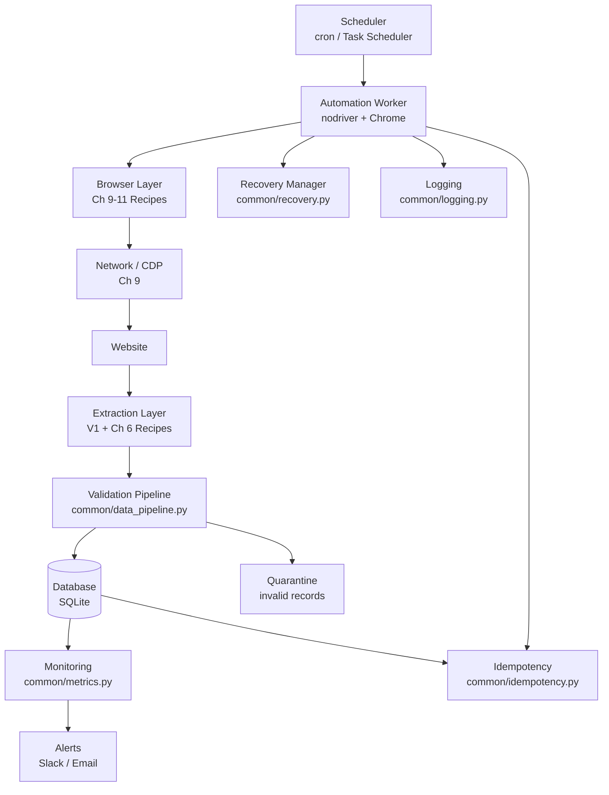

# Appendix A: Browser Automation System Map

## Full Architecture



## Recipe-to-Layer Mapping

```text
BROWSER LAYER (Ch 1-8, V1):
  BROWSER-LAUNCH, TAB-MANAGEMENT, BROWSER-PROFILES,
  BROWSER-STARTUP-CONFIG, NAVIGATION-CONTROL, ...

ADVANCED BROWSER (Ch 9-11, V2):
  NETWORK-INSPECTION, RESOURCE-CONTROL, CONSOLE-MONITORING,
  BROWSER-PERFORMANCE, ENVIRONMENT-EMULATION,
  FINGERPRINT-AUDIT, ENVIRONMENT-REPRODUCTION,
  DRAG-DROP, IFRAME-HANDLING, SHADOW-DOM, ...

PRODUCTION LAYER (Ch 12-13, V2):
  DOCKER-DEPLOYMENT, JOB-SCHEDULING, DATABASE-STORAGE,
  OBSERVABILITY, HEALTH-RECOVERY, DATA-CLEANING,
  DEDUPLICATION, EXPORT-PIPELINE, INCREMENTAL-COLLECTION,
  DATA-QUALITY

APPLICATIONS (Ch 14, V2):
  PRICE-MONITOR, SAAS-AUTOMATION, LEAD-WORKFLOW,
  DATA-PIPELINE, AUTOMATION-PLATFORM
```

## Depth Tier Reference

| Tier | Depth | Count | Recipe IDs |
|------|-------|-------|------------|
| 1 (Full) | Problem, Why, Mental Model, Code, Failure Modes, Decision Table, Rule | 15 | NETWORK-INSPECTION, RESOURCE-CONTROL, CONSOLE-MONITORING, BROWSER-PERFORMANCE, FINGERPRINT-AUDIT, ENVIRONMENT-REPRODUCTION, COMPATIBILITY-DIAGNOSIS, IFRAME-HANDLING, SHADOW-DOM, DOCKER-DEPLOYMENT, JOB-SCHEDULING, OBSERVABILITY, HEALTH-RECOVERY, INCREMENTAL-COLLECTION, DATA-QUALITY |
| 2 (Medium) | Problem, Concept, Code, Walkthrough, Edge Cases | 10 | ENVIRONMENT-EMULATION, PROFILE-ISOLATION, LOCALE-CONSISTENCY, DRAG-DROP, RICH-TEXT, KEYBOARD-CLIPBOARD, DATABASE-STORAGE, DEDUPLICATION, PRICE-MONITOR, AUTOMATION-PLATFORM |
| 3 (Utility) | Problem, Code, Notes | 5 | See Ch 14 (Capstone recipes in 7-section format) |

The five capstone recipes (56-60) use a unique 7-section format: Business Problem, Requirements, Constraints, Architecture, Technology Decisions, Failure Scenarios, Scaling Path.
