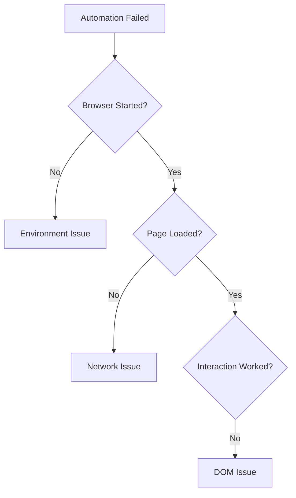

# Decision Framework Specification

## Purpose

A decision framework helps the reader choose between options. It replaces "it depends" with a concrete decision process. Every Tier 1 recipe must include one.

## Format Options

Choose the format that matches the decision type.

### Option 1: Decision Table

Use when the reader chooses between discrete options:

```markdown
| Situation | Recommendation |
|-----------|---------------|
| Single worker, desktop | SQLite |
| Multiple workers, production | PostgreSQL |
| API access needed | PostgreSQL |
```

### Option 2: Decision Flowchart (Mermaid)

Use when the decision has conditional branches:



### Option 3: Rules of Thumb

Use when the decision depends on experience rather than discrete categories:

```markdown
**When to retry:**
- The failure is transient (network timeout, rate limit)
- The failure is recoverable (browser crash → restart)

**When NOT to retry:**
- The failure is permanent (selector missing, login expired)
- The output would be corrupted (partial data written)
```

## Rules

- Every Tier 1 recipe must have a decision framework
- Place after Failure Modes, before Production Rule
- Choose the format that matches the decision complexity
- Never use a flowchart for a two-option decision (use a table)
- Never use a table for decisions with 4+ conditions (use a flowchart)

## Placement

Within each Tier 1 recipe:

```text
Code
Walkthrough
Failure Modes
Decision Framework ← here
Production Rule
```
