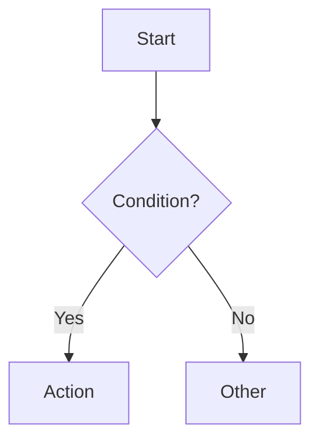
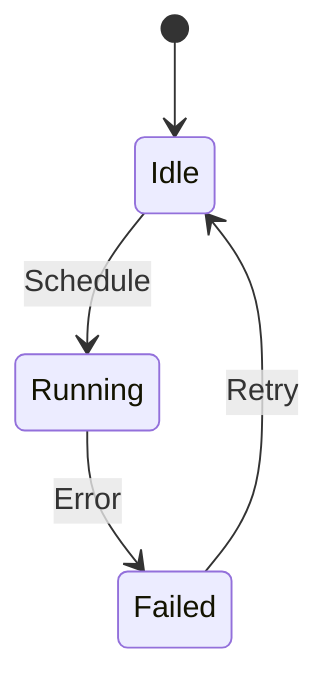
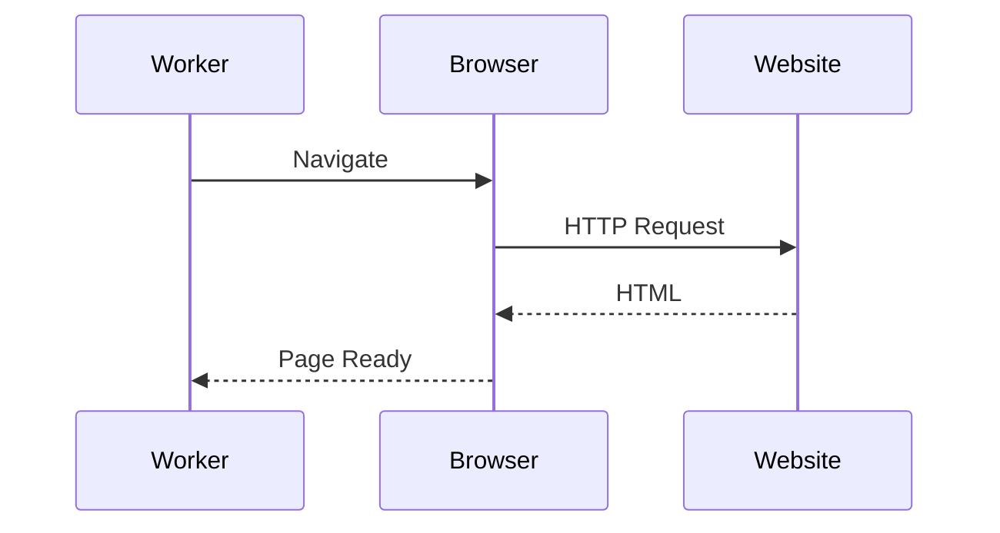
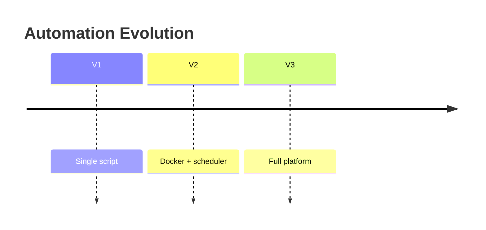

# Diagram Guide

## Purpose

Diagrams make the abstract concrete. A reader who remembers a diagram has learned the concept. Every chapter must have at least 3 diagrams, and no two diagrams in the same chapter should be the same type.

## Required Diagram Count Per Chapter

| Chapter Type | Minimum Diagrams | Maximum Same Type |
|-------------|-----------------|-------------------|
| V1 chapter | 2 (1 architecture + 1 decision/lifecycle) | 1 |
| V2 chapter | 3 (1 architecture + 1 decision + 1 lifecycle/sequence) | 1 |
| Part intro | 1 architecture summary | N/A |

## Available Diagram Types

### Flowchart (Mermaid `graph`)

Use for: decision processes, branching logic, workflows with yes/no paths.

**When:** The reader needs to choose a path based on conditions.

**When NOT:** Simple linear process (use a lifecycle or timeline instead).



### State Diagram (Mermaid `stateDiagram-v2`)

Use for: component lifecycles, states a system passes through, finite states.

**When:** A browser, session, or job has distinct states with transitions.

**When NOT:** Linear process with no state persistence.



### Sequence Diagram (Mermaid `sequenceDiagram`)

Use for: multi-party interactions, request-response flows, event ordering.

**When:** Browser ↔ Website ↔ Database or any message-passing between components.

**When NOT:** Single-component behavior.



### Timeline (Mermaid `timeline`)

Use for: chronological progression, version evolution, historical context.

**When:** Showing how a system evolved (V1 → V2 → V3).



### Pyramid / Layer Diagram (Mermaid `graph` with layered layout)

Use for: hierarchy, dependency stacking, abstraction levels.

**When:** Architecture has clear layers where each depends on the one below.

**Example:** Production Reliability Pyramid, Data Trust Pyramid.

### Comparison Table (Markdown table)

Use for: decision support, technology selection, trade-off analysis.

**When:** The reader chooses between options with different characteristics.

| Option | When | When Not |
|--------|------|----------|
| SQLite | Single worker | Multiple writers |
| PostgreSQL | Concurrent access | Single-file deployment |

### Lifecycle Diagram (Mermaid `graph LR` with sequential nodes)

Use for: linear processes where each step feeds the next.

**When:** The reader needs to understand the order of operations.

```
A → B → C → D
```

**When NOT:** The process has conditional branches (use a flowchart instead).

## Diagram Placement Rules

1. Architecture diagram first — within the "Architecture" or "Mental Model" section
2. Decision diagram inside the recipe or as a standalone "Decision Framework" section
3. Lifecycle/sequence diagram inside the recipe where the interaction is described
4. Never place two diagrams directly adjacent — at least one paragraph between them
5. Every diagram must have a caption line immediately below it explaining what to notice

## Mermaid Formatting

- Always specify the diagram type on the first line (`graph TD`, `stateDiagram-v2`, etc.)
- Use `-->` for forward transitions, `-->>` for responses
- Use `{ }` for decision nodes, `[ ]` for action nodes, `( )` for terminal nodes
- Keep node labels under 40 characters
- Use composable labels: break complex ideas into multiple nodes rather than one long label

## Image Diagrams

For complex architecture diagrams that cannot be expressed in Mermaid:

- Use dark navy background matching the book's visual theme
- Use thin cyan/teal lines connecting components
- Matte surfaces, precise geometry, no text explanation inside the image
- Keep consistent visual language across the entire series
- No screenshots of real websites or UI chrome
- 8K resolution where feasible

## Prohibited Patterns

- ❌ Four flowcharts in one chapter
- ❌ Diagram with no caption
- ❌ Mermaid that renders wider than the page (keep diagrams narrow)
- ❌ Diagrams that repeat the same information as adjacent text (diagram must add value)
- ❌ Screenshots of real websites or applications (use simplified mockups)
