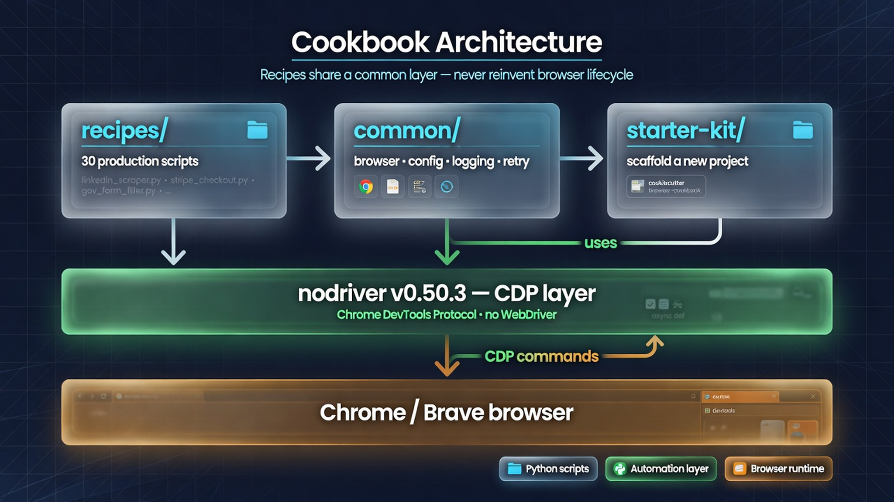

# Before You Begin

## The Problem This Chapter Solves

Most setup guides tell you to "pip install nodriver" and call it done. Then you hit the first error — wrong Python version, missing Chrome, permission issues, version mismatch — and you have no mental map of what's broken.

This chapter walks through a complete, verified setup. By the end, you have launched a browser from Python and closed it successfully. Chapter 1 starts from there.



## Required Environment

Your automation stack has five layers. Every layer must be present and compatible.

```
Your Machine (Windows / macOS / Linux)
        │
Python 3.11+ (virtual environment)
        │
nodriver 0.50.3 (pip package)
        │
Chrome 130+ (browser)
        │
Your Automation Scripts
```

The next five sections verify each layer.

## Verify Python

Open a terminal and run:

```bash
python --version
```

**Expected output:**

```
Python 3.11.x
```

**Why 3.11?** Three reasons:

1. **Async performance** — Python 3.11 optimized async task switching. Browser automation makes thousands of async calls per session. The speed difference vs 3.9 is measurable.
2. **Error messages** — 3.11+ pinpoints the exact expression that failed in a traceback. When a `page.find()` returns None and your code crashes on `None.text`, the traceback shows you exactly where.
3. **Typing support** — 3.11 added `Self` type and improved `TypedDict`. nodriver's type hints are most accurate under 3.11+.

If you see 3.8 or lower, install Python 3.11 from [python.org](https://python.org) before proceeding.

## Create Project Environment

Never install automation dependencies globally. Browser tooling has frequent version conflicts with system packages and other projects.

```bash
mkdir browser-automation-project
cd browser-automation-project
python -m venv .venv
```

Activate the environment:

**Windows (cmd/PowerShell):**
```bash
.venv\Scripts\activate
```

**Windows (Git Bash):**
```bash
source .venv/Scripts/activate
```

**macOS / Linux:**
```bash
source .venv/bin/activate
```

Your prompt should now show `(.venv)` at the beginning.

## Install Dependencies

Upgrade pip first. Pip versions older than 22 can silently install wrong versions.

```bash
pip install --upgrade pip
pip install nodriver==0.50.3
```

Pin the version in a requirements file. This ensures reproducible installs across machines and deployments.

```bash
pip freeze > requirements.txt
```

**Why pin nodriver?** Browser automation is sensitive to three things that change between versions:

- **Chromium protocol changes** — Chrome updates the CDP protocol frequently. nodriver must match.
- **API surface changes** — What worked in 0.48 may not work in 0.50.
- **Bug fixes** — A patch version may change behavior of `find()`, `click()`, or `send_keys()`.

A `requirements.txt` with pinned versions is your insurance against "it worked yesterday."

## Verify Chrome Installation

nodriver controls Chrome. It does not replace Chrome.

**Windows:** Open Chrome and go to `chrome://version`. Note the version number.

**macOS / Linux:**
```bash
google-chrome --version
# or
chromium-browser --version
```

**Expected:** Version 130 or higher.

**What if Chrome is not installed?** Download from [google.com/chrome](https://google.com/chrome). Chromium (the open-source base) also works.

**What about Brave, Edge, or other Chromium browsers?** They work. Specify the executable path when calling `launch_browser()`. The cookbook uses Chrome by default.

## First Test

Create a small verification script before running any recipes.

Create `test_browser.py`:

```python
import asyncio
import nodriver as uc

async def main():
    browser = await uc.start()
    page = await browser.get("https://example.com")
    title = await page.title()
    print(f"Chrome opened. Page: {title}")
    browser.stop()

if __name__ == "__main__":
    asyncio.run(main())
```

Run it:

```bash
python test_browser.py
```

**Expected output:**

```
Chrome opened. Page: Example Domain
```

**What to check for:**

| Observation | Meaning |
|-------------|---------|
| Chrome window appears and closes | Browser works, CDP connected |
| Error "Chrome not found" | Chrome path missing |
| Error "Connection refused" | Port conflict, close other Chrome instances |
| Error "ModuleNotFoundError: nodriver" | Environment not activated or not installed |

**If the test fails:** Fix the issue now. Every recipe in this book assumes a working browser connection. Debugging a broken environment while learning new concepts is frustrating and unnecessary.

## You are ready for Recipe 1.

