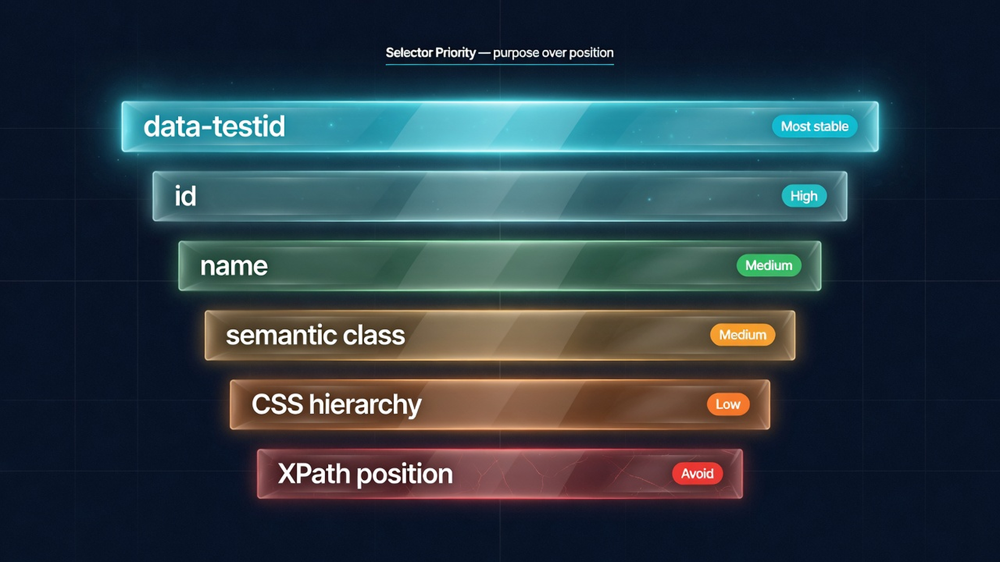

# Chapter 4: Elements & Forms

## The Problem This Chapter Solves

Most automation scripts fail at the interaction layer. Not because clicking is difficult. Because websites are dynamic. Elements appear late. Selectors change between deployments. Overlays block intended clicks. Validation happens asynchronously.

This chapter teaches you to interact with pages the way production automation systems do: with stable selectors, state-aware clicking, and recovery patterns.




## Recipe 13: Find Elements Using Stable Selectors

**File:** `recipes/13_find_elements.py`

### Why This Matters

The wrong selector breaks automation when the page changes. A selector that works today fails tomorrow — not because the element is gone, but because a CSS class was renamed or a div was restructured. Choose selectors by stability, not convenience.

### Selector Priority

| Priority | Selector | Example | Stability |
|----------|----------|---------|-----------|
| ⭐⭐⭐⭐⭐ | `data-testid` | `[data-testid="login-btn"]` | Max |
| ⭐⭐⭐⭐ | `id` | `#submit-button` | High |
| ⭐⭐⭐ | `name` | `input[name="email"]` | Medium |
| ⭐⭐ | CSS class | `.btn-primary` | Medium |
| ⭐ | CSS hierarchy | `div > ul > li` | Low |
| 🚫 | XPath | `//div[3]/span` | Fragile |

### The Code

```python
import asyncio
from common.browser import launch_browser, close_browser

async def main():
    browser = await launch_browser()
    page = await browser.get("https://example.com")

    # Preferred: data-testid
    login_button = await page.find("[data-testid='login-button']")
    if login_button:
        await login_button.click()

    # Fallback: name attribute
    search_input = await page.find("input[name='search']")
    if search_input:
        await search_input.send_keys("automation")

    # Last resort: semantic type selector
    submit = await page.find("button[type='submit']")
    if submit:
        await submit.click()

    await close_browser(browser)

if __name__ == "__main__":
    asyncio.run(main())
```

### Code Walkthrough

The code demonstrates the priority in practice: data-testid first, then name, then type-based CSS. Each level is a fallback when the previous one is unavailable.

### Production Rule

Prefer selectors that describe purpose, not position. `data-testid` over CSS hierarchy every time.

### Used In Real Projects

**Good fit:** Any automation that uses selectors.
**Avoid:** XPath — there is always a better selector.


## Recipe 14: Click Elements Reliably

**File:** `recipes/14_click_elements.py`

### Why This Matters

A visible element is not clickable. It can be hidden behind an overlay, disabled, or off-screen. The click is trivial. The preparation is what makes automation reliable.

### The Code

```python
import asyncio
from common.browser import launch_browser, close_browser

async def safe_click(element):
    try:
        await element.scroll_into_view()
        await element.click()
        return True
    except Exception as e:
        print(f"Click failed: {e}")
        return False

async def main():
    browser = await launch_browser()
    page = await browser.get("https://example.com")
    link = await page.find("a")
    if link:
        await safe_click(link)
        await page.sleep(1)
        print(f"After click: {page.url}")
    await close_browser(browser)

if __name__ == "__main__":
    asyncio.run(main())
```

### Code Walkthrough

`scroll_into_view()` brings the element into the viewport. Overlays (cookie banners, chat widgets, sticky headers) cause clicks to land on the wrong element.

### Production Rule

Scroll before click. An out-of-viewport click fails silently.

### Used In Real Projects

**Good fit:** Every script that clicks anything.
**Avoid:** JavaScript-triggered clicks via `evaluate()`.


## Recipe 15: Fill Forms

**File:** `recipes/15_fill_forms.py`

### Why This Matters

Forms are the most common web interaction. The pattern is always the same: find the input by name, type the value, move to the next field.

### The Code

```python
import asyncio
from common.browser import launch_browser, close_browser

async def main():
    browser = await launch_browser()
    page = await browser.get("https://httpbin.org/forms/post")
    name = await page.find("input[name='custname']")
    if name:
        await name.send_keys("Test User")
    tel = await page.find("input[name='custtel']")
    if tel:
        await tel.send_keys("555-0123")
    email = await page.find("input[name='custemail']")
    if email:
        await email.send_keys("test@example.com")
    await page.sleep(2)
    await close_browser(browser)

if __name__ == "__main__":
    asyncio.run(main())
```

### Production Rule

Find form inputs by `name` attribute. IDs may be dynamic but names are intentional.


## Recipe 16: Upload Files

**File:** `recipes/16_upload_files.py`

### Why This Matters

File uploads need a dedicated API. `send_keys()` does not work on `<input type="file">`.

### The Code

```python
import asyncio
from pathlib import Path
from common.browser import launch_browser, close_browser

async def main():
    browser = await launch_browser()
    page = await browser.get("https://httpbin.org/post")
    file_input = await page.find("input[type='file']")
    if file_input:
        test_file = Path("test_upload.txt")
        test_file.write_text("Hello from cookbook!")
        await file_input.send_file(str(test_file.resolve()))
        print(f"Uploaded: {test_file}")
        test_file.unlink()
    await close_browser(browser)

if __name__ == "__main__":
    asyncio.run(main())
```

### Production Rule

Use absolute paths for file uploads. Relative paths break when the working directory changes.


## Recipe 17: Select Dropdown Options

**File:** `recipes/17_select_dropdown.py`

### Why This Matters

Dropdown `<select>` elements need `select_option()`, not `send_keys()`.

### The Code

```python
import asyncio
from common.browser import launch_browser, close_browser

async def main():
    browser = await launch_browser()
    page = await browser.get("https://httpbin.org/forms/post")
    size = await page.find("select")
    if size:
        await size.select_option("large")
        print("Selected: large")
    await close_browser(browser)

if __name__ == "__main__":
    asyncio.run(main())
```

### Production Rule

Select by value when stable, by label when values are auto-generated.


## Recipe 18: Handle Dialogs and Pop-ups

**File:** `recipes/18_dialogs_popups.py`

### Why This Matters

Pop-ups block your automation. Handle them before critical interactions.

### The Code

```python
import asyncio
from common.browser import launch_browser, close_browser

async def dismiss_cookie_banner(page):
    selectors = [
        "button:has-text('Accept')",
        "button:has-text('OK')",
        "button:has-text('Got it')",
        ".cookie-banner button",
        "#cookie-consent button",
    ]
    for sel in selectors:
        btn = await page.find(sel, timeout=2)
        if btn:
            await btn.click()
            return True
    return False

async def main():
    browser = await launch_browser()
    page = await browser.get("https://example.com")
    if await dismiss_cookie_banner(page):
        print("Dismissed cookie banner")
    await close_browser(browser)

if __name__ == "__main__":
    asyncio.run(main())
```

### Production Rule

Check for overlays before clicking primary elements. A banner costs 2 seconds. A failed click costs a retry loop.


