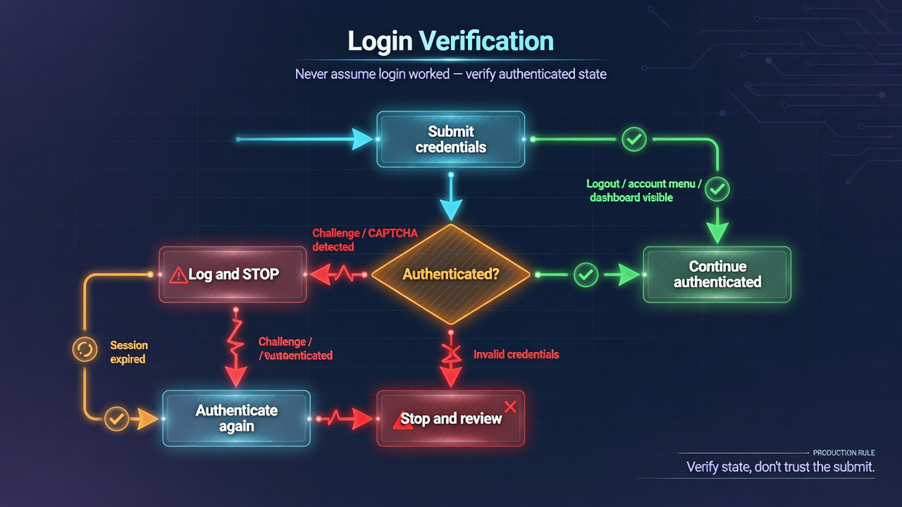

# Chapter 5: Authentication & Sessions

## The Problem This Chapter Solves

Authentication is the most common production automation challenge. Logging in once is easy. Staying logged in, verifying session state, managing multiple accounts — that is where most implementations break.




## Recipe 19: Log In and Verify Authentication

**File:** `recipes/19_login_forms.py`

### Why This Matters

Submit does not mean success. You must verify authentication actually happened. Check for multiple signals: logout button, URL change, account menu.

### The Code

```python
import asyncio
from common.browser import launch_browser, close_browser

async def login_succeeded(page):
    signals = [
        page.find("a:has-text('Logout')"),
        page.find("a:has-text('Sign out')"),
        page.find("[data-testid='account-menu']"),
    ]
    results = await asyncio.gather(*signals, return_exceptions=True)
    return any(bool(r) for r in results if not isinstance(r, Exception))

async def main():
    browser = await launch_browser()
    page = await browser.get("https://example.com/login")
    username = await page.find("input[name='username']")
    password = await page.find("input[name='password']")
    if username and password:
        await username.send_keys("testuser")
        await password.send_keys("testpass")
        submit = await page.find("button[type='submit']")
        if submit:
            await submit.click()
    await page.sleep(3)
    if await login_succeeded(page):
        print("Login successful")
    else:
        print("Login failed")
    await close_browser(browser)

if __name__ == "__main__":
    asyncio.run(main())
```

### Production Rule

Never assume login succeeded. Verify using at least two independent signals.

### Used In Real Projects

**Good fit:** SaaS dashboards, admin panels, internal tools.
**Avoid:** CAPTCHA-protected logins.


## Recipe 20: Work with Cookies

**File:** `recipes/20_cookies.py`

### Why This Matters

Cookies carry session state across requests. Knowing how to read, save, and restore them is essential for session reuse.

### The Code

```python
import asyncio
import json
from pathlib import Path
from common.browser import launch_browser, close_browser

COOKIE_FILE = Path("cookies.json")

async def main():
    browser = await launch_browser()
    page = await browser.get("https://httpbin.org/cookies/set?session=abc123")
    cookies = browser.cookies
    print(f"Got {len(cookies)} cookies")
    COOKIE_FILE.write_text(json.dumps(cookies, indent=2))
    print(f"Saved to {COOKIE_FILE}")
    await close_browser(browser)

if __name__ == "__main__":
    asyncio.run(main())
```

### Production Rule

Save cookies in JSON format. Portable across runs, inspectable manually.


## Recipe 21: Reuse Authenticated Sessions

**File:** `recipes/21_reuse_sessions.py`

### Why This Matters

Logging in on every run is slow and risks rate limiting or CAPTCHA. Save and restore authenticated state.

### The Code

```python
import asyncio
import json
from pathlib import Path
from common.browser import launch_browser, close_browser

COOKIE_FILE = Path("cookies.json")

async def is_authenticated(page):
    logout = await page.find("a:has-text('Logout')", timeout=3)
    return logout is not None

async def restore_session(browser, cookie_file):
    if not cookie_file.exists():
        return False
    cookies = json.loads(cookie_file.read_text())
    for c in cookies:
        await browser.add_cookie(c)
    return True

async def main():
    browser = await launch_browser()
    page = await browser.get("https://example.com")
    restored = await restore_session(browser, COOKIE_FILE)
    if restored and await is_authenticated(page):
        print("Session valid")
    else:
        print("Session expired")
    await close_browser(browser)

if __name__ == "__main__":
    asyncio.run(main())
```

### Production Rule

Always verify session after loading cookies. Sessions expire without warning.


## Recipe 22: Manage Multiple Accounts

**File:** `recipes/22_multi_account.py`

### Why This Matters

Different automation tasks need different user contexts. Keep accounts isolated.

### The Code

```python
import asyncio
import json
from pathlib import Path
from common.browser import launch_browser, close_browser

async def switch_profile(browser, profile_dir):
    cookie_file = Path(profile_dir) / "cookies.json"
    if cookie_file.exists():
        cookies = json.loads(cookie_file.read_text())
        for c in cookies:
            await browser.add_cookie(c)
        return True
    return False

async def main():
    browser = await launch_browser()
    await switch_profile(browser, "./profiles/admin")
    page = await browser.get("https://example.com")
    print("Using admin profile")
    await close_browser(browser)

if __name__ == "__main__":
    asyncio.run(main())
```

### Production Rule

One profile directory per account. Never share cookies between contexts.


