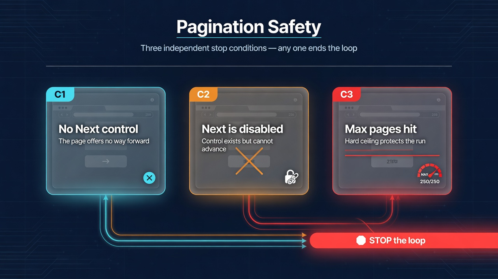
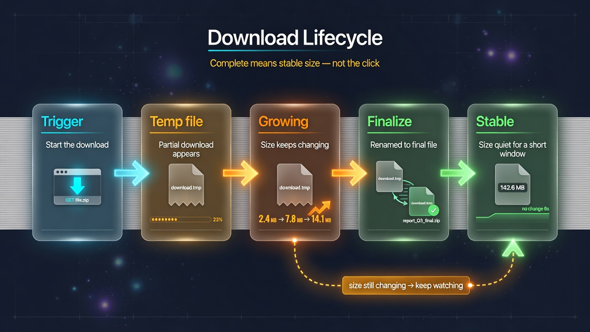

# Chapter 6: Data Collection

## The Problem This Chapter Solves

Extracting data is the most common automation goal. But real web pages do not present clean datasets. Tables have missing cells. Pages paginate indefinitely. Downloads appear incomplete. This chapter teaches extraction that handles real-world data.




The two critical patterns for data collection: pagination safety guards and download lifecycle tracking. The first prevents infinite loops; the second prevents serving incomplete files to users.



## Recipe 23: Extract Structured Tables

**File:** `recipes/23_extract_tables.py`

### Why This Matters

HTML tables look clean in the browser. Under the hood they have colspan, rowspan, missing cells, and mixed `td`/`th` elements.

### The Code

```python
import asyncio
from common.browser import launch_browser, close_browser

async def extract_table(page):
    rows = await page.find_all("tr")
    data = []
    for row in rows:
        cells = await row.find_all("td") or await row.find_all("th")
        data.append([(await c.text).strip() for c in cells])
    return data

async def main():
    browser = await launch_browser()
    page = await browser.get("https://example.com")
    table = await page.find("table")
    if table:
        data = await extract_table(table)
        for row in data[:5]:
            print(row)
    await close_browser(browser)

if __name__ == "__main__":
    asyncio.run(main())
```

### Production Rule

Test table extraction against at least 5 pages. Tables vary more than any other HTML structure.


## Recipe 24: Handle Pagination

**File:** `recipes/24_pagination.py`

### Why This Matters

Pagination without safety guards runs forever on a broken page. Three independent stop conditions protect against infinite loops.

### The Code

```python
import asyncio
from common.browser import launch_browser, close_browser

MAX_PAGES = 100

async def has_next_page(page):
    btn = await page.find(".pagination .next, a:has-text('Next')", timeout=3)
    if not btn:
        return False
    classes = await btn.get_attribute("class") or ""
    return "disabled" not in classes

async def main():
    browser = await launch_browser()
    page = await browser.get("https://example.com")
    page_num = 0
    while await has_next_page(page) and page_num < MAX_PAGES:
        print(f"Page {page_num + 1}")
        next_btn = await page.find(".pagination .next, a:has-text('Next')")
        if next_btn:
            await next_btn.click()
            await page.sleep(2)
            page_num += 1
    print(f"Done after {page_num} pages")
    await close_browser(browser)

if __name__ == "__main__":
    asyncio.run(main())
```

### Production Rule

Always set MAX_PAGES. A broken page can generate infinite "next" buttons.


## Recipe 25: Scrape Infinite Scroll Pages

**File:** `recipes/25_infinite_scroll.py`

### Why This Matters

Infinite scroll has no "next" button. You must detect when content stops loading.

### The Code

```python
import asyncio
from common.browser import launch_browser, close_browser

MAX_SCROLLS = 50

async def main():
    browser = await launch_browser()
    page = await browser.get("https://example.com")
    prev_height = 0
    stable_count = 0
    for i in range(MAX_SCROLLS):
        await page.scroll_down(delta_y=1000)
        await page.sleep(2)
        height = await page.evaluate("document.body.scrollHeight")
        if height == prev_height:
            stable_count += 1
            if stable_count >= 3:
                print(f"No new content after {i+1} scrolls")
                break
        else:
            stable_count = 0
        prev_height = height
    await close_browser(browser)

if __name__ == "__main__":
    asyncio.run(main())
```

### Production Rule

Check 3 times before concluding there is no more content. Network latency delays loading.


## Recipe 26: Download Files Reliably

**File:** `recipes/26_download_files.py`

### Why This Matters

A file on disk does not mean the download is complete. Chrome writes temporary `.crdownload` files first.

### The Code

```python
import asyncio
from pathlib import Path
from common.browser import launch_browser, close_browser

DOWNLOAD_DIR = Path("./downloads")
DOWNLOAD_DIR.mkdir(exist_ok=True)

async def wait_for_download(page, link_selector, timeout=30):
    link = await page.find(link_selector)
    if not link:
        raise ValueError(f"Link not found")
    before = set(DOWNLOAD_DIR.iterdir())
    await link.click()
    for _ in range(timeout):
        after = set(DOWNLOAD_DIR.iterdir()) - before
        new_files = [f for f in after if f.suffix != ".crdownload"]
        if new_files:
            return new_files[0]
        await page.sleep(1)
    raise TimeoutError("Download did not complete")

async def main():
    browser = await launch_browser()
    page = await browser.get("https://example.com")
    file_path = await wait_for_download(page, "a[download]")
    print(f"Downloaded: {file_path}")
    await close_browser(browser)

if __name__ == "__main__":
    asyncio.run(main())
```

### Production Rule

A `.crdownload` file is not a completed download. Wait for the final filename.


## Recipe 27: Extract Images and Media

**File:** `recipes/27_extract_images.py`

### Why This Matters

Image URLs on the page are often relative. You need to resolve them to absolute paths before downloading.

### The Code

```python
import asyncio
from urllib.parse import urljoin
from common.browser import launch_browser, close_browser

async def main():
    browser = await launch_browser()
    page = await browser.get("https://example.com")
    images = await page.find_all("img")
    base = page.url
    for img in images:
        src = img.attrs.get("src", "")
        alt = img.attrs.get("alt", "")
        full_url = urljoin(base, src)
        print(f"{alt[:30]:30s} {full_url}")
    await close_browser(browser)

if __name__ == "__main__":
    asyncio.run(main())
```

### Production Rule

Always convert relative image URLs to absolute. A relative URL is useless outside the page context.


