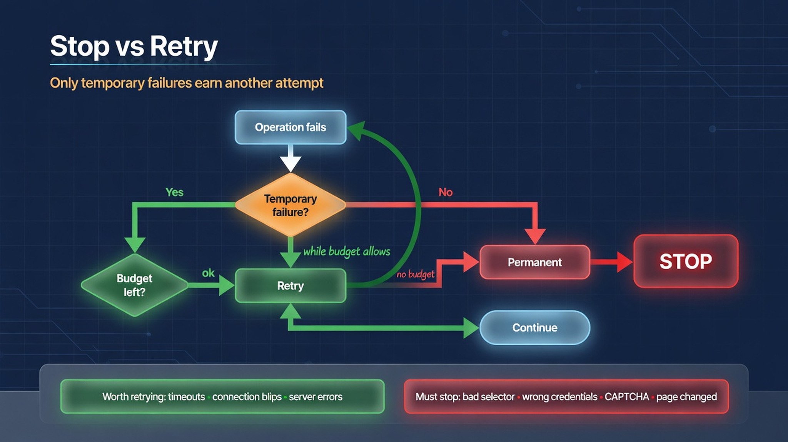

# Chapter 7: Reliable Automation

## The Problem This Chapter Solves

A script that works on your laptop at 2 PM fails on the server at 3 AM. Production automation needs consistency and a decision framework for handling failures.




## Recipe 28: Build Automation That Resembles Normal Usage

**File:** `recipes/28_stealth_automation.py`

### Why This Matters

Some websites detect automation and block it. The goal is not to hide. It is to avoid triggering obvious detection signals.

### The Code

```python
import asyncio
from pathlib import Path
from common.browser import launch_browser, close_browser

PROFILE = Path("./profiles/stealth_profile")

async def main():
    browser = await launch_browser(
        user_data_dir=str(PROFILE),
        window_size=(1366, 768),
    )
    page = await browser.get("https://example.com")
    print(f"Browser: {await page.evaluate('navigator.userAgent')}")
    await close_browser(browser)

if __name__ == "__main__":
    asyncio.run(main())
```

### Production Rule

Consistent profiles and viewport size matter more than any single trick.


## Recipe 29: Build Resilient Browser Automation

**File:** `recipes/29_resilient_automation.py`

### Why This Matters

Production automation must handle failures without human intervention. The decision framework: temporary? retry within budget? success? continue. Otherwise stop.

### The Code

```python
import asyncio
from common.browser import launch_browser, close_browser
from common.logging import logger
from common.retry import retry

async def main():
    browser = await launch_browser()
    try:
        page = await retry(
            browser.get,
            "https://httpbin.org/delay/3",
            exceptions=(TimeoutError, ConnectionError),
            max_retries=3,
            delay=2,
        )
        logger.info(f"Loaded: {await page.title()}")
    except Exception as e:
        logger.error(f"Failed after retries: {e}")
    finally:
        await close_browser(browser)

if __name__ == "__main__":
    asyncio.run(main())
```

### Production Rule

Complete successfully or fail with enough information for the next run. Not to run forever.


