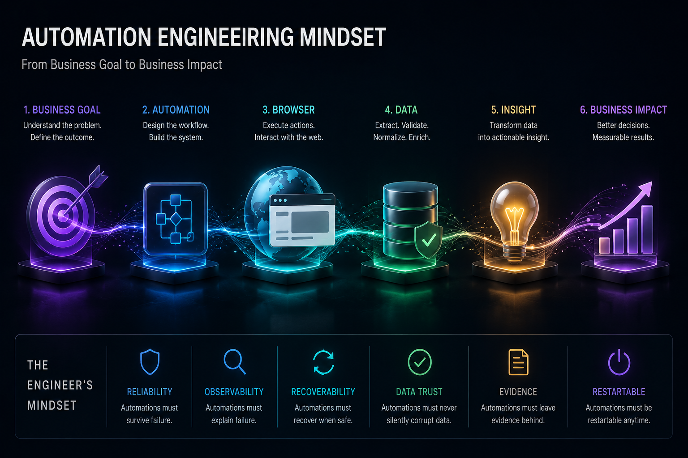

# Automation Engineering Mindset

Before the recipes, before the code, before the architecture — there is a mindset shift.

V1 taught you **how to control a browser**.

V2 teaches you **how to operate an automation system**.

These are different skills. This chapter explains the difference.

### Previously

Welcome. This book is written for engineers who already know how to write browser automation with nodriver. You know how to launch a browser, click elements, and extract data. The question this book answers is: can you operate that automation reliably in production?


## The Three Ways Engineers Think

Throughout this book, you will notice three levels of thinking:

```text
Junior      "I know how."       Can execute the recipe.
Senior      "I know why."       Understands the architecture.
Principal   "I know when NOT."  Chooses the right pattern and knows when to break it.
```

This book is written for the second level, with the goal of reaching the third. If you finish a chapter thinking "I know how to implement this pattern" — that is V1 thinking. If you finish thinking "I know when this pattern applies and when it doesn't" — that is V2 thinking.


## Section 1: Why Most Automation Fails

A company builds a competitor price tracker.

The developer writes:

```python
open website
extract price
save csv
```

It works for two weeks.

Then Monday morning: the report shows zero products. The script did not crash. The server is healthy. There are no error logs. Nobody knows something is wrong.

The website changed one API field name. The selector still exists but returns `undefined`. The script exits successfully with empty data.

**This is the most dangerous automation failure: the one that looks like success.**

### The Four Failure Categories

Production automation has four failure modes, and only one is easy to detect:

#### Hard Failure — Program stops

```
Chrome crashed
```
Easy to detect. Easy to alert. Beginners handle this.

#### Soft Failure — Program runs incorrectly

```
1000 products checked
1000 prices = None
```
Harder to detect. The script exits normally. The output is wrong. Needs validation.

#### Silent Failure — No error, wrong output

```
Login expired halfway through
Extractor saves login page HTML as "product data"
```
No error is raised. The data looks plausible. The damage is discovered days later.

#### Business Failure — Technical success, business loss

```
Price alert sent 12 hours late
Alert email had wrong format
```
The automation runs perfectly. The business outcome fails.

### The Lesson

Most automation tutorials teach you to handle *hard failures* — timeouts, missing elements, crashes. Production automation must handle *all four*.

The difference between a V1 reader and a V2 reader is:

> V1 asks: "Did my script finish?"
> V2 asks: "Did my automation produce correct, complete, and trustworthy results?"


## Section 2: The Automation Maturity Ladder

Not every automation needs every feature. The level of production engineering depends on the automation's impact.

```
Level 1 — Script
  "I can automate clicking."
  One-off tasks, personal use.
  No retries, no logging, no monitoring.

Level 2 — Reliable Script
  "I handle common failures."
  Retry logic, logging, basic error handling.
  Still manual execution.

Level 3 — Production Job
  "It runs daily without me."
  Scheduling, Docker, persistent state.
  Runs unattended but not monitored.

Level 4 — Automation System
  "It monitors itself."
  Health checks, metrics, alerts, recovery.
  Self-healing, observable, measurable.
```

Most books stop at Level 2. This book takes you to Level 4.

**Where are you now?** If you can answer "yes" to all questions at your level, move up.


## The Cost Curve

As automation moves through stages of maturity, the cost of failure — and therefore the required engineering investment — changes dramatically.

```text
Personal script        Failure cost: 10 minutes of your time
       ↓
Internal team tool     Failure cost: Someone else's morning ruined
       ↓
Client deliverable     Failure cost: Lost client, lost revenue
       ↓
Mission-critical ops   Failure cost: Business stops
```

Each stage demands different engineering. A personal price tracker does not need health checks, recovery managers, or Slack alerts. A client-facing dashboard automation does. The recipes in this book give you the tools for every stage — your job is to choose the right level for the automation's cost of failure.


## Section 3: The Production Engineer Mindset

### Rule 1: Execution success is not business success

A script that finishes is not the same as a job that produced correct results. Every output must be validated.

### Rule 2: Data quality matters more than completion

A scraper that stores 10,000 empty records did more damage than a scraper that crashed on record 10. Validation is not optional.

### Rule 3: Every failure needs a diagnosis path

When automation breaks, you need to know:
- What happened?
- When did it happen?
- What was the browser doing?
- What was the website responding?

Without CDP monitoring, console logs, network captures, and screenshots, you cannot answer these.

### Rule 4: Every automation needs ownership

Unattended automation with no owner is abandoned automation. Someone must be responsible for:
- Monitoring success rates
- Updating selectors when websites change
- Responding to alerts
- Reviewing data quality

### Rule 5: Design for 3 AM

If your automation fails at 3 AM:
- Does it recover automatically?
- Is someone notified?
- Are the logs useful for diagnosis?

If the answer to any is "no," the automation is not production-ready.


## Section 4: The Cost of Failure

The production engineering investment should match the cost of failure:

| Use Case | Failure Cost | Production Level |
|----------|-------------|-----------------|
| Personal price check | Low | Level 1-2 |
| Client report | Medium | Level 3 |
| Business pricing decisions | High | Level 4 |
| Automated financial transactions | Critical | Level 4 + audit |

A personal script that fails costs you 10 minutes. A client automation that fails costs you the client. A pricing system that silently stores wrong data costs the business real money.


## Section 5: What This Book Expects From You

V2 builds on V1. You should already know:

- Launching a browser and managing tabs
- Finding elements and clicking them
- Filling forms and handling authentication
- Extracting data from tables and pages
- The project structure from the starter kit

If any of these are unfamiliar, start with the V1 recipes. V2 assumes them.


## The One-Sentence Shift

> **V1 taught you to control a browser. V2 teaches you to operate an automation system.**

The recipes are the same tools. The mindset is what changes.


Automation mindset is not a fixed trait. It is reinforced through deliberate practice.



\newpage

## The Cost of Getting This Wrong

| Failure Mode | Example | Business Impact |
|-------------|---------|-----------------|
| Hard crash | Chrome crashes at 3 AM | Script stops. Obvious. Easy to alert. |
| Soft failure | Script runs but extracts null for every field | No crash. No error. Report shows empty. |
| Silent failure | Login expires mid-run, scraper saves login page HTML as "product data" | No error raised. Data looks plausible. |
| Business failure | Price alert sends 12 hours late | Automation runs correctly. Business outcome fails. |


## Automation Maturity Ladder

Not every automation needs to be a platform. The level of engineering should match the automation's impact:

```text
Level 1 — Personal Script
  Works on your machine. No retries, no logging, no monitoring.
  Failure costs: 10 minutes of your time.

Level 2 — Reliable Script
  Handles common failures. Retry logic, logging, basic error handling.
  Failure costs: Someone else's morning.

Level 3 — Production Automation
  Runs unattended. Docker, scheduling, monitoring, alerting.
  Failure costs: Client deliverable, revenue.

Level 4 — Business Platform
  Multiple jobs, health checks, SLAs, operator dashboard.
  Failure costs: Business operations depend on it.

Level 5 — Automation Portfolio
  Multi-client, multi-target, automated deployment, cost tracking.
  Failure costs: Entire business unit.
```

## Automation Engineering Principles

Like SOLID for software design, these principles govern browser automation system design. They are referenced throughout the book and serve as a quick decision framework when you are unsure which pattern to apply.

1. **Observe before acting.** Never interact with a page element without first understanding its state. CDP events, network logs, and console output are your sensors.

2. **Validate before storing.** Extraction is not the end of the pipeline. Every field must be checked for type, range, and completeness before it enters your database.

3. **Never trust success.** An exit code of 0 does not mean the data is correct. Always validate the output, not just the process.

4. **State is everything.** Browser state (cookies, storage, profiles) determines behavior. If you do not control state explicitly, it controls you implicitly.

5. **Retry only transient failures.** A selector that does not exist will never exist on retry. A network timeout might succeed. Classify before retrying.

6. **Isolation beats cleverness.** One profile per worker. One browser per identity. One concern per module. Shared state is the root of most production bugs.

7. **The browser is infrastructure.** Treat it like a database connection: launch with configuration, monitor its health, close it in a `finally` block.

8. **Evidence beats assumptions.** When automation fails, you need screenshots, HTML dumps, console logs, and network captures — not guesses.

9. **Recovery is part of execution.** A production automation does not stop at "it failed." It answers: can I recover? Should I? What data did I already commit?

10. **Data without provenance is opinion.** Every stored record should answer: where did this come from, when was it collected, and which scraper produced it?

11. **Design for 3 AM.** If your automation fails at 3 AM, can you diagnose it from the logs alone? If not, the automation is not production-ready.

12. **Every automation has an owner.** Unattended automation with no responsible operator is abandoned automation. Someone must be accountable for its operation.

These principles are the backbone of every engineering decision in this book.


## The Full Picture

```text
Business Goal
    ↓
Automation Design
    ↓
Browser (nodriver + Chrome)
    ↓
Website (target application)
    ↓
Extracted Data
    ↓
Validation + Provenance
    ↓
Business Decision
```

The browser is one component in a chain that starts and ends with business outcomes. Every engineering decision in this book exists to serve that chain.

