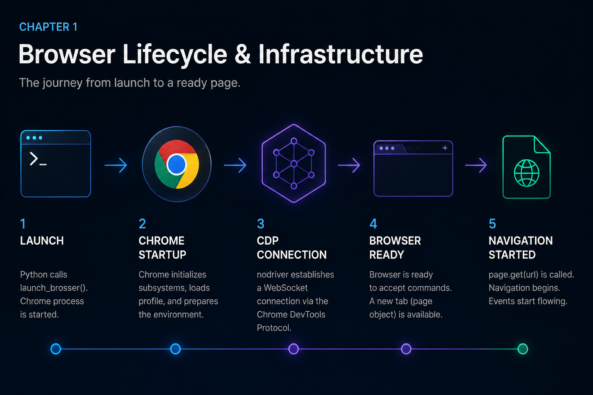

# Browser Lifecycle & Infrastructure

## Launch, Profile, Configure — and Walk Away




## Previously

You understand the four categories of automation failure and the maturity ladder from scripts to systems. You know the cost of getting automation wrong.

Now we build the foundation every production automation depends on: managing the browser process itself.


## Why This Chapter Exists

nodriver 0.50.x does not import a browser library. It launches a Chrome subprocess and communicates over a WebSocket through the Chrome DevTools Protocol. This is a fundamentally different architecture from calling functions in a Python library — and every common failure in browser automation traces back to engineers treating it as if it were the same.

The four recipes in this chapter look deceptively simple: launch a browser, open a tab, reuse a profile, set startup options. They are the simplest recipes in the book and the most dangerous.


## The Cost of Getting This Wrong

| Symptom | Root Cause | Cost |
|---------|-----------|------|
| "Connection refused" | Chrome not started or crashed | Days of debugging selector logic that was never the problem |
| "Profile locked" | Two workers sharing one directory | Corrupted sessions, random auth failures |
| "Session state missing" | Launched without profile | Every run starts from scratch, re-authenticating unnecessarily |
| "Memory grew until OOM" | Chrome never closed | Server crashes, missed schedules, lost data |
| "Works locally, fails on server" | Headless mode differences | Production incidents that cannot be reproduced in development |

Every item in this table is a failure of infrastructure understanding, not automation logic. This chapter eliminates all of them.


## Production Incident

```
Monday 02:00 — Scheduler started nightly report automation.
02:01 — Chrome launched successfully.
02:03 — Navigation started. Page loaded.
02:08 — Extraction completed. Script exited. Exit code: 0.
02:09 — Monitoring dashboard: [✓] SUCCESS

Wednesday 08:30 — Report missing. Operations team investigates.
08:45 — Server process list shows 17 Chrome processes running.
08:50 — Root cause found: close_browser() was only called on the 
         success path. Network timeout at 02:05 skipped the finally block.
         Each failed run leaked a Chrome process.
         After 17 runs, memory exhausted. Chrome couldn't start.
         The error said "Connection refused" — not "Out of memory."

Root cause: The developer treated launch and close as optional bookends, 
not a transaction.
```

**Lesson:** The browser lifecycle is infrastructure. A launch without a guaranteed close is a memory leak waiting to happen. Always wrap automation in `try/finally`.


## Mental Model — The Browser Is a Remote Machine

> **Thinking of nodriver as a "browser library" causes half the bugs in this chapter.**

The correct mental model: nodriver is a remote control for a separate operating system process. Chrome itself is not a single process — it is a process family.

### Chrome Process Anatomy

```text
Your Python Script (asyncio event loop)
    │
    │  nodriver 0.50.x API calls
    │
    ▼
WebSocket Connection (CDP — Chrome DevTools Protocol)
    │
    ▼
Chrome Browser Process  ← orchestrator
    │
    ├── Renderer Process  ← per tab (HTML, CSS, JS)
    ├── GPU Process       ← accelerated rendering
    ├── Network Process   ← HTTP, DNS, WebSockets
    ├── Storage Process   ← cookies, IndexedDB, local storage
    ├── Audio Process     ← sound (usually absent in automation)
    └── Utility Processes ← crashpad, extensions, etc.
```

When nodriver calls `launch_browser()`, it spawns the browser process, which spawns its children. A crash in the renderer process does not necessarily crash the browser process — but a crash in the browser process kills everything. Understanding this separation helps you diagnose: "did the tab crash, or did the browser crash?"


### Browser Startup Timeline

When you call `launch_browser()`, the following happens in sequence:

```text
launch_browser() called
    ↓
Chrome binary located (PATH or explicit)
    ↓
Chrome process spawned (with arguments)
    ↓
Child processes created (renderer, GPU, network, storage)
    ↓
Profile directory opened or created
    ↓
Extensions loaded (if any)
    ↓
DevTools port opened
    ↓
WebSocket connection established
    ↓
CDP session ready
    ↓
Tab created (default blank page)
    ↓
browser.get(url) → navigation starts
```

### Why Chrome Startup Is Expensive

Chrome startup is not a lightweight operation. Each launch:

- **Spawns 5+ OS processes** (browser, renderer, GPU, network, storage, audio, crashpad)
- **Loads and parses a profile** (cookies, storage, IndexedDB, service workers)
- **Initializes the V8 JavaScript engine**
- **Opens a WebSocket listener** and waits for the CDP handshake
- **Negotiates protocol version** between nodriver and Chrome

On a modern VPS with SSD, this takes 2-5 seconds. On a resource-constrained system or with a large profile, it can take 15-30 seconds. This is not a bug — it is the cost of a multi-process browser architecture.


### Browser Lifetime Timeline

Every automation run follows the same lifecycle. Seeing it as a timeline makes state transitions explicit:

```text
SPAWN:     nodriver.start() → Chrome process tree created
   │
CONNECT:   WebSocket handshake → CDP session established
   │
PAGE:      browser.get() → tab created, navigation starts
   │
NAVIGATE:  HTTP request → response → DOM parsed → load event
   │
EXECUTE:   Your automation logic (find, click, extract)
   │
SHUTDOWN:  close_browser() → CDP close → process term
   │
CLEANUP:   Verify no orphaned Chrome processes remain
```

Each stage can fail independently. The diagnostic question is always: which stage did we fail in?

Everything follows from this model:
- **Why async?** Every nodriver call sends a CDP message and waits for a response over the WebSocket. Blocking the event loop blocks ALL communication.
- **Why close_browser()?** Python's exit does not kill child processes. Chrome stays running.
- **Why user_data_dir?** Browser state lives on disk, not in Python memory. Launch without it, and you get a blank slate every time.
- **Why startup arguments?** Chrome's defaults assume a human with a monitor, keyboard, and mouse. Production servers have none of these.


## Engineering Analysis

A logistics company deployed an automation that downloaded shipment manifests every morning. The script worked flawlessly on the developer's Mac for three weeks. On the Linux VPS, it failed every other day with "Unable to connect to browser."

The developer spent a week: adding retries, longer timeouts, restart logic. Nothing helped.

On day five, they checked the server's process list. Seventeen Chrome processes were running. The automation launched Chrome, the script crashed on a network timeout, and `close_browser()` never executed because it was only called on the success path. Each failed run leaked a Chrome process. When memory exhausted, Chrome couldn't start, and the error message blamed the connection — not the lifecycle.

**Root cause:** The developer treated launch and close as optional bookends. They are a transaction. If close fails, the next launch starts with less memory than it expects.

The fix: a `try/finally` block wrapping the entire automation. Close executes even when the script crashes.


## Learning Objectives

By the end of this chapter, you will know:

1. How nodriver manages the Chrome process lifecycle under the hood
2. Why tabs are independent execution contexts and how to choose between tabs and processes
3. How persistent profiles encode state and the three rules for safe profile sharing
4. How startup configuration affects reproducibility across environments
5. How to diagnose the five most common browser lifecycle failures


## Recipe 1 — Launch and Close a Browser

**Tier: Full Production Depth (Foundational)**
**Stable ID:** BROWSER-LAUNCH
**Prerequisites:** None
**File:** `recipes/ch01/01_launch_browser.py`

### Problem

Every automation begins with a browser process. If you cannot start and stop Chrome reliably, nothing else matters.

### Why This Recipe Exists

`nodriver.start()` spawns Chrome as a subprocess and establishes a WebSocket connection to its DevTools port. This is not a constructor call — it is an OS-level process spawn with all the failure modes that implies:

- Chrome binary not found
- Port already in use
- User data directory locked
- Missing shared libraries
- Sandbox restrictions in containers

A production launch must handle these without crashing the entire automation.

### Mental Model

```text
nodriver.start()
    │
    ├── Find Chrome binary (PATH, common locations, or explicit path)
    ├── Spawn process with arguments
    ├── Wait for DevTools port to open
    ├── Establish WebSocket connection
    └── Return browser handle
```

Each step can fail independently. The launch function should report which step failed — not just "browser not available."

### Code

```python
import asyncio
from common.browser import launch_browser, close_browser


async def main():
    browser = await launch_browser()
    try:
        page = await browser.get("https://example.com")
        title = await page.title()
        print(f"Title: {title}")
    finally:
        await close_browser(browser)


if __name__ == "__main__":
    asyncio.run(main())
```

### Walkthrough

`launch_browser()` wraps `nodriver.start()` with environment-aware defaults: headless mode detection, port selection, and timeout configuration. The `try/finally` is non-negotiable — it ensures Chrome terminates even when the script crashes.

`browser.get()` navigates to a URL and waits for the page load event. The returned page object represents a tab. Every CDP command sent through this object is asynchronous — awaiting it blocks the event loop for that message round-trip.

`close_browser()` sends a CDP `Browser.close` command and then terminates the process. If the WebSocket is already dead (Chrome crashed), it force-kills the process by PID.

### Decision Table

| Scenario | Fresh Launch | Reuse Profile |
|----------|-------------|---------------|
| One-off data extraction | [✓] | [✗] |
| Daily scheduled job | [✗] | [✓] |
| CI/CD test run | [✓] | [✗] |
| Authenticated session | [✗] | [✓] |
| Parallel workers | Each gets a fresh temp profile | Never share one profile |

### Failure Modes

| Failure | Cause | Resolution |
|---------|-------|------------|
| Chrome binary not found | PATH mismatch or missing install | Set explicit `CHROME_PATH` env var or install Chrome |
| Port in use | Previous Chrome not terminated | Kill orphaned processes or use `--port=0` for auto-assignment |
| Connection timeout | Chrome crashed during startup | Increase startup timeout; check `--disable-gpu` on headless servers |
| Sandbox error | Running as root in Docker | Create a non-root user in the container |

### Engineering Note

> Do not increase the launch timeout as your first debugging step. A browser that takes 60 seconds to start is likely crashing and retrying internally. Check the Chrome process exists first with `ps aux | grep chrome`.

### Engineering Note: user_data_dir is not a cache directory

> Browser profiles are not caches — they are state databases. A profile directory can contain IndexedDB records, service worker registrations, and extension configurations that affect page behavior. Deleting or reusing profiles arbitrarily can cause hard-to-reproduce bugs. Treat profile directories with the same care as database files.

### Engineering Note: headless is not invisible headed

> Do not assume headless Chrome produces identical page output. Rendering differences exist: font availability, GPU code paths, and WebGL support differ between modes. Validate critical extraction paths in the same mode you deploy with.

### Production Rule

> Launch and close are a transaction. If one fails, the other must still execute. Always use `try/finally` or a context manager.


## Recipe 2 — Open and Manage Browser Tabs

**Tier: Medium Depth**
**Stable ID:** TAB-MANAGEMENT
**Prerequisites:** BROWSER-LAUNCH
**File:** `recipes/ch01/02_manage_tabs.py`

### Problem

Each browser tab is an independent execution context with its own cookies, local storage, DOM, and JavaScript event loop. Tabs share the same Chrome process but do not share state — unless the application explicitly synchronizes it.

### When to Use Tabs vs Processes

| Criteria | Multiple Tabs (one process) | Multiple Processes |
|----------|---------------------------|-------------------|
| Memory | Shared — lower overhead | Isolated — higher overhead |
| Isolation | Cookies/sessions NOT shared | Completely isolated |
| Crash domain | One tab can crash the whole process | One process crash doesn't affect others |
| Profile state | Same user_data_dir | Separate user_data_dir per process |
| Coordination | Same event loop | Need IPC or external coordination |

Use tabs when scraping multiple pages at the same domain. Use separate browser processes when you need complete isolation (e.g., two different user accounts on the same website).

### Code

```python
import asyncio
from common.browser import launch_browser, close_browser


async def main():
    browser = await launch_browser()
    try:
        tab1 = await browser.get("https://example.com")
        tab2 = await browser.create_new_page()
        await tab2.get("https://httpbin.org")
        print(f"Open tabs: {len(browser.tabs)}")
        await tab1.bring_to_front()
    finally:
        await close_browser(browser)


if __name__ == "__main__":
    asyncio.run(main())
```

### Production Rule

> Use tabs for parallel work at different URLs. Use separate browser processes for different identities. Never mix the two mental models.


## Recipe 3 — Reuse a Browser Profile Across Sessions

**Tier: Full Production Depth (Foundational)**
**Stable ID:** PROFILE-ISOLATION
**Prerequisites:** BROWSER-LAUNCH
**File:** `recipes/ch01/03_persistent_profile.py`

### Problem

A fresh Chrome launch has no cookies, no local storage, no saved logins. For automation that operates on authenticated data — dashboards, CRMs, supplier portals — every run must begin with the previous run's session state.

### What a Profile Contains

| Component | Persists? | Production Relevance |
|-----------|-----------|---------------------|
| Cookies | [✓] | Sessions, auth tokens |
| Local storage | [✓] | App state, preferences |
| IndexedDB | [✓] | Client-side databases |
| Cache | [✓] | Performance, but deterministic? No |
| Service workers | [✓] | Can intercept network requests |
| Extensions | [✓] | May affect page behavior |
| Browser history | [✗] | Not useful for automation |

### The Three Rules of Safe Profile Sharing

1. **One writer per profile.** Chrome locks the profile directory with a lockfile. A second process attempting to use the same profile will either block (waiting for the lock) or fail with "profile locked." Never share a profile across concurrent workers.

2. **Never share across environments.** A profile created by Chrome 130 on Windows may not be fully compatible with Chrome 128 on Linux. Version or platform differences can corrupt profile state.

3. **Treat profiles as disposable infrastructure.** A corrupted profile should be deletable without losing business logic. Store the authentication logic (login sequence, MFA checkpoint) separately so the profile can be rebuilt.

### Code

```python
import asyncio
from pathlib import Path
from common.browser import launch_browser, close_browser

PROFILE_DIR = Path("./profiles/worker-1")
PROFILE_DIR.mkdir(parents=True, exist_ok=True)


async def main():
    browser = await launch_browser(user_data_dir=str(PROFILE_DIR))
    try:
        page = await browser.get("https://example.com")
        print(f"Profile: {PROFILE_DIR}")
    finally:
        await close_browser(browser)


if __name__ == "__main__":
    asyncio.run(main())
```

### Decision Table

| Factor | Fresh Profile | Persistent Profile |
|--------|---------------|-------------------|
| Start state | Clean — deterministic | Carries previous state |
| Session reuse | None — must re-authenticate | Immediate if session valid |
| Storage cost | None | ~50MB after first run |
| Reproducibility | High — no leftover state | Depends on profile age |
| Security risk | Minimal | Contains cookies, tokens |

### Production Rule

> Profiles are state containers, not automation identity. If a profile is corrupted, the automation should be able to create a new one, re-authenticate, and continue. Never hardcode a dependency on a specific profile file.


## Recipe 4 — Customize Browser Startup Options

**Tier: Medium Depth**
**Stable ID:** STARTUP-CONFIG
**Prerequisites:** BROWSER-LAUNCH
**File:** `recipes/ch01/04_configure_startup.py`

### Problem

Chrome's default configuration assumes a human user with a display, GPU, audio output, and input devices. A headless production server has none of these. Every argument omitted is a potential failure mode.

### Critical Startup Arguments for Production

| Argument | Effect | When Required |
|----------|--------|---------------|
| `--headless=new` | No visible window | Servers, CI, Docker |
| `--no-sandbox` | Disable sandbox (security tradeoff) | Docker containers running as root |
| `--disable-gpu` | Disable GPU acceleration | Headless servers, CI |
| `--disable-dev-shm-usage` | Use /tmp instead of /dev/shm | Docker with small /dev/shm |
| `--window-size=1920,1080` | Set viewport size | Layout-dependent extraction |
| `--disable-extensions` | Fewer processes | Scraping (reduces noise) |
| `--mute-audio` | Disable audio | Background execution |
| `--proxy-server=...` | Route traffic through proxy | IP rotation, geo-testing |

### Code

```python
import asyncio
import os
from common.browser import launch_browser, close_browser


async def main():
    headless = os.environ.get("HEADLESS", "true").lower() == "true"
    browser = await launch_browser(
        headless=headless,
        window_size=(1920, 1080),
        arguments=["--disable-extensions", "--mute-audio"],
    )
    try:
        page = await browser.get("https://example.com")
        print(f"Headless: {headless}")
    finally:
        await close_browser(browser)


if __name__ == "__main__":
    asyncio.run(main())
```

### Centralize, Don't Duplicate

Startup arguments should live in one place — `common/config.py` — not duplicated across every recipe. When a Chrome update deprecates an argument (e.g., `--headless` becoming `--headless=new`), you change it once.

### Production Rule

> A browser launched with the wrong arguments on day one will fail on day 30 when you deploy to a new environment. Document every argument, including why it exists.


\newpage

## Common Mistakes

### [✗] Not closing the browser

Chrome stays running after Python exits. A few test iterations and you have a dozen Chrome processes consuming memory.

**Fix:** Always wrap the automation body in `try/finally`. Never call `launch_browser()` without a matching `close_browser()` on the exit path.

### [✗] Confusing `user_data_dir` with a profile path

`user_data_dir` is the **parent directory** that contains profile folders (Default/, Profile 1/, etc.). Passing a profile path directly causes Chrome to create a nested Default/Default/ structure.

**Fix:** Point `user_data_dir` to a fresh directory per worker. Chrome creates the Default/ profile inside it.

### [✗] Assuming headless Chrome is identical to headed Chrome

Page rendering, PDF output, extension behavior, and some JavaScript APIs differ between headless and headed modes. A bug that only appears on the server is often a headless rendering difference.

**Fix:** Test critical paths in both modes. If a feature depends on visual rendering, run headed with Xvfb on Linux.

### [✗] Sharing one profile across concurrent workers

Two processes writing to the same profile directory will corrupt cookies, storage, and session state.

**Fix:** Each worker gets its own profile directory. Use worker IDs in the path: `profiles/worker-1/`, `profiles/worker-2/`.

### [✗] Hardcoding startup arguments in every script

When Chrome updates and deprecates an argument, you must update every file.

**Fix:** Keep all arguments in `common/config.py`. Scripts import configuration; they do not define it.

### [✗] Launching with `--no-sandbox` without understanding the tradeoff

`--no-sandbox` disables Chrome's security sandbox. This is required in Docker but reduces process isolation between your automation and Chrome.

**Fix:** Run Chrome as a non-root user in Docker. If you must use `--no-sandbox`, audit what else runs in the same container.

### [✗] Ignoring the WebSocket disconnect

The CDP WebSocket can disconnect even when both Python and Chrome are alive. Network interruptions, proxy timeouts, or Chrome's background throttling can drop the connection.

**Fix:** Implement a reconnect or health check after long idle periods. Monitor the WebSocket state.


## Reflection Questions

1. Your automation crashes with "Connection refused" after running successfully for a month. You find 30 Chrome processes on the server. Where in the code is the bug — the launch, the close, or both?

2. You have five suppliers, each requiring authentication on their portal. Each portal keeps the session alive for 24 hours. Do you use one browser with five tabs, or five browser processes with separate profiles? Justify the tradeoffs.

3. A startup argument that works in Chrome 128 is deprecated in Chrome 130. Your automation stops working after a Chrome update. Where should the fix be applied — in every recipe file, or in one configuration file?

4. Your headless automation works locally on macOS but fails on the Linux server with "cannot find Chrome." What are the two most likely causes, and how would you diagnose each without adding print statements?

5. You launch a browser, navigate to a page, and the page loads but all network requests fail. The console shows no errors. The browser is not headless. What would you check about the browser process state?


## Production Checklist

- [ ] `close_browser()` is called in a `finally` block (not just on success)
- [ ] Each concurrent worker has its own profile directory
- [ ] `user_data_dir` points to a parent directory, not a profile folder
- [ ] Startup arguments are centralized in `common/config.py`
- [ ] Headless mode tested with the specific site features needed
- [ ] Chrome binary path is configurable via environment variable
- [ ] Profile lock conflicts tested (run two workers simultaneously)
- [ ] WebSocket disconnect behavior is handled or documented
- [ ] Launch timeout is configurable (not hardcoded)


## Tradeoffs

| Decision | Benefit | Cost |
|----------|---------|------|
| Fresh profile per run | Deterministic, no state drift | Must re-authenticate every time |
| Persistent profile | Session reuse, faster runs | State can drift or corrupt |
| Multiple tabs (one process) | Lower memory, simpler coordination | Single process crash kills all tabs |
| Multiple processes | Complete isolation, crash independence | Higher memory, more complex setup |
| Centralized arguments | Single source of truth | Requires config module awareness |


## Chapter Connections

- **Depends on:** Python 3.9+, nodriver 0.50.x installed
- **Uses:** `common/browser.py` (BROWSER-LAUNCH), `common/config.py` (STARTUP-CONFIG)
- **Produces:** Stable IDs BROWSER-LAUNCH, TAB-MANAGEMENT, PROFILE-ISOLATION, STARTUP-CONFIG
- **Leads to:** Chapter 2 (Navigation & Interaction), Chapter 3 (Reliability Patterns)


## Chapter Summary

The browser lifecycle is infrastructure, not setup. Launch, close, profile isolation, and startup configuration follow the same engineering discipline as database connection management or HTTP client configuration. Close what you open. Isolate what you share. Centralize what you configure. The simple recipes in this chapter prevent an entire class of production failures that no amount of retry logic or selector optimization can fix.


## Engineering Review

### Things You Now Understand
- nodriver does not import a browser library — it spawns a Chrome subprocess and communicates over WebSocket
- Chrome is a multi-process architecture: browser, renderer, GPU, network, storage processes
- The browser lifecycle has distinct stages: spawn, connect, page, navigate, execute, shutdown, cleanup
- Launch and close are a transaction — always use `try/finally`
- Profiles are state containers, not automation identity — treat them as disposable
- Startup arguments should be centralized in config, never duplicated across scripts

### Common Mistakes
- [✗] Not closing the browser — Chrome stays running after Python exits
- [✗] Confusing `user_data_dir` with a profile path — creates nested Default/Default/
- [✗] Sharing one profile across concurrent workers — corrupts both sessions
- [✗] Hardcoding startup arguments in every script — update one file when Chrome changes
- [✗] Assuming headless Chrome is identical to headed — rendering differences exist

### Senior Takeaways
- The diagnostic question is never "why did it fail?" but "which lifecycle stage did we fail in?"
- Profile corruption is inevitable. Design your automation to survive profile deletion and re-creation.
- The cheapest performance optimization is closing Chrome when you're done with it.

### Architecture Questions
1. You have 10 concurrent workers. Each needs a unique browser profile. What directory structure would you use, and how would you generate profile paths at scale?
2. An automation fails with "profile locked" intermittently. What are the possible causes, and how would you detect each?
3. Why is `--no-sandbox` required in Docker but not on a developer laptop? What security tradeoff does it represent?

**Next: Chapter 2 — Navigation and Interaction**

Moving from browser lifecycle to controlling where the browser goes and what it does on the page.
