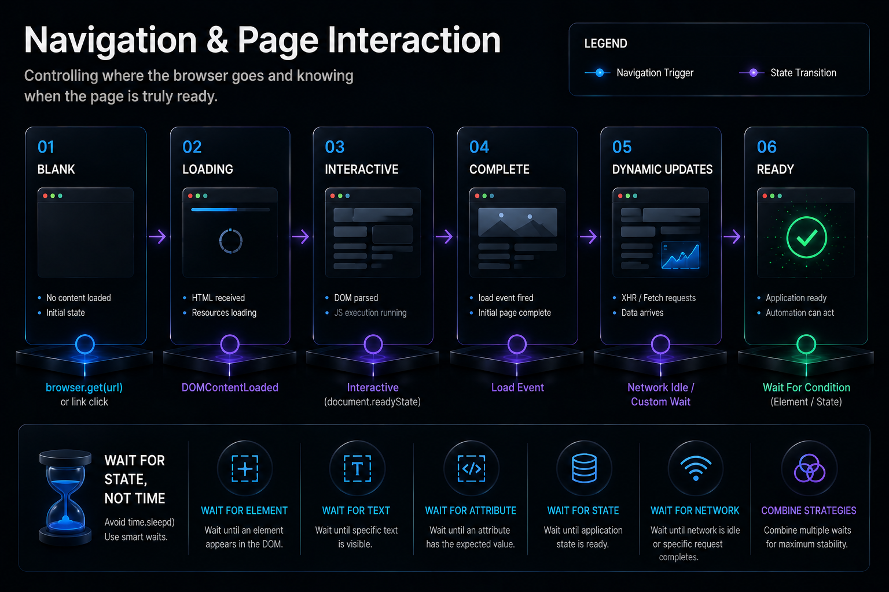

# Navigation and Page Interaction

## Controlling Where the Browser Goes and When It's Ready




## Previously

You learned that nodriver launches Chrome as a separate OS process, that the browser lifecycle is infrastructure, and that profiles are state containers with strict isolation rules.

Now we navigate the browser to pages and interact with the DOM — the layer where most automation bugs actually live.


## Why This Chapter Exists

Navigation and element interaction are the most common source of flaky automation — not because the concepts are hard, but because the timing is wrong. A page is not "loaded" when the browser fires the load event. It is loaded when the application state your automation depends on is present in the DOM.

This chapter teaches you to think about page readiness as a **distributed systems problem**, not a UI automation problem. The browser and the server are two independent systems. The browser fires events. The server sends responses. Your automation sits between them, observing signals and deciding when to act.


## The Cost of Getting This Wrong

| Failure Pattern | Root Cause | Cost |
|-----------------|-----------|------|
| `time.sleep(10)` works locally, fails on server | Network conditions differ between machines | Intermittent failures that cannot be reproduced |
| Page loads but data is missing | Single-page app loads shell HTML, then fetches data via XHR | Empty reports that look like valid results |
| Selector finds element, click does nothing | Event listener registered after DOM query | Hours debugging "why won't it click?" |
| Automation passes Monday, fails Tuesday | Timing coincidence — 10-second wait happens to work on fast days | Stochastic failures that erode trust in the system |


## Production Incident

```
Monday 07:00 — SaaS dashboard automation ran. Extracted 47 rows of KPI data.
07:05 — Report delivered. Everything normal.

Tuesday 07:00 — Automation ran. Extracted 0 rows.
07:05 — Report delivered showing "no data."
07:30 — Director reviews report. Sees nothing. Assumes system is down.
08:00 — Developer paged. Investigates.
08:15 — Checks selectors. They work. Runs manually. Data appears.
08:45 — Finds the real issue: the dashboard started lazy-loading 
         report data after the load event. The 10-second wait was a
         race condition that happened to work on fast days.

Fix: Replace time.sleep(10) with wait_for(".data-table.ready", timeout=15).
The wait returns as soon as the data appears — not before, not after.

Root cause: The developer waited for time instead of condition.
```

**Lesson:** Every `time.sleep()` in automation is a deferred production incident. Never wait for duration. Wait for state.


## The Navigation Decision Framework

Before you write any navigation code, decide which mechanism matches the interaction:

| Action | Mechanism | When To Use |
|--------|-----------|-------------|
| Click a button | `page.find()` + `element.click()` | UI-triggered navigation, form submission |
| Navigate to URL | `browser.get(url)` | Direct page change, reset state |
| Evaluate JavaScript | `page.evaluate(js)` | SPA transitions, state changes without page load |
| Observe CDP network | Monitor CDP events | Detect API calls without interacting with the DOM |

This decision prevents the most common error: clicking a link that triggers an SPA route change and waiting for a page load that never comes. If the URL does not change, `browser.get()` is wrong. If the DOM does not change, clicking is wrong.


## Mental Model — Page Readiness Is Not a Single Event

```text
browser.get(url)
    │
    ├── HTTP request sent
    ├── HTTP response received (DOM parsed)
    ├── load event fired
    ├── JavaScript executes (frameworks boot)
    ├── API calls complete (data arrives)
    ├── Components render (DOM updates)
    └── Application becomes usable ← automation should act here
```

Most tutorials wait for the load event. Production automation waits for the application to be usable — which can happen seconds after the load event, or never if an API fails silently.


### Navigation as a State Machine

A browser tab is a state machine. Every navigation transitions through states:

```text
[Blank] → browser.get(url) → [Loading]
    → HTTP response received → [DOM Interactive]
    → page resources loaded → [Complete]
    → SPA re-renders → [Dynamic Update]
    → user clicks link → [Loading] (again)
```

Key insight: `browser.back()` does not return to the previous state — it triggers a new navigation cycle. The tab transitions from whatever state it was in back to [Loading] for the previous URL. If the previous URL was an SPA, this may trigger a full re-render rather than restoring a cached state.


### State Transitions, Not Linear Flows

Senior engineers do not think "click → wait → done." They think in state transitions:

```text
[Landing Page] → click "Sign In" → [Login Form]
    → fill credentials → submit → [Authenticated Session]
    → navigate to dashboard → [Dashboard Loading]
    → API completes → [Dashboard Ready]
    → extract data → [Data Collected]
```

Each arrow is a state transition with preconditions. "Dashboard Ready" is not the same as "page loaded." It is the state after the API call completes and the React component re-renders. Framing interactions as state transitions forces you to identify the trigger (what changes the state), the signal (how you know it changed), and the timeout (how long you wait before assuming failure).


## Learning Objectives

1. Why `page.wait_for()` is superior to `time.sleep()` for every scenario
2. How to construct selectors that survive frontend refactors
3. The three phases of page readiness and how to observe each
4. How to handle pagination as a state machine (not a "next button" click)
5. How to debug interaction failures by tracing the signal path


## Recipe 5 — Navigation and Wait Strategies

**Tier: Full Production Depth**
**Stable ID:** NAVIGATION-STRATEGIES
**Prerequisites:** BROWSER-LAUNCH
**File:** `recipes/ch02/05_navigation.py`

### Problem

`await page.get(url)` returns when the browser fires the load event. But the application may not be ready until seconds later.

### Why This Recipe Exists

The gap between "page loaded" and "page usable" is where flaky automation is born. A dashboard that loads report data via XHR after the initial render will have its table populated 2-15 seconds after the load event. Scraping too early produces empty results. Waiting a fixed duration produces inconsistent behavior.

### The Readiness Hierarchy

```text
Level 1 — DOM exists         → element is in the HTML
Level 2 — Element is visible → not hidden by CSS or parent
Level 3 — Element is enabled → not disabled, readonly, or aria-hidden
Level 4 — Element has data   → contains text, option, or attribute
Level 5 — Data is correct    → validated against expected schema
```

Most `wait_for()` calls check Level 2 or 3. Production automation should check Level 4 or 5.

```python
import asyncio
from common.browser import launch_browser, close_browser


async def main():
    browser = await launch_browser()
    try:
        page = await browser.get("https://competitor.com/products")
        # Wait for Level 4 — a row to have data
        await page.wait_for(".product-row:nth-child(1) .price", timeout=15)
        price = await page.evaluate("document.querySelector('.price').textContent")
        print(f"Price: {price}")
    finally:
        await close_browser(browser)


if __name__ == "__main__":
    asyncio.run(main())
```

### Decision Table

| Wait Strategy | Use Case | Risk |
|-------------|----------|------|
| `time.sleep(N)` | Prototyping only | Fails when N is wrong |
| `page.wait_for(secs=N)` | Fixed delay | Over- or under-waits |
| `page.wait_for(selector, timeout=N)` | Element must exist | Element exists but is empty |
| `page.evaluate()` + polling | Custom condition | More code, but precise |

### Engineering Note

> Every `time.sleep()` in your codebase is a deferred production incident. Replace them systematically: one per sprint until zero remain. The only exception is a deliberate rate-limit pause, which should be calculated from the API's documented limit, not guessed.

### Production Rule

> Never wait for time. Wait for state.


## Recipe 6 — Page Navigation and Screenshots

**Tier: Medium Depth**
**Stable ID:** PAGE-NAVIGATION
**Prerequisites:** BROWSER-LAUNCH
**File:** `recipes/ch02/06_screenshots.py`

### Problem

Navigation is not just `browser.get()`. Back, forward, reload, and error pages each have distinct behavior. Screenshots are the most common diagnostic tool — and the most commonly misused.

### When to Screenshot

| Purpose | Format | Value |
|---------|--------|-------|
| Debugging selector issues | Full-page PNG | High |
| Visual regression testing | Pixel comparison | Medium — ads break diffs |
| Compliance evidence | PDF with timestamp | High |
| General "did it work?" | Not a screenshot — check data | Low — screenshot doesn't prove data correctness |

### Engineering Note

> Screenshots are evidence, not validation. A screenshot shows the page rendered. It does not show whether the extracted data is correct. Always validate the data. Use screenshots to debug validation failures.

### Production Rule

> Screenshots prove the page loaded. Data validation proves the automation worked. Do not confuse the two.


## Recipe 7 — JavaScript Execution

**Tier: Full Production Depth**
**Stable ID:** JS-EXECUTION
**Prerequisites:** NAVIGATION-STRATEGIES
**File:** `recipes/ch02/07_javascript.py`

### Problem

Some extraction targets are not accessible through the DOM — computed styles, data stored in JavaScript variables, or content rendered by WebGL/Canvas. nodriver exposes `page.evaluate()` to execute arbitrary JavaScript in the page context.

### Why This Matters

`page.evaluate()` is the escape hatch. When selectors fail, when Shadow DOM is closed, when data lives in a JavaScript closure — evaluate is the last resort. It is also the most dangerous: injected JavaScript runs with the page's permissions and can trigger side effects.

### Code Pattern

```python
async def get_network_requests(page) -> list:
    return await page.evaluate("""
    () => performance.getEntriesByType('resource')
              .map(e => ({ url: e.name, duration: e.duration }))
    """)
```

### Production Rule

> `page.evaluate()` is a powerful escape hatch. It is also a maintenance liability — inline JavaScript strings bypass linting, type checking, and version control review. Extract complex JS into separate files or helper functions.


## Recipe 8 — Browser State Persistence

**Tier: Medium Depth**
**Stable ID:** BROWSER-STATE
**Prerequisites:** PROFILE-ISOLATION
**File:** `recipes/ch02/08_browser_state.py`

### Problem

After navigating, the browser holds state: cookies, local storage, session storage, IndexedDB. This state may be needed for the next navigation or the next run.

### What to Persist

| State Type | Survives Tab Close? | Survives Browser Restart? | When to Persist |
|-----------|---------------------|--------------------------|-----------------|
| Cookies | Yes (session cookies = no) | Yes (with profile) | Auth tokens, session IDs |
| Local storage | Yes | Yes | App preferences, cached IDs |
| Session storage | No | No | Tab-scoped state |
| IndexedDB | Yes | Yes | Client-side databases |

### Production Rule

> Browser state is part of your automation's data. If you do not persist it intentionally, you lose it. If you persist everything, you accumulate technical debt. Decide per data type.


\newpage

## Common Mistakes

### [✗] Using time.sleep() for page readiness

A hardcoded wait is a promise that the page will be ready in exactly N seconds. This promise is always broken eventually.

**Fix:** Replace every `time.sleep()` with `page.wait_for(selector)` or a polling loop.

### [✗] Assuming the load event means the page is ready

Single-page applications load a shell HTML, then populate it with API data. The load event fires before the data arrives.

**Fix:** Wait for a data-bearing element, not the document ready state.

### [✗] Building selectors that depend on page structure

Selectors like `div:nth-child(3) > table > tr:nth-child(2)` break when the page adds a new section or changes the table layout.

**Fix:** Use data attributes (`[data-product-id]`), stable IDs, or text content patterns.

### [✗] Taking screenshots as proof of correctness

A screenshot shows the page rendered. It does not show whether `₹0` was stored instead of `₹89,999`.

**Fix:** Validate extracted data against expected ranges and types. Screenshots are for debugging, not validation.

### [✗] Blocking the event loop during navigation

Every `await page.get()` and `await page.evaluate()` blocks your asyncio event loop for the round-trip. If you have concurrent tabs, they wait.

**Fix:** Use `asyncio.gather()` for truly independent page interactions.

### [✗] Forgetting to handle the back/forward cache

Modern Chrome caches pages in the back/forward cache (bfcache). A page restored from bfcache does not fire a new load event — it fires a `pageshow` event instead.

**Fix:** Listen for `pageshow` if back/forward navigation is part of your flow.

### [✗] Using the wrong version of wait_for

`page.wait_for(5)` waits 5 seconds regardless of whether the condition is met. `page.wait_for(selector, timeout=5)` waits up to 5 seconds but returns as soon as the element appears.

**Fix:** Always use the selector-based overload when waiting for an element.


## Reflection Questions

1. Your automation extracts a table from a dashboard. It works 80% of the time. On slow days, the table is empty. You add `time.sleep(5)` and it improves to 95%. Is this a fix or a deferral? What would you do instead?

2. A selector like `.price` breaks after a frontend deployment. The price is still displayed on the page — its CSS class changed from `price` to `product-price`. How could you have designed the selector to survive this change?

3. Your automation navigates to a page, waits for the load event, and extracts data. The data is stale — still showing yesterday's values. What signal should you wait for instead of the load event?

4. Two automations share the same Chrome profile. One logs into a portal. The other navigates to a different page. After a few runs, both fail with session errors. What profile rule did they violate?

5. You need to extract data from a page that loads content 60 seconds after the initial render. The delay is inconsistent (30-90 seconds). How would you implement this wait without using a 90-second timeout?


## Production Checklist

- [ ] Every `time.sleep()` has a documented reason or has been removed
- [ ] Page readiness waits target a data-bearing element, not the load event
- [ ] Selectors use stable attributes (data-*) over structural selectors
- [ ] Screenshots are stored per-run for debugging, not treated as validation
- [ ] JavaScript in `evaluate()` calls is extracted to helper functions
- [ ] Back/forward cache behavior is tested if using browser navigation
- [ ] Concurrent tab operations use `asyncio.gather()` not sequential awaits
- [ ] Navigation timeout is configurable, not hardcoded
- [ ] Error pages (404, 500, timeout) are detected and logged distinctly


## Tradeoffs

| Decision | Benefit | Cost |
|----------|---------|------|
| Short timeout + retry | Fast failure detection | May miss slow pages |
| Long timeout | Catches slow pages | Delays failure detection |
| CSS class selector | Simple, fast | Breaks on class rename |
| Data attribute selector | Survives refactors | Requires dev coordination |
| Screenshot-based validation | Visual proof | Doesn't check data correctness |
| Data-based validation | Ensures correctness | More code per recipe |


## Chapter Connections

- **Depends on:** BROWSER-LAUNCH, PROFILE-ISOLATION
- **Uses:** `common/browser.py`, `common/timeouts.py`
- **Produces:** NAVIGATION-STRATEGIES, PAGE-NAVIGATION, JS-EXECUTION, BROWSER-STATE
- **Leads to:** Chapter 3 (Reliability Patterns), Chapter 4 (Element Selection)


## Chapter Summary

Navigation and interaction failures are timing failures until proven otherwise. Replace every fixed wait with a state-based condition. Selectors should survive frontend refactors — prefer data attributes and stable text patterns over structural selectors. JavaScript execution is an escape hatch, not a primary tool. And screenshots document the page; they do not validate the data.


## Engineering Review

### Things You Now Understand
- Page readiness is multi-phase: HTTP response, load event, framework boot, API data, component render
- Every `time.sleep()` is a deferred production incident — wait for state, not time
- Navigation is a state machine with transitions: loading → interactive → complete → dynamic update
- Screenshots are evidence, not validation
- JavaScript execution via `evaluate()` is an escape hatch with maintenance cost

### Common Mistakes
- [✗] Using `time.sleep()` for page readiness — fails when network conditions change
- [✗] Assuming the load event means the page is ready — SPA data loads after
- [✗] Using structural selectors that depend on element position — break on layout changes
- [✗] Taking screenshots as proof of correctness — show the page, not the data

### Senior Takeaways
- A page that loads but shows no data is a navigation failure, not an extraction failure
- The Navigation Decision Framework prevents the most common SPA automation error
- `browser.back()` triggers a new navigation cycle — it does not restore cached state

### Architecture Questions
1. Your automation navigates to a page that loads data via two sequential API calls. Which state signal should you wait for?
2. A page works locally but times out in production. The timeout is 30 seconds. Do you increase it to 60, or investigate the cause?
3. An SPA page changes the URL without triggering a full page load. Does `browser.get()` still work? What alternative would you use?

**Next: Chapter 3 — Reliability & Failure Recovery**

Where we move from "does the automation work?" to "what happens when it fails?"
