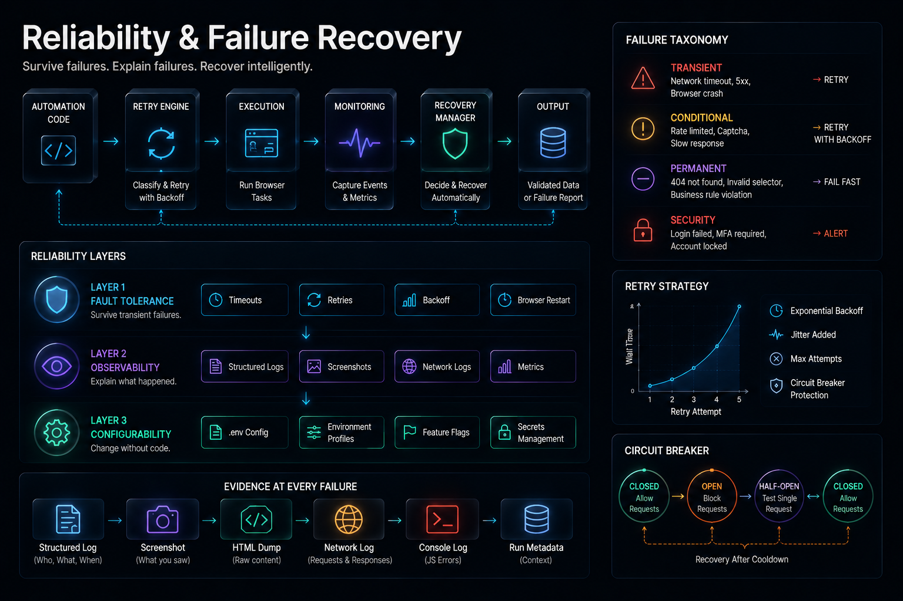

# Reliability & Failure Recovery

## Automations That Explain Themselves When They Break




## Previously

You learned that page readiness is a multi-phase signal and that every `time.sleep()` is a deferred production incident. You now wait for state, not time.

Now we add the layer that separates scripts from systems: reliability. An automation that fails silently is indistinguishable from one that never ran.


## Why This Chapter Exists

A production automation will fail. Not "might fail" — will fail. The browser will crash. The network will timeout. The website will change. The question that defines engineering quality is not "did it fail?" but "what happens next?"

This chapter builds the three pillars of nodriver automation reliability:
1. **Retry with taxonomy** — not all failures should be retried the same way
2. **Logging with context** — enough information to diagnose without rerunning
3. **Configuration management** — environment-specific settings with nodriver's `common/config.py` without code changes


## The Cost of Getting This Wrong

| Mistake | Outcome | Cost |
|---------|---------|------|
| Retrying all failures the same way | Permanent failures retried until timeout, masking root cause | Hours of delayed diagnosis, wasted API quota |
| Using `print()` for logging | At 3 AM, no timestamps, no levels, no context | Cannot diagnose without reproducing the failure |
| Hardcoding environment values | Each deployment requires editing code | Merge conflicts, deployment errors, config drift |
| No correlation IDs per run | Logs from different runs indistinguishable | Cannot tell which run produced which error |
| Infinite retry loop | Amplifies load on already-struggling server | Can cause cascading outages |


## Production Incident

```
Day 1-540 — Fintech reconciliation automation runs nightly. Pulls transaction 
             data from banking portal. Compares to internal records. 
             Flags discrepancies. Runs for 18 months without incident.

Day 541 — Automation reports zero discrepancies. Finance team signs off.
          Nobody questions a perfect run.

Day 583 — Audit reveals $340,000 in unreconciled transactions.
          Investigation begins.

Day 584 — Root cause found: the bank's portal started returning cached 
          pages after the first failed attempt. The retry decorator caught 
          every exception, logged "Retry 3/3 — succeeded," and returned 
          stale data. Every technical metric showed green. The business 
          outcome was catastrophic.

Fix: Add data quality validation after retry. Compare response checksum 
against expected format. If all records fail validation, stop and alert — 
don't report success.
```

**Lesson:** A retry that succeeds with bad data is worse than a retry that fails. Classify failures before retrying. Validate the output, not just the process.


## Retry Budgets

Every retry consumes resources: time, API quota, server capacity, and — in the case of login retries — account lockout risk. A retry budget caps how many retries a system is allowed within a time window.

```text
Window: 1 hour
Budget: 10 retries
Each retry consumes 1 unit.

 08:00 — 3 retries (network timeout)  → budget remaining: 7
 08:30 — 2 retries (timeout)          → budget remaining: 5
 09:00 — 5 retries (selector missing) → budget exhausted → alerts escalate
```

When the budget is exhausted, the system stops retrying and alerts a human. This prevents a cascading failure where retries amplify the load on an already-struggling server.

### Circuit Breakers

A circuit breaker prevents retries from reaching a system that is already failing. It has three states:

```text
CLOSED  → normal operation, requests pass through
OPEN    → failures exceed threshold, requests blocked immediately
HALF-OPEN → test request to see if the service recovered
```

In browser automation, a circuit breaker applies at the target level. If a website returns 5xx errors for 10 consecutive requests, the circuit opens. No further requests are sent for a cooldown period. After the cooldown, a test request determines whether to close the circuit (resume) or keep it open (escalate).

Implementing a circuit breaker does not require a library — it requires a counter with a threshold and a timer. The concept is more important than the code.

### Failure Cost Matrix

Every retry decision has a cost. This matrix helps you choose:

| Failure | If You Retry | If You Don't Retry |
|---------|-------------|-------------------|
| Network timeout | Success after 1-2 retries | Lost data for that run |
| Browser crash | Success after restart | Missed schedule, manual re-run |
| Login failure | Account locked after 3+ retries | Manual login required |
| Selector missing | Infinite loop — always fails | Alert raised, human investigates |
| Empty data page | Retry returns same empty data | Validation catches it, alert fires |
| Rate limit hit | IP blocked after repeated retries | Backoff succeeds after cooldown |


## Mental Model — The Three Reliability Layers

```text
Layer 1 — Fault Tolerance
    │   Survive transient failures (timeout, crash, network)
    │   Implement: retry with backoff, timeout, browser restart
    ▼

Layer 2 — Observability
    │   Explain what happened (logs, metrics, screenshots)
    │   Implement: structured logging, run timestamps, output hashes
    ▼

Layer 3 — Configurability
    │   Change behavior without changing code
    │   Implement: .env, config module, environment profiles
```

Most scripts stop at Layer 1. Production systems require all three.


## Learning Objectives

1. How to classify failures and apply the correct retry strategy for each type
2. How structured logging preserves evidence without manual annotation
3. How to build configuration that works across dev, staging, and production without edits
4. How to distinguish between an automation bug and an environmental failure


## Recipe 9 — Wait for Elements Correctly

**Tier: Full Production Depth**
**Stable ID:** WAIT-STRATEGIES
**Prerequisites:** NAVIGATION-STRATEGIES
**File:** `recipes/ch03/09_wait_for_elements.py`

### Problem

Waiting for a specific duration is a guess. Waiting for a condition is engineering.

### Why This Recipe Exists

Every flaky automation has one thing in common: it assumes the universe is consistent. "The table loads in 3 seconds." "The button appears after 2 seconds." These assumptions are false — network conditions change, servers get slow, JavaScript frameworks evolve.

```python
import asyncio
from common.browser import launch_browser, close_browser


async def main():
    browser = await launch_browser()
    try:
        page = await browser.get("https://example.com/products")
        # Wait for up to 15 seconds, return as soon as element is visible
        await page.wait_for(".product-table", timeout=15)
        rows = await page.evaluate("""
            document.querySelectorAll('.product-row').length
        """)
        print(f"Found {rows} products")
    finally:
        await close_browser(browser)


if __name__ == "__main__":
    asyncio.run(main())
```

### Engineering Note

> A wait with a timeout is a contract: "I expect this condition to be true within N seconds." If the timeout expires, treat it as a distinct failure class — not a generic exception. Log the condition that wasn't met, the timeout, and the page state at expiry.

### Production Rule

> Every wait is a hypothesis: "this element will exist within this timeframe." Timeout expiration falsifies the hypothesis — investigate why, not just extend the timeout.


## Recipe 10 — Retry Failures Intelligently

**Tier: Full Production Depth**
**Stable ID:** RETRY-TAXONOMY
**Prerequisites:** WAIT-STRATEGIES
**File:** `recipes/ch03/10_retry_failures.py`

### Problem

Retry blindly makes things worse. A selector that changed will never work on retry. A network timeout might. The retry strategy must match the failure class.

### The Failure Taxonomy

| Failure Class | Example | Should Retry? | Strategy |
|--------------|---------|---------------|----------|
| Transient | Network timeout, DNS failure | Yes | Exponential backoff, 3 attempts |
| Recoverable | Browser crash, session expired | Yes | Full restart, then retry |
| Permanent | Selector not found, page 404 | No | Log and escalate |
| Data quality | Empty table, zero prices | No | Stop and alert |

```python
import asyncio
from common.retry import retry
from common.browser import launch_browser, close_browser


@retry(max_attempts=3, delay=2, backoff=2.0)
async def fetch_prices(url: str) -> list:
    browser = await launch_browser()
    try:
        page = await browser.get(url)
        prices = await page.evaluate("""
            Array.from(document.querySelectorAll('.price'))
                 .map(el => el.textContent.trim())
        """)
        if not prices:
            raise ValueError("No prices found — possible extraction failure")
        return prices
    finally:
        await close_browser(browser)


async def main():
    prices = await fetch_prices("https://competitor.com/products")
    print(f"Fetched {len(prices)} prices")


if __name__ == "__main__":
    asyncio.run(main())
```

### Engineering Note

> The `@retry` decorator in `common/retry.py` implements exponential backoff with jitter. Do not write your own retry loop. Every custom retry loop eventually has a bug that causes infinite retries or zero retries.

### Production Rule

> Never retry a permanent failure. It will fail N times instead of once, each time consuming resources and delaying the alert.


## Recipe 11 — Structured Logging

**Tier: Full Production Depth**
**Stable ID:** LOGGING-SYSTEM
**Prerequisites:** None
**File:** `recipes/ch03/11_logging.py`

### Problem

`print()` statements are not logging. When an automation fails at 3 AM, the operator needs to know: what was the URL, what was the error, how long did it take, what was the page state — not just "error: something went wrong."

### Why This Recipe Exists

```python
# Bad — tells you nothing
print("Error occurred")
```

```python
# Good — tells you what, where, and context
logger.error("Extraction failed", extra={
    "url": url,
    "selector": ".price",
    "duration_s": 42.3,
    "page_title": page_title,
})
```

`common/logging.py` provides structured logging with timestamps, levels, and correlation IDs:

```python
from common.logging import logger

logger.info("Navigation complete", extra={"url": url, "status": status})
logger.warning("Slow page load", extra={"duration_s": duration})
logger.error("Extraction failed", extra={"selector": selector, "error": str(e)})
```

### Production Rule

> Every log line should answer: what happened, when, where (URL/selector), and how long did it take. If a log cannot answer these, it is noise.


## Recipe 12 — Configuration Management

**Tier: Full Production Depth**
**Stable ID:** CONFIGURATION-MANAGEMENT
**Prerequisites:** None
**File:** `recipes/ch03/12_configuration.py`

### Problem

Hardcoded URLs, credentials, timeouts, and selectors make automation brittle. A deployment to a different environment requires editing code — the opposite of reliable engineering.

### The Configuration Hierarchy

```text
Environment variables (.env)     ← secrets, environment-specific
  ↓
Configuration file (config.yaml) ← per-environment defaults
  ↓
Code defaults                    ← fallback values
```

`common/config.py` implements this hierarchy:

```python
from common.config import config

url = config.get("TARGET_URL", default="https://default.example.com")
timeout = config.getint("NAVIGATION_TIMEOUT", default=30)
```

### Production Rule

> Code should be identical across environments. Only configuration changes. If you edit code to deploy, your deployment process is wrong.


\newpage

## Common Mistakes

### [✗] Retrying permanent failures

A selector that changed will never work on retry. Each retry wastes time, delays the alert, and consumes API quota.

**Fix:** Classify failures before retrying. Use the taxonomy in Recipe 10.

### [✗] Using `print()` for production logging

`print()` has no timestamps, no log levels, no structured output. When something breaks at 3 AM, `print()` output is indistinguishable from noise.

**Fix:** Use `common/logging.py` with level, timestamp, and structured context.

### [✗] Hardcoding environment-specific values

A URL hardcoded as `https://dev.portal.com` will fail when deployed to production. The developer who deploys must edit the code — which creates a diff, which creates merge risk.

**Fix:** Use environment variables and `common/config.py`. URL belongs in `.env`, not in Python.

### [✗] Not logging the page state on failure

When an automation fails, the most valuable diagnostic is: what was on the page? Without a screenshot, HTML dump, and console log at failure time, debugging requires reproducing — which may not be possible.

**Fix:** Capture screenshot, HTML, and console output in the exception handler.

### [✗] Infinite retry loops

`while True: try: ... except: pass` never stops retrying. A production failure triggers infinite retries, consuming resources and preventing alerting.

**Fix:** Always cap retries at 3-5 attempts. Use `common/retry.py` which enforces this.

### [✗] Configuring timeouts too tightly

A 5-second navigation timeout may work on your laptop but fail on a slow VPS. The failure looks like a bug but is actually a configuration mismatch.

**Fix:** Make timeout configurable per environment. Default generous, tighten in production.

### [✗] Not adding correlation IDs to logs

Without a run ID, logs from different runs are indistinguishable. Correlating a failure with the specific automation run requires manual timestamp matching.

**Fix:** Generate a UUID per run and include it in every log line.


## Reflection Questions

1. Your automation retries a failed login 10 times. On the 11th attempt, it triggers an account lockout. What failure class does a login failure belong to? Should it be retried at all?

2. A network timeout occurs on 1% of runs. You add retry with exponential backoff. The failure rate drops to 0.1%. Is the system more reliable, or are you masking a symptom?

3. You deploy your automation to a client's server. The client has a different Chrome version, different screen resolution, and different network latency. Which configuration values should be in `.env` and which should be in code?

4. An automation runs for 6 months without issue. Then it fails. The logs show "Error occurred" at line 42. No URL, no error type, no page state. How would you redesign the logging to make this failure diagnosable without reproducing?

5. Your monitoring dashboard shows 99.9% success rate. But the business reports that data has been wrong for a week. What failure class is not captured by your current retry and logging strategy?


## Production Checklist

- [ ] Failure taxonomy is documented and implemented (transient vs permanent)
- [ ] Retries use exponential backoff with jitter (not fixed delays)
- [ ] Retry count is capped (3-5 max) with escalation on exhaustion
- [ ] Every log line includes: timestamp, level, message, and context (URL, duration)
- [ ] Screenshot + HTML are captured on any failure
- [ ] Configuration is externalized to environment variables
- [ ] `.env.example` documents every required setting
- [ ] Correlation ID (run UUID) is generated per run
- [ ] No hardcoded URLs, credentials, or timeouts remain in recipe code


## Tradeoffs

| Decision | Benefit | Cost |
|----------|---------|------|
| Retry all failures | Simple implementation | Masks permanent failures |
| Classify before retry | Correct behavior per type | More code, taxonomy design |
| Console logging | Zero configuration | Useless for diagnosis |
| Structured logging | Diagnosable at 3 AM | Requires log aggregation |
| Config in code | Fast to write | Requires code change per env |
| Config in env vars | Deploy without changes | More setup per environment |


## Chapter Connections

- **Depends on:** BROWSER-LAUNCH, NAVIGATION-STRATEGIES
- **Uses:** `common/retry.py` (RETRY-TAXONOMY), `common/logging.py` (LOGGING-SYSTEM), `common/config.py` (CONFIGURATION-MANAGEMENT)
- **Produces:** WAIT-STRATEGIES, RETRY-TAXONOMY, LOGGING-SYSTEM, CONFIGURATION-MANAGEMENT
- **Leads to:** Chapter 4 (Element Selection), Chapter 5 (Authentication)


## Chapter Summary

Reliability is not about preventing failures — it is about surviving them correctly. Classify every failure as transient, recoverable, permanent, or data quality. Retry only the first two. Log enough context to diagnose without reproducing. Externalize configuration so that deploying to a new environment never requires editing code. A system that cannot explain its failures is not production-ready.


## Engineering Review

### Things You Now Understand
- A production automation will fail — the engineering question is "what happens next?"
- Retries must be classified: transient failures should be retried, permanent failures should not
- Every retry consumes budget — retry budgets prevent cascading failures
- Circuit breakers prevent retries from reaching a failing system
- Structured logging with correlation IDs makes 3 AM diagnosis possible
- Configuration belongs in environment variables, not in code

### Common Mistakes
- [✗] Retrying permanent failures — wastes time, delays the alert
- [✗] Using `print()` for production logging — no timestamps, no levels
- [✗] Hardcoding environment-specific values — requires code changes to deploy
- [✗] Infinite retry loops — `while True: try: except: pass` never stops
- [✗] Not logging page state on failure — no evidence to diagnose

### Senior Takeaways
- A retry that succeeds with bad data is worse than a retry that fails
- Exhausting the retry budget is a signal, not an emergency
- The circuit breaker pattern applies at the target level, not the automation level

### Architecture Questions
1. Your automation retries a login 5 times and the account is locked. Should the retry count be lower, or should login not be retried at all?
2. A network timeout occurs on 1% of runs. You add retry with backoff. The failure rate drops to 0.1%. Is this a fix or a mask?
3. You deploy the same automation to 3 clients. Each has different URLs and credentials. Where do these values live?

**Next: Chapter 4 — Element Selection and Form Interaction**

Where we move from general reliability to the specific challenge of finding and interacting with DOM elements reliably.
