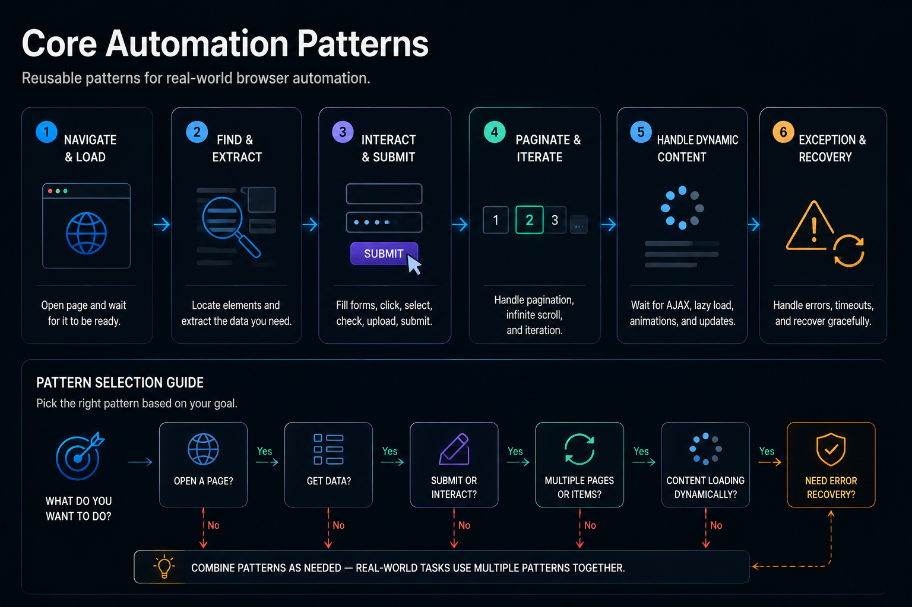

# Element Selection and Form Interaction

## Finding the Right Element and Proving You Did




## Previously

You built the reliability layer — failure taxonomy, structured logging, and configuration management. Your automation now distinguishes between transient and permanent failures and logs enough context to diagnose without reproducing.

Now we return to the DOM, but with a different question: not "how do I select an element," but "how do I select the *right* element and prove I did?"


## Why This Chapter Exists

Element selection is the most-written-about topic in browser automation. Most tutorials stop at "use CSS selectors." This chapter exists because *which* selector you choose determines whether your automation works for six days or six months.

The DOM is not stable. Frontend frameworks regenerate it on every state change. CSS classes are renamed during refactors. Elements appear and disappear based on authentication state, A/B tests, and user permissions.


## The Cost of Getting This Wrong

| Mistake | Outcome | Cost |
|---------|---------|------|
| Using structural selectors (`nth-child`) | Breaks when any element before the target is added or removed | Every frontend deployment breaks the automation |
| Clicking without verifying the result | Click lands on invisible overlay or disabled button | Automation reports success, nothing actually happened |
| Filling forms without triggering change events | React/Vue never registers the input value | Form appears filled but submits empty fields |
| Assuming `wait_for()` means interactable | Element visible but covered by modal or disabled | Intermittent "element not interactable" errors |
| No fallback selector chain | Single selector is single point of failure | A frontend class rename stops all extraction |


## Production Incident

```
Day 1 — Logistics automation deployed. Extracts shipment status from 
         carrier tracking portal. Uses selector: 
         table tr:nth-child(3) td:nth-child(2). Works perfectly.

Day 365 — Carrier redesigns tracking page. Status information is still 
          present on the page — but the table now has a header row. 
          Every row index shifted by one.

Day 366 — Automation extracts "Origin Warehouse" instead of "In Transit" 
          for every shipment. No error raised. No alert fired.
          Operations team makes routing decisions based on wrong data.

Day 369 — A manual audit catches the discrepancy. Three days of 
          misrouted shipments. Fix: one line change from structural 
          selector to [data-track="status"].

Root cause: The selector referenced where the element sat, not what it was.
```

**Lesson:** A selector that references layout position will break when the layout changes. Data attributes survive frontend refactors. Structural selectors do not.


## The Evolution of the DOM

Understanding why selectors break requires understanding how the DOM evolved:

```text
2010 — Static HTML       Server-rendered pages. Elements had stable IDs.
                         $("#product-123") worked for years.

2015 — jQuery + AJAX     Pages updated dynamically. IDs still stable,
                         but content appeared and disappeared.

2020 — React + Vue       Frameworks regenerate the DOM on every state
                         change. CSS classes become build artifacts
                         (Product_abc123). IDs may be auto-generated.

2026 — SSR + Hydration   Initial HTML from server, then React hydrates.
                         DOM may exist before the component is interactive.
                         Streaming UI sends content in chunks.
```

A selector that works on a static HTML page fails on a React app because the DOM is not the source of truth — it is a rendering of application state. The selector targets the shadow, not the substance. This chapter teaches you to target the substance.


## Engineering Analysis

A logistics automation extracted shipment status from a carrier's tracking portal. The selector was: `table tr:nth-child(3) td:nth-child(2)`. It worked for a year.

The carrier redesigned their tracking page. The status information was still there — but the table now had a header row. Every row index shifted by one. The automation extracted "Origin Warehouse" instead of "In Transit" for every shipment. The operations team made routing decisions based on wrong data for three days.

The fix was a single change: from structural selector to `[data-track="status"]`. But that required finding the bug first — which took three days because the automation reported success.

**Lesson:** Structural selectors (nth-child, first-of-type) are tied to visual layout, not data identity. Use selectors that reference what the element *is*, not where it *sits*.


## Mental Model — The Selector Hierarchy

```text
Selector Stability
    │
    ┌── Data attribute    [data-id="sku-123"]  ← most stable
    │   ID                #search-box
    │   Text anchor       button:has-text("Submit")
    │   Attribute         [aria-label="Close"]
    │   Class             .price-value
    │   Tag + class       div.product-card
    └── Structural        div:nth-child(3)     ← least stable
```

Selectors higher in this hierarchy survive frontend changes. Selectors lower in this hierarchy break when the visual layout changes. Choose the highest stable selector that uniquely identifies the element.


## Learning Objectives

1. How to evaluate selector stability and choose the right strategy for each element
2. How to interact with forms — fills, clicks, uploads, dropdowns — without race conditions
3. How to handle dialogs, alerts, and popups that interrupt automation flow
4. How to verify that an interaction succeeded by checking application state, not DOM state


## Recipe 13 — Find Elements Reliably

**Tier: Full Production Depth**
**Stable ID:** SELECTOR-STRATEGY
**Prerequisites:** WAIT-STRATEGIES
**File:** `recipes/ch04/13_find_elements.py`

### Problem

`find_element(By.CSS_SELECTOR, ".price")` works until the class changes. The information is still on the page. The selector just can't find it.

### Why This Recipe Exists

Selector fragility is the #1 maintenance burden in production browser automation. Every frontend deployment is a risk that selectors will break. This recipe teaches you to design selectors that survive refactors.


### Selector Lifetime

Selectors have a predictable lifespan based on what they reference:

```text
day 1                        day 90                       day 365
├────────────────────────────┼────────────────────────────┤
XPath / structural           │                            │
  nth-child(3)               ████████ dies first
                             │                            │
CSS class                    │                            │
  .price-value               ████████████████ may be renamed
                             │                            │
Data attribute               │                            │
  [data-product-id]          ██████████████████████████████ survives refactors
                             │                            │
Text content                 │                            │
  :has-text("Add to cart")   ██████████████████████████████ survives if unique
```

Data attributes and text-anchored selectors outlive structural and class-based selectors because they reference what the element *is*, not how it is *styled* or where it *sits*.


### The Selector Decision Tree

```text
Element has a stable data attribute?     → [data-id="..."]
Element has a stable ID?                 → #element-id
Element has visible text?                → see Recipe 14
Element has a unique aria label?         → [aria-label="..."]
None of the above?                       → compound selector combining tag + class + position (document fragility risk)
```

```python
from common.selectors import by_data, by_text


async def extract_product(page, sku: str):
    # Most stable: data attribute
    price_el = await page.find(by_data("product-id", sku))
    # Fallback: visible text anchor
    name_el = await page.find(by_text("Laptop"))
    return price_el, name_el
```

### Engineering Note

> Data attributes like `[data-product-id]` are the most stable selector target because they are explicitly designed as machine-readable anchors. Class names and element positions are visual concerns. If the frontend team adds a data attribute, it's because they want automation to find that element.

### Production Rule

> The most reliable selector is the one that references what the element is, not where it sits in the visual layout.


## Recipe 14 — Click Elements Without Race Conditions

**Tier: Full Production Depth**
**Stable ID:** CLICK-STRATEGY
**Prerequisites:** SELECTOR-STRATEGY
**File:** `recipes/ch04/14_click_elements.py`

### Problem

A click is not a single event. It is a sequence: element must exist, be visible, be enabled, receive the click event, trigger the handler, and produce a state change. Any step can fail independently.

### The Click Contract

```text
Element exists in DOM     → wait_for(selector)
Element is visible        → wait_for(selector), verify display != none
Element is enabled        → verify !disabled, !aria-hidden
Click event dispatched    → page.evaluate with dispatchEvent
Application state changes → verify downstream condition
```

```python
async def safe_click(page, selector: str):
    await page.wait_for(selector, timeout=10)
    await page.evaluate(f"""
        document.querySelector('{selector}').scrollIntoView()
    """)
    await page.evaluate(f"""
        document.querySelector('{selector}').click()
    """)
    # Always verify the click had an effect
    await page.wait_for(".confirmation", timeout=5)
```

### Production Rule

> A click is not complete when the mouse button is pressed. It is complete when the application state has changed. Verify the result, not the action.


## Recipe 15 — Fill Forms Reliably

**Tier: Full Production Depth**
**Stable ID:** FORM-INTERACTION
**Prerequisites:** CLICK-STRATEGY
**File:** `recipes/ch04/15_fill_forms.py`

### Problem

Form fields may appear interactive but reject input due to JavaScript validation, framework state, or missing focus events. Simply setting `value` on an input field does not trigger the application's change detection.

### The Form Lifecycle

```text
Focus input          → triggers focus event
Clear existing value → triggers input event
Type new value       → triggers input + change events
Blur                → triggers blur event
Enable submit       → framework-level validation
```

```python
async def fill_field(page, selector: str, value: str):
    el = await page.find(selector)
    await el.focus()
    await el.clear()
    await el.send_keys(value)
    await el.send_keys("Tab")  # Trigger blur
```

### Engineering Note

> Many modern frameworks (React, Vue, Angular) ignore the native `input` event and listen for React's synthetic `change` event. Simply setting `element.value` via JavaScript will not trigger the framework's state update. Use nodriver's `send_keys` method, which dispatches the correct events.

### Production Rule

> After filling a form field, verify that the value was accepted. Read it back from the DOM and compare to the expected value. A form field that shows "empty" after fill is a validation or framework issue.


## Recipe 16 — File Uploads

**Tier: Medium Depth**
**Stable ID:** FILE-UPLOAD
**Prerequisites:** None
**File:** `recipes/ch04/16_upload_files.py`

### Problem

File upload dialogs are OS-level windows that nodriver cannot interact with directly. The standard approach is to set the file input's value via CDP.

```python
async def upload_file(page, selector: str, file_path: str):
    """Set file input value via CDP — bypasses the OS file dialog."""
    await page.evaluate(f"""
        document.querySelector('{selector}').style.display = 'block'
    """)
    el = await page.find(selector)
    await el.send_keys(file_path)
```

### Production Rule

> File uploads via input elements are reliable. File uploads via drag-and-drop zones are not. If the application supports both, automate the input element path.


## Recipe 17 — Select Dropdown Options

**Tier: Medium Depth**
**Stable ID:** DROPDOWN-SELECTION
**Prerequisites:** None
**File:** `recipes/ch04/17_select_dropdown.py`

```python
async def select_option(page, selector: str, value: str):
    """Select dropdown by option value."""
    await page.evaluate(f"""
        document.querySelector('{selector}').value = '{value}'
    """)
```

### Production Rule

> Dropdowns built with `<select>` are reliable. Dropdowns built with custom JavaScript components (autocomplete, combobox) require clicking through the menu — test these manually first.


## Recipe 18 — Dialogs, Alerts, and Popups

**Tier: Medium Depth**
**Stable ID:** DIALOG-HANDLING
**Prerequisites:** None
**File:** `recipes/ch04/18_dialogs_popups.py`

### Problem

JavaScript alerts, confirm dialogs, and modal popups block automation execution until dismissed. nodriver can auto-accept or auto-dismiss them, but the correct action depends on the dialog type.

```python
async def handle_dialog(page, accept: bool = True):
    """Auto-accept or dismiss the next dialog."""
    if accept:
        await page.evaluate("window.alert = () => {}")
    else:
        await page.evaluate("window.confirm = () => false")
```

### Production Rule

> Auto-accepting all dialogs hides bugs. Auto-dismissing all dialogs breaks workflows that require confirmation. Handle dialogs by type — log unexpected dialogs as warnings because they often indicate a page error disguised as a user prompt.


\newpage

## Common Mistakes

### [X] Using structural selectors (nth-child)

Structural selectors break when the DOM surrounding the target element changes — exactly what happens during frontend refactors.

**Fix:** Use data attributes, IDs, or text-anchored selectors.

### [X] Clicking without verifying the result

Automation clicks a button and assumes the action completed. The click landed on an invisible overlay, the button was disabled, or the JavaScript handler threw an exception.

**Fix:** Always verify a downstream state change — a new element, a removed element, a URL change, or a success message.

### [X] Filling forms without triggering change events

Setting `el.value = "text"` via JavaScript does not trigger React's change detection. The field shows the text, but the application does not register it.

**Fix:** Use `send_keys()` or dispatch the `input` and `change` events programmatically.

### [X] Assuming a visible element is interactable

An element can be visible but covered by an overlay, disabled, or hidden behind a z-index issue. `wait_for()` only checks DOM presence and visibility.

**Fix:** Scroll the element into view and verify it is not covered by another element.

### [X] Uploading files via the OS dialog

Automation frameworks cannot control OS file dialogs. Attempting to do so produces a race condition between the browser and the OS.

**Fix:** Always set the file input's value programmatically via CDP.

### [X] Hardcoding selectors without fallbacks

A single selector is a single point of failure. If it breaks, the entire recipe stops producing data before validation catches it.

**Fix:** Implement a fallback chain: try `[data-id]`, then `[aria-label]`, then `.class-name`. Log which strategy succeeded.

### [X] Ignoring shadow DOM boundaries

Custom web components often encapsulate their internals in Shadow DOM. Standard selectors cannot reach inside a shadow root.

**Fix:** Use `page.evaluate()` with `element.shadowRoot.querySelector()` to pierce shadow boundaries.


## Reflection Questions

1. A selector `div.card:nth-child(3) .price` worked for six months. After a frontend update, it extracts prices from the wrong product. The HTML structure changed but the data attributes did not. What selector should you have used on day one?

2. Your automation clicks a "Submit" button. The button visibly depresses and the click event fires. But the form does not submit. What three things could be wrong that have nothing to do with the click itself?

3. A form field accepts text visibly but rejects it on the server. The server logs show "empty field." What client-side event did the automation not trigger?

4. Your automation encounters a modal popup that appears randomly. The popup blocks all further interaction. How would you detect and dismiss it without knowing when it appears?

5. A file upload via CDP works in development but fails in production. The production server requires a different file format. Where in the automation pipeline should format validation live?


## Production Checklist

- [ ] Every selector has a rationale documented ("why this selector, not an alternative")
- [ ] Structural selectors (nth-child) are replaced with data-attribute or text-anchored alternatives
- [ ] Every click is followed by a verification of the resulting state change
- [ ] Form fills verify the value was accepted (read back from DOM after input)
- [ ] File uploads use CDP input manipulation, not OS-level dialog interaction
- [ ] Dialogs are handled by type (alert vs confirm vs unexpected)
- [ ] Shadow DOM boundaries are identified and handled per component
- [ ] Selector fallback chains are implemented for critical extractions


## Tradeoffs

| Decision | Benefit | Cost |
|----------|---------|------|
| Data attribute selector | Survives layout changes | Requires frontend coordination |
| Structural selector | No coordination needed | Breaks on layout change |
| Single selector | Simple, fast | Single point of failure |
| Fallback chain | Resilient | More code, logged warnings |
| verify-after-click | Catches silent failures | Extra round-trip per click |


## Chapter Connections

- **Depends on:** WAIT-STRATEGIES, NAVIGATION-STRATEGIES
- **Uses:** `common/selectors.py` (SELECTOR-STRATEGY), `common/timeouts.py`
- **Produces:** SELECTOR-STRATEGY, CLICK-STRATEGY, FORM-INTERACTION, FILE-UPLOAD, DROPDOWN-SELECTION, DIALOG-HANDLING
- **Leads to:** Chapter 5 (Authentication & Sessions), Chapter 6 (Data Extraction)


## Chapter Summary

Selectors fail when they reference the wrong thing: visual position instead of data identity. Choose selectors from the top of the stability hierarchy — data attributes first, structural selectors never. Every interaction must be verified by checking the resulting application state, not the DOM state. A click that does not change the application state is not a click at all — it is noise.


## Engineering Review

### Things You Now Understand
- The DOM is not stable — frontend frameworks regenerate it on every state change
- Selectors have predictable lifetimes: data attributes > text anchors > classes > structural
- Every click must be verified by checking the resulting application state
- Form interactions must trigger the correct JavaScript events for the framework
- Dialogs, alerts, and popups must be handled by type, not auto-accepted

### Common Mistakes
- [X] Using structural selectors (`nth-child`) — break on any layout change
- [X] Clicking without verifying the result — click lands on disabled or invisible element
- [X] Filling forms without triggering change events — React never registers the value
- [X] Assuming `wait_for()` means interactable — element visible but covered by modal
- [X] No fallback selector chain — single selector is single point of failure

### Senior Takeaways
- The most reliable selector references what the element IS, not where it sits
- DOM evolution explains WHY selectors became unreliable — understanding the history prevents repeating mistakes
- A form field that accepts text but submits empty is a framework event problem, not a selector problem

### Architecture Questions
1. A selector `.price` worked for 6 months. After a frontend deployment, it returns `undefined`. The price is still visible on the page. What changed, and what selector would have survived?
2. Your automation clicks "Submit" and the button depresses, but the form does not submit. What 3 things could be wrong?
3. A file upload works in development but fails in production. The production server logs show "empty file." What changed?

**Next: Chapter 5 — Authentication and Session Management**

Where we move from interacting with elements to proving identity to the application.
