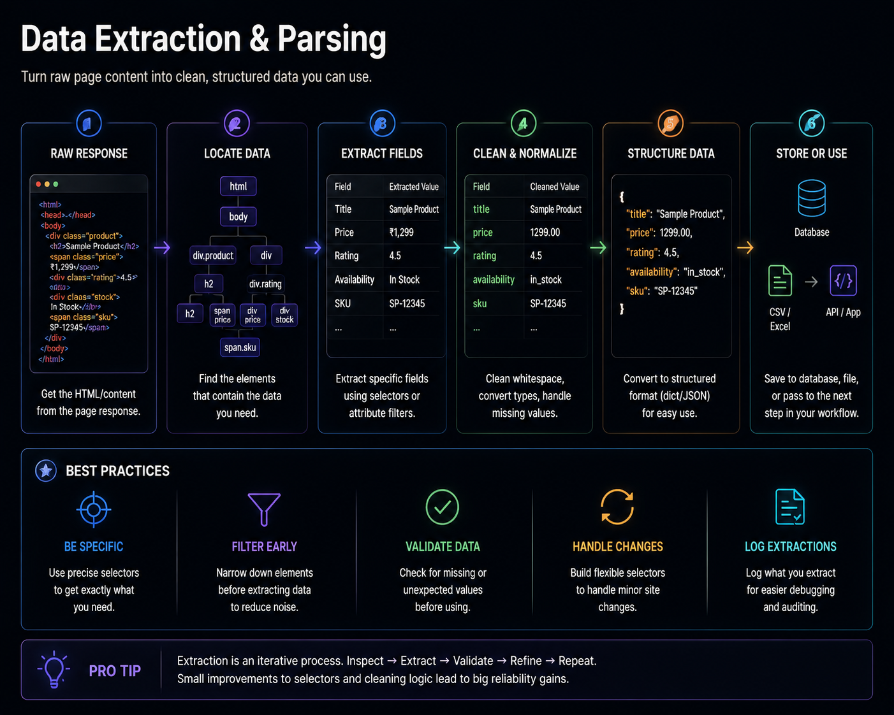

# Authentication and Session Management

## Proving Identity Without Storing Passwords in Code




## Previously

You learned to select elements by what they are, not where they sit. Every click now verifies a state change. Form interactions trigger the correct framework events.

Now we tackle the most constrained part of any automation: authentication.


## Why This Chapter Exists

Authentication is the most failure-prone subsystem in production browser automation using nodriver. Not because login forms are technically hard, but because authentication is designed to resist automation. CAPTCHA, rate limiting, MFA, session timeouts, and account lockouts are intentional barriers.


## The Cost of Getting This Wrong

| Mistake | Outcome | Cost |
|---------|---------|------|
| Hardcoding credentials in code | Credentials committed to git, permanently compromised | Security breach, credential rotation for every repo clone |
| Logging in on every run | Each login risks CAPTCHA, lockout, MFA challenge | Account locked after 5 retries, automation stopped for hours |
| No session validation | Automation extracts data from login page instead of dashboard | All downstream metrics are wrong |
| Shared profile across accounts | Two concurrent logins corrupt each other's session | Random auth failures that cannot be reproduced |
| No MFA handling | Automation encounters MFA challenge and crashes | No data collected until human intervenes |


## Production Incident

```
SaaS provider runs automation for 400 client accounts. Each account 
logs in from the same IP, same timing, same browser pattern.

Day 1-200 — Everything works. 400 accounts processed nightly.

Day 201 — One client account is suspended for ToS violation.
          The provider's IP address is flagged.
          Every login from that IP now shows a CAPTCHA — including 
          the other 399 legitimate accounts.

Day 202 — Entire automation stopped. Not 1 account — all 400.
          Infrastructure shared between a bad actor and 399 
          good actors meant one suspension blocked everyone.

Fix: 1) IP isolation for critical accounts (separate proxies).
     2) Account-level health monitoring (detect suspension 
        before it impacts other accounts).
```

**Lesson:** Authentication failures cascade through shared infrastructure. Every shared component creates a blast radius. Design for isolation at every layer.


### Authentication State Diagram

An automation session evolves through distinct authentication states:

```text
[No Session] → login() → [Authenticated]
                              ↓
                    session expires / token stale
                              ↓
                         [Expired]
                              ↓
                    try: refresh_token()
                              ↓
                   ┌──── success ────→ [Authenticated]
                   │
                   └──── failure ───→ [No Session] → re-login
                              ↓
                    logout() → [No Session]
```

Each state transition has a distinct trigger and signal. "Session expired" is detectable (API returns 401 or login page appears). "No session" is detectable (no cookies or profile empty). Automations that treat all auth failures as "login required" waste time re-authenticating when a refresh would suffice.


## The Authentication Trust Model

Understanding where authentication breaks requires understanding the trust chain:

```text
Password     → Something you know. Stored in .env, never in code.
Session      → A server-side record that "this browser is logged in."
Token        → A signed credential (JWT, cookie). Proves identity.
Identity     → The user account. Survives session expiry.
Authorization→ What the identity is allowed to do.
```

Most automation failures happen at the Session → Token boundary: the session persists, but the token expired. The automation appears logged in (no redirect to login page) but cannot access protected data because the token is stale.

## Engineering Analysis

A SaaS provider managed automation for 400 client accounts. Each account had its own login, profile, and data extraction. The automation logged into all 400 accounts sequentially every night — all from the same IP address, with the same timing pattern.

One account was suspended for a terms-of-service violation. The provider's IP address was flagged. Every login from that IP was prompted with a CAPTCHA, including the other 399 legitimate accounts. The entire automation stopped — not because 399 systems failed, but because one system shared infrastructure with a bad actor.

The fix required two architectural changes:
1. IP isolation for critical accounts (separate proxies per high-value client)
2. Account-level health monitoring (detect when a single account is suspended before it impacts others)

**Lesson:** Authentication failures cascade through shared infrastructure. Shared IP, shared profile directory, shared credential storage — any shared component creates a blast radius. Design for isolation at every layer.


## Mental Model — The Authentication Stack

```text
Layer 1 — Credential Storage
    │   Never in code. Always in environment variables or secrets manager.
    ▼
Layer 2 — Session Persistence
    │   Cookies + profile directory. Avoid re-login whenever possible.
    ▼
Layer 3 — Session Validation
    │   Before extracting, verify: "Am I who I think I am?"
    ▼
Layer 4 — Re-authentication
    │   When session expires, re-login. Detect MFA and pause.
    ▼
Layer 5 — Account Isolation
    │   One profile per automation identity. Never share.
```


## Learning Objectives

1. How to store and load credentials without exposing them in source code
2. How to persist browser sessions across runs using cookie files
3. How to validate session state before acting on authenticated data
4. How to detect MFA challenges and pause for manual approval (not bypass)
5. How to isolate identities across concurrent automations


## Recipe 19 — Login Forms

**Tier: Full Production Depth**
**Stable ID:** LOGIN-FORMS
**Prerequisites:** FORM-INTERACTION
**File:** `recipes/ch05/19_login_forms.py`

### Problem

Login forms are the same every time: find username field, find password field, click submit. The challenge is making this reliable across session expirations, CAPTCHA appearances, and rate limiting.

```python
import os
from common.browser import launch_browser, close_browser


async def login(browser, url: str):
    """Authenticate with credentials from environment variables."""
    page = await browser.get(url)
    await page.find("input[name='email']").send_keys(os.environ["LOGIN_USER"])
    await page.find("input[name='password']").send_keys(os.environ["LOGIN_PASS"])
    await page.find("button[type='submit']").click()
    # Verify login succeeded — not just that the button was clicked
    await page.wait_for(".dashboard", timeout=10)
    return page
```

### Engineering Note

> Never store credentials in the recipe file. `os.environ["LOGIN_USER"]` reads from the environment, which can be populated by a `.env` file, Docker secrets, or a secrets manager. The recipe code never contains a password.

### Production Rule

> After every login, verify that authentication succeeded. A failed login that silently navigates back to the login page will cause every subsequent selector to fail with a confusing "element not found" error.


## Recipe 20 — Cookie Persistence

**Tier: Full Production Depth**
**Stable ID:** COOKIE-PERSISTENCE
**Prerequisites:** LOGIN-FORMS
**File:** `recipes/ch05/20_cookies.py`

### Problem

Logging in every run is expensive, slow, and increases the risk of account lockout. Most sessions last 24 hours. Persisting cookies across runs avoids unnecessary login.

```python
import json
from pathlib import Path


async def save_cookies(page, path: str = "cookies.json"):
    cookies = await page.evaluate("document.cookie")
    Path(path).write_text(cookies)


async def load_cookies(page, path: str = "cookies.json"):
    cookies = Path(path).read_text()
    await page.evaluate(f"document.cookie = '{cookies}'")
```

### Production Rule

> Cookies expire. A cookie file that was valid yesterday may be invalid today. Always validate the session after restoring cookies — if the login page appears instead of the dashboard, delete the cookie file and re-authenticate.


## Recipe 21 — Session Reuse

**Tier: Full Production Depth**
**Stable ID:** SESSION-REUSE
**Prerequisites:** COOKIE-PERSISTENCE, PROFILE-ISOLATION
**File:** `recipes/ch05/21_reuse_sessions.py`

### Problem

Cookie persistence works for same-domain scenarios. For multi-domain authentication, you need the full profile. Session reuse combines profile persistence with cookie validation.

```python
async def with_session(browser, url: str, profile_dir: str):
    """Launch with an existing profile; re-login only if session expired."""
    browser = await launch_browser(user_data_dir=profile_dir)
    page = await browser.get(url)
    # If we land on the login page, session expired
    if await page.find("input[name='email']"):
        await login(browser, url)
    return page
```

### Engineering Note

> Detecting session expiry is application-specific. Some apps redirect to a login page. Others stay on the same page but show an "expired" overlay. Test the specific signal your target application sends.

### Production Rule

> Session reuse is a performance optimization, not a reliability strategy. Always validate the session before trusting it.


## Recipe 22 — Multi-Account Isolation

**Tier: Medium Depth**
**Stable ID:** MULTI-ACCOUNT
**Prerequisites:** PROFILE-ISOLATION
**File:** `recipes/ch05/22_multi_account.py`

### Problem

Automating multiple accounts on the same website requires complete state isolation. Sharing a profile between accounts corrupts both sessions.

```python
profiles/
    customer-a/   ← profile for first account
    customer-b/   ← profile for second account
    customer-c/   ← profile for third account
```

### Production Rule

> One profile per identity. Never share a profile between accounts. Profile corruption from sharing is silent — it manifests as random session errors days or weeks later.


\newpage

## Common Mistakes

### [X] Storing credentials in source code

A credential committed to git is permanently compromised. Even if you delete it later, it exists in the commit history.

**Fix:** Use environment variables or a secrets manager. Never hardcode.

### [X] Not validating session state

The automation loads a page, assumes the user is logged in, and tries to extract data. The page shows a login form. Every selector fails with "element not found."

**Fix:** Check for a page element that only exists when authenticated (avatar, username, logout button). If it's missing, re-authenticate.

### [X] Logging in on every run

Each login is a risk of account lockout, CAPTCHA, or MFA challenge. Logging in 30 times per month increases failure probability.

**Fix:** Persist sessions via cookies or profiles. Only re-authenticate when validation fails.

### [X] Sharing sessions across workers

Two workers using the same profile will invalidate each other's sessions. The result is random "logged out" errors.

**Fix:** Each worker has its own profile path.

### [X] Ignoring MFA during development

Building the automation on a non-MFA account means the first production deployment hits MFA and stops.

**Fix:** Design for MFA from day one — session persistence + manual checkpoint. Do not attempt to bypass MFA.

### [X] Not handling password rotation

The website expires passwords every 90 days. The automation fails until someone remembers to update .env.

**Fix:** Monitor login failure rates. A sudden increase in login failures may indicate a password change.

### [X] Assuming one login works for all pages

Some applications authenticate per-section. A login that works for the dashboard may not work for the admin panel.

**Fix:** Validate authentication separately for each distinct section of the application.


## Reflection Questions

1. Your automation logs in and extracts a dashboard report. The login succeeds. The report page shows "no data." The session is valid. What else could cause an empty report despite a valid login?

2. You persist cookies to a file and restore them on the next run. The automation reports success. But the data is from a cached page that does not require authentication. How would you detect this?

3. A client has MFA enabled on their CRM. Your automation needs daily data from it. Should you bypass MFA, request a policy exception, or build a manual approval checkpoint?

4. You run 10 concurrent workers, each scraping a different supplier portal. Two workers share the same profile directory by accident. What failure symptoms would you expect, and how long would it take to diagnose?

5. A password manager rotates credentials every 30 days. Your automation fails every 30 days. The fix is to update .env. How could you design the system so that password rotation does not require manual intervention?


## Production Checklist

- [ ] No credentials exist in source code — all from environment variables
- [ ] Session state is validated before any data extraction
- [ ] Cookies are persisted and restored across runs
- [ ] Profile isolation is enforced per identity
- [ ] MFA detection and manual approval checkpoint is implemented
- [ ] Login failure rate is monitored (alert on sudden increase)
- [ ] `.env.example` documents all required credential variables
- [ ] Re-authentication flow is tested (force session expiry manually)
- [ ] Each concurrent worker has a unique profile directory


## Tradeoffs

| Decision | Benefit | Cost |
|----------|---------|------|
| Session persistence | Faster runs, fewer login failures | Stale session risk |
| Fresh login each run | Always a valid session | Slower, more API calls, more risk |
| Profile isolation | Clean identity separation | More disk space per worker |
| Cookie-only persistence | Lighter than full profile | May miss non-cookie auth state |
| Manual MFA checkpoint | No security bypass | Requires human in loop |


## Chapter Connections

- **Depends on:** FORM-INTERACTION, PROFILE-ISOLATION, CONFIGURATION-MANAGEMENT
- **Uses:** `common/session.py` (SESSION-REUSE), `common/config.py`
- **Produces:** LOGIN-FORMS, COOKIE-PERSISTENCE, SESSION-REUSE, MULTI-ACCOUNT
- **Leads to:** Chapter 6 (Data Extraction), Chapter 9 (Advanced Browser Engineering)


## Chapter Summary

Authentication is the most failure-prone subsystem in production automation because it is designed to resist automation. The strategy is not "fill forms faster" — it is session persistence with validation. Store credentials outside the code. Validate sessions before acting. Isolate identities across workers. Design for MFA as a manual checkpoint, not a bypass challenge. A login that succeeds 99% of the time but fails silently on the 1% is a production incident waiting to happen.


## Engineering Review

### Things You Now Understand
- Authentication is the most failure-prone subsystem — it is designed to resist automation
- Session persistence with cookie/profile reuse is faster and safer than logging in every run
- Session validation must happen before data extraction — verify identity before trusting output
- MFA should be handled with a manual approval checkpoint, not automated bypass
- One profile per identity — never share profiles across accounts

### Common Mistakes
- [X] Storing credentials in source code — permanently compromised if committed to git
- [X] Not validating session state — extracting data from login page instead of dashboard
- [X] Logging in on every run — each login risks CAPTCHA, lockout, MFA challenge
- [X] Sharing sessions across workers — random auth failures that cannot be reproduced

### Senior Takeaways
- Authentication failures cascade through shared infrastructure — isolate IPs, profiles, credentials
- The Session → Token boundary is where most auth failures happen, not the password → session boundary
- A login that succeeds 99% of the time but fails silently on the 1% is a production incident waiting to happen

### Architecture Questions
1. Your automation manages 50 client accounts. One account's password expires. Should the automation fail for all 50, or just the one?
2. A session typically lasts 24 hours. Your automation runs every 6 hours. Should it re-authenticate every run or every 4th run? What signal tells you the session is still valid?
3. You design a new automation for a client with MFA. The client cannot disable MFA. What is your authentication architecture?

**Next: Chapter 6 — Data Extraction**

Where we move from proving identity to collecting structured data from the browser.
