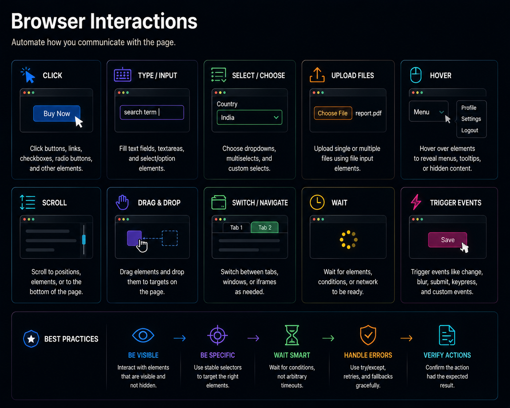

# Data Extraction

## Collecting Structured Data from an Unstructured Browser




## Previously

You learned authentication as a multi-layered system — session persistence, validation, and recovery. Your automation now proves identity before extracting data.

Now we focus on extraction itself: converting browser-rendered HTML into structured, validated data that downstream systems can trust.


## Why This Chapter Exists

Extracting data from a browser page is deceptively simple. `element.textContent` returns text. But that text may be incomplete, incorrectly formatted, or from the wrong element. The browser does not validate the data it renders — it renders whatever the application sends.

Production extraction is a pipeline — and skipping any step means bad data enters your database. Bad data in a database looks exactly like good data until someone makes a wrong decision based on it.


## The Cost of Getting This Wrong

| Mistake | Outcome | Cost |
|---------|---------|------|
| Not validating data type | Price extracted as "₹89,999" instead of 89999.0 | Downstream sorting, aggregation, and reporting all break |
| Assuming all rows have same structure | Merged cells produce jagged arrays | Index errors, silent data loss |
| Reading entire page into memory | 10,000-row table consumes 500MB | OOM crashes on small VPS instances |
| Not handling empty pages | Zero rows returned, treated as "catalog empty" | Wrong business decisions based on "no data" |
| Capping pages but not runtime | MAX_PAGES=100 runs for 6 hours on slow pages | Schedule overlap, resource exhaustion |


## Production Incident

```
Procurement automation extracts pricing from supplier catalog.

Day 1-200 — Everything works. Selector: span.price. Output: ₹89,999.

Day 201 — One supplier lists a product at ₹0.00 — a placeholder 
          for "call for price." Automation stores ₹0.00.
          
Day 202 — Pricing engine treats ₹0.00 as a legitimate price.
          Company matches the price on every unit. Loses margin.

Day 210 — Finance notices the margin loss. Investigation traces 
          back to a single ₹0.00 extraction. The selector was 
          correct. The HTML was correct. The data was wrong.

Fix: Add business rule: price > ₹100 for this product category.
The rule existed in the business analyst's head — not in the automation.
```

**Lesson:** Extraction without validation is reading, not engineering. A production data pipeline validates every field against business rules before storing.


## The Data Lifecycle

Extraction is one step in a larger lifecycle. Understanding the full chain helps you design each stage correctly:

```text
CAPTURE   → Browser renders the page. Raw DOM exists.
PARSE     → Selectors extract text from DOM elements.
VALIDATE  → Check type, range, completeness against schema.
NORMALIZE → Convert "₹89,999" to 89999.0, "In Stock" to true.
STORE     → Write validated records to database.
SERVE     → Make data available to downstream systems.
ARCHIVE   → Retire old data or move to cold storage.
```

Most tutorials start at PARSE. Production engineering starts at CAPTURE and considers every stage through ARCHIVE.

### Confidence Scores

Not all extracted data is equally trustworthy. Assign each record a confidence score:

```text
100% — All validations pass. Types match. Ranges are normal. Business rules satisfied.
 90% — Validations pass but one field was normalized (currency stripped, date reformatted).
 40% — Record has missing non-critical fields (e.g., no description). Stored with warning.
  0% — Record failed critical validation. Quarantined. Never stored.
```


## Mental Model — The Extraction Pipeline

```text
Raw HTML           → Browser renders the page
↓
DOM Elements       → Selectors find the nodes
↓
Raw Text            → .textContent or .innerText
↓
Parsed Values       → Convert "₹89,999" to 89999.0
↓
Validation          → Price > 0, name not empty, URL valid
↓
Provenance          → Attach source, timestamp, run ID
↓
Storage             → Database or file
```

Each arrow is a transformation that can fail independently. The automation should detect which step failed and report it distinctly.


## Learning Objectives

1. How to extract structured data from tables, lists, and paginated pages
2. How to handle incomplete data — missing fields, partial pages, network interruptions
3. How to detect and recover from extraction failures without losing already-collected data
4. How to design extractors that survive minor HTML changes


## Recipe 23 — Extract Data From Tables

**Tier: Full Production Depth**
**Stable ID:** TABLE-EXTRACTION
**Prerequisites:** SELECTOR-STRATEGY
**File:** `recipes/ch06/23_extract_tables.py`

### Problem

HTML tables present data in rows and cells. The structure is predictable, but the content varies: empty cells, merged columns, inconsistent formatting.

```python
async def extract_table(page, selector: str = "table") -> list[dict]:
    return await page.evaluate(f"""
        () => {{
            const table = document.querySelector('{selector}');
            const rows = Array.from(table.querySelectorAll('tr'));
            return rows.map(row => {{
                const cells = Array.from(row.querySelectorAll('td, th'));
                return cells.map(c => c.textContent.trim());
            }});
        }}
    """)
```

### Engineering Note

> Table extraction is reliable when the structure is a true HTML `<table>`. Beware of "tables" built with CSS grid or divs — these require a different extraction strategy because the visual row/column relationship exists only in CSS, not the DOM.

### Production Rule

> Validate the row count after extraction. A table that usually has 100 rows but returns 0 rows is likely a page-load failure, not an empty catalog.


## Recipe 24 — Pagination

**Tier: Full Production Depth**
**Stable ID:** PAGINATION
**Prerequisites:** TABLE-EXTRACTION
**File:** `recipes/ch06/24_pagination.py`

### Problem

Data rarely fits on one page. Pagination is a state machine: current page has content, next page may or may not exist, and the "next" button may be disabled, hidden, or infinite-scroll.

```python
MAX_PAGES = 100
page_num = 1

while page_num <= MAX_PAGES:
    rows = await extract_table(page)
    if not rows:
        break  # No more data
    save(rows)
    more = await page.evaluate(
        "document.querySelector('.next-page:not(.disabled)') !== null"
    )
    if not more:
        break
    await page.find(".next-page").click()
    await page.wait_for(".table", timeout=10)
    page_num += 1
```

### Production Rule

> Always cap pagination. An infinite loop that runs all night because the "next" button never disappears is worse than missing the last page. Set `MAX_PAGES` and a maximum runtime.


## Recipe 25 — Infinite Scroll

**Tier: Full Production Depth**
**Stable ID:** INFINITE-SCROLL
**Prerequisites:** None
**File:** `recipes/ch06/25_infinite_scroll.py`

### Problem

Infinite scroll does not have a "next page" button. Content loads as the user scrolls. The end condition is ambiguous — is the content exhausted, or is the server slow to respond?

```python
async def scroll_collect(page, selector: str, max_items: int = 1000):
    items = set()
    while len(items) < max_items:
        new_items = await page.evaluate(f"""
            Array.from(document.querySelectorAll('{selector}'))
                 .map(el => el.textContent.trim())
        """)
        items.update(new_items)
        await page.evaluate("window.scrollTo(0, document.body.scrollHeight)")
        await asyncio.sleep(2)
        # Detect end: scroll position unchanged
        height = await page.evaluate("document.body.scrollHeight")
        # If no new items and height unchanged, content exhausted
        if len(items) == len(items_before) and height == height_before:
            break
    return list(items)
```

### Production Rule

> Infinite scroll is a data stream, not a page. Treat it like one: implement a maximum item count, a timeout, and an end-detection heuristic (height + item count unchanged).


## Recipe 26 — Download Files

**Tier: Medium Depth**
**Stable ID:** DOWNLOAD-FILES
**Prerequisites:** None
**File:** `recipes/ch06/26_download_files.py`

### Problem

Some pages offer downloadable files (CSV, PDF, Excel). nodriver cannot interact with the browser's download dialog, but you can intercept the download CDP event or modify the download behavior via JavaScript.

```python
async def download_file(page, url: str, save_path: str):
    """Trigger a download and wait for the file to appear."""
    await page.evaluate(f"window.location.href = '{url}'")
    # Wait for file to appear at save_path
    while not Path(save_path).exists():
        await asyncio.sleep(1)
```

### Production Rule

> After downloading, verify the file: check its size is > 0 bytes, and check its format (CSV should parse, PDF should have pages). A zero-byte download is a failure, not a success.


## Recipe 27 — Extract Images and Media

**Tier: Medium Depth**
**Stable ID:** MEDIA-EXTRACTION
**Prerequisites:** None
**File:** `recipes/ch06/27_extract_images.py`

### Problem

Images may be lazy-loaded, behind CORS restrictions, or replaced with placeholders. Extracting `src` attributes is not enough — you need to verify the image actually loaded.

```python
async def extract_image_urls(page, selector: str = "img") -> list[str]:
    return await page.evaluate(f"""
        Array.from(document.querySelectorAll('{selector}'))
             .filter(img => img.complete && img.naturalWidth > 0)
             .map(img => img.src)
    """)
```

### Production Rule

> Filter out images that did not load (`naturalWidth === 0`). A lazy image that has not entered the viewport returns a placeholder, not the actual image. Scroll images into view before extracting.


\newpage

## Common Mistakes

### [✗] Not validating data type after extraction

A price extracted as `"₹89,999"` is a string. Downstream systems expect a float. Storing the string breaks reporting, sorting, and aggregation.

**Fix:** Parse and type-convert every field before storing. Use `common/data_pipeline.py`.

### [✗] Assuming all rows have the same number of cells

Merged rows, hidden columns, and variable-length data produce jagged arrays. Code that assumes `row[3]` is always the price will index out of bounds.

**Fix:** Check row length before accessing cells. Fall back to `None` for missing cells.

### [✗] Reading the entire page into memory

Pages with thousands of rows can consume hundreds of megabytes. Loading everything before processing risks OOM on small VPS instances.

**Fix:** Process and discard in batches — extract, validate, store, then free the DOM references.

### [✗] Not handling empty pages

A page that loads but shows "no results" still has a valid DOM. The extraction code returns zero rows. Downstream systems see zero and think the catalog is empty.

**Fix:** Check for an explicit "no results" indicator. Log a warning when extraction returns zero rows.

### [✗] Capping pagination but not runtime

A script with `MAX_PAGES = 100` may still run for hours if each page loads slowly. The timeout protects against infinite loops but not against long loops.

**Fix:** Set both a page cap and a maximum runtime (`asyncio.wait_for` on the entire extraction).

### [✗] Storing raw HTML as the source of truth

HTML contains dynamic elements (timestamps, session IDs, ad placeholders) that change every load. Storing raw HTML is expensive and does not provide a stable diff target.

**Fix:** Extract and store structured data. Keep raw HTML only as a debugging artifact for the most recent failure.

### [✗] Extracting from the wrong rendering context

A `<select>` dropdown shows visible text, but the value sent to the server is the `value` attribute. Extracting the visible text gives you the label, not the data.

**Fix:** Always extract `value` attributes for form controls. Use visual text only as a fallback.


## Reflection Questions

1. Your table extraction returns 97 rows. Yesterday it returned 98. Which is the bug — 97 or 98? How would you design validation to detect this without a human checking every day?

2. An infinite scroll page loads items 20 at a time. You scroll 100 times before hitting the end. But items 75-80 are duplicates of items 1-5. What happened, and how should the extraction handle it?

3. Your automation downloads a CSV file. The file is 0 bytes. The download succeeded — the file exists. What failure mode does this represent, and how would you prevent storing the empty file?

4. A product table has 10 columns. After a website update, it has 11. Your extraction code accesses index 7 for the price, but the price is now at index 8. How could you design the extraction to survive column reordering?

5. Your extraction processes 10,000 products per run. On one run, it extracts 0 products. The page loaded successfully. The selector matches zero elements. What is your diagnosis process?


## Production Checklist

- [ ] Every extracted field is type-converted (string → float, int, bool)
- [ ] Row count is validated against expected bounds (min/max per run)
- [ ] Pagination has both a page cap and a runtime timeout
- [ ] Infinite scroll has an end condition (height + item count)
- [ ] Downloaded files are verified (size > 0, format check)
- [ ] Lazy-loaded images are scrolled into view before extraction
- [ ] Extracted data is validated before storage (common/data_pipeline.py)
- [ ] Raw HTML is retained only as a recent-failure debugging artifact
- [ ] Extraction is idempotent — running twice does not create duplicates


## Tradeoffs

| Decision | Benefit | Cost |
|----------|---------|------|
| CSS selector extraction | Fast, simple | Brittle to layout changes |
| JavaScript extraction | Can access any DOM state | Harder to maintain |
| Page-by-page pagination | Clear end condition | Slower for large datasets |
| API-based extraction (observe CDP) | Structured data, stable | Requires API discovery |
| In-memory batch processing | Fast | Memory-constrained environments |
| Streaming per-page processing | Lower memory | Slower overall |


## Chapter Connections

- **Depends on:** SELECTOR-STRATEGY, NAVIGATION-STRATEGIES
- **Uses:** `common/data_pipeline.py`, `common/logging.py`
- **Produces:** TABLE-EXTRACTION, PAGINATION, INFINITE-SCROLL, DOWNLOAD-FILES, MEDIA-EXTRACTION
- **Leads to:** Chapter 7 (Stealth & Resilience), Chapter 13 (Data Engineering)


## Chapter Summary

Extraction is a pipeline, not a single operation. Every field must be parsed, type-converted, and validated before storage. Pagination and infinite scroll are state machines — implement end conditions for both, and never assume the "next" button disappears. Downloaded files must be verified, not just checked for existence. The browser renders data; the automation system is responsible for proving that data is correct.


## Engineering Review

### Things You Now Understand
- Extraction is a pipeline: capture → parse → validate → normalize → store → serve → archive
- Every extracted field must be type-converted and validated before storage
- Pagination and infinite scroll are state machines — implement end conditions for both
- Downloaded files must be verified (size > 0, format check), not just checked for existence
- Confidence scores make data quality visible to operators

### Common Mistakes
- [✗] Not validating data type after extraction — "₹89,999" stored as string breaks reporting
- [✗] Assuming all rows have the same structure — merged cells produce jagged arrays
- [✗] Not handling empty pages — zero rows returned, treated as "catalog empty"
- [✗] Capping pages but not runtime — MAX_PAGES=100 runs for 6 hours on slow pages

### Senior Takeaways
- Extraction without validation is reading, not engineering
- The Data Lifecycle shows that most tutorials start at PARSE — production engineering starts at CAPTURE
- Confidence scores transform "48,122 records" into "48,122 records (avg 98% confidence)"

### Architecture Questions
1. Your table extraction returns 97 rows. Yesterday it returned 98. Is either number wrong? How would you detect a missing row?
2. An infinite scroll page loads items 20 at a time. Items 75-80 are duplicates of items 1-5. What happened, and how should extraction handle it?
3. A CSV download produces a 0-byte file. The download succeeded (file exists). What failure mode does this represent?

**Next: Chapter 7 — Stealth and Resilience**

Where we move from extracting data to ensuring the automation survives detection and continues operating through adverse conditions.
