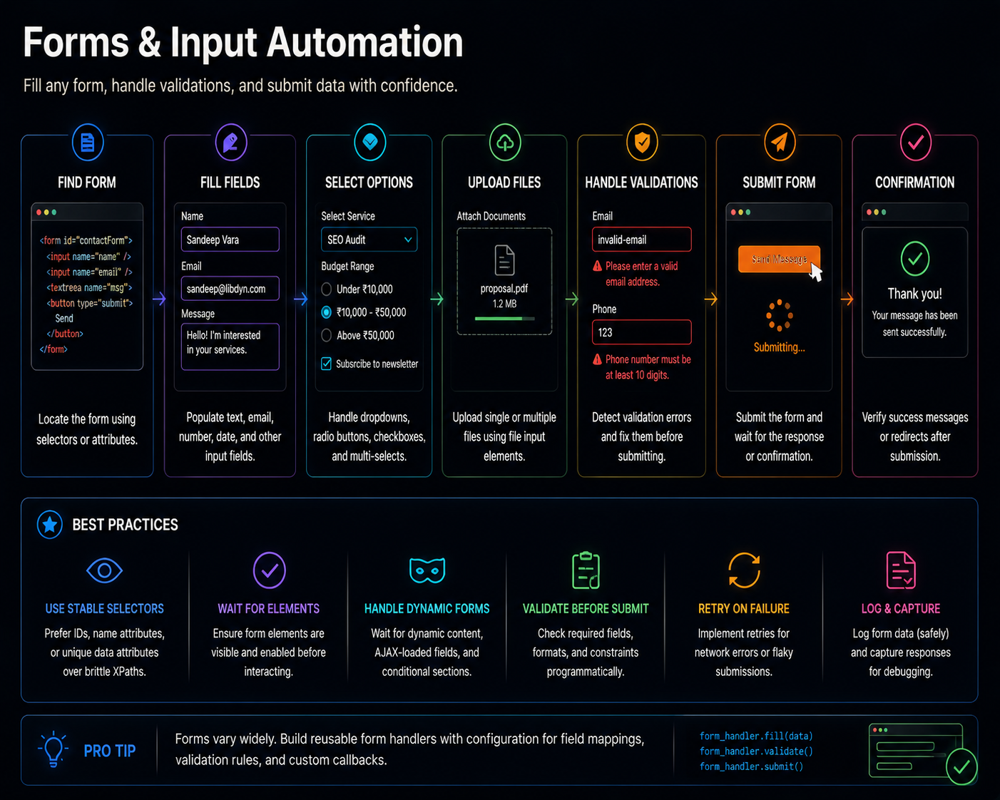

# Stealth and Resilience

## Operating Under Observation




## Previously

You built a complete extraction pipeline — selectors, pagination, type conversion, validation. Your automation now collects structured data the pipeline can trust.

Now we address the reality that some websites do not welcome automation.


## Why This Chapter Exists

Anti-bot systems (Cloudflare, DataDome, Akamai, Imperva) evaluate browser signals, request patterns, and behavioral characteristics to distinguish automated traffic from human traffic. These systems are a fact of production automation life.

This chapter does not teach you to defeat security systems. It teaches you to understand what signals your browser broadcasts, detect when a challenge has been triggered, and respond professionally.


## The Cost of Getting This Wrong

| Mistake | Outcome | Cost |
|---------|---------|------|
| Randomizing delays without understanding detection | Inconsistent behavior that is MORE detectable | Increased block rate, harder to diagnose |
| Trying to bypass CAPTCHA programmatically | Violates ToS, wastes engineering time | Account suspension, legal liability |
| Ignoring rate limits | IP gets permanently blocked | Cannot access the site from any automation |
| Over-blocking resources (images, fonts) | Creates abnormal browser fingerprint | Easier to detect as non-human |
| No challenge detection | Automation silently extracts CAPTCHA page HTML | Stores garbage data as if it were valid |


## Production Incident

```
E-commerce price monitor ran successfully for 8 months.
Scrapes product prices every 6 hours.

Month 9 — Marketplace deploys DataDome. Automation returns 
          HTTP 403 — but only for product pages. Login and 
          search pages still work.

The developer notices "some prices are missing." The automation 
had silently fallen back to cached pages that returned empty 
product data. Dashboard still showed green because requests 
succeeded — but responses were empty.

The automation was designed for stealth: randomized delays, 
rotating viewports, residential proxies. None of it helped 
because detection was on the API layer, not the browser layer.

Fix: Add response validation. If the page returns 403 or empty 
product data, log it as a distinct failure class — not success.
```

**Lesson:** Anti-bot detection is a systems problem. Browser fingerprint changes do not help when detection is at the network layer. Detect challenges by their type and respond with evidence collection, not evasion.


## The Detection Matrix

Anti-bot systems evaluate signals across multiple layers. Understanding which layer you are detected on determines the correct response:

| Layer | Signals Evaluated | Can You Control? | Should You Change It? |
|-------|------------------|-----------------|----------------------|
| Network | IP reputation, TLS handshake, request timing, CDN behavior | Partially (proxy, IP rotation) | Yes, within rate limits |
| Browser | User agent, WebGL, fonts, screen, `navigator.webdriver` | Yes (nodriver config) | Yes, minor adjustments |
| Behavior | Scroll speed, mouse movement, click timing, navigation flow | Partially (add natural delays) | Rarely — behavior is functional |
| Timing | Request frequency, time-of-day patterns, inter-request intervals | Yes (rate limiting, scheduling) | Yes — off-peak hours |
| Volume | Total requests per IP, per account, per session | Yes (reduce scope, distribute) | Yes — distribute across IPs/accounts |
| Account | Login history, action types, data access patterns | No (server-side) | Never — the account is the identity |
| History | Previous blocks, suspicious activity flags | No (server-side) | Never — cannot change the past |

The table answers the practical question: "I was detected. What do I change?" If the detection is on the infrastructure layer (IP reputation, volume), changing browser signals will not help. If the detection is on the account level (user flag), changing IPs will not help.


## Engineering Analysis

An e-commerce price monitor ran successfully for eight months. It scraped product prices from a major marketplace every 6 hours. Then the marketplace deployed DataDome. The automation returned HTTP 403 on every request — but only for the product listing pages, not the login or search pages.

The developer noticed that some prices were "missing." The automation had started returning data from cached pages instead of failing visibly. The monitoring dashboard still showed green because requests succeeded — but the responses were empty of product data.

The automation was designed to be stealthy. It randomized delays, rotated viewport sizes, and used residential proxies. None of that helped because the detection was on the API layer, not the browser layer.

**Lesson:** Anti-bot systems target the request pattern, not just the browser fingerprint. Detecting a challenge should trigger a visible escalation, not a silent fallback.


## Mental Model — The Detection Surface

```text
Your Automation
    │
    ├── Browser signals (user agent, webgl, fonts, screen)
    ├── Network signals (IP, TLS handshake, timing, request ordering)
    ├── Behavioral signals (scroll speed, mouse movement, click timing)
    └── Application signals (API call frequency, data access patterns)
```

Anti-bot systems combine signals across these layers. Modifying one signal while leaving others unchanged does not reduce detectability — it may increase it by creating an inconsistent profile.


## Learning Objectives

1. How nodriver's default browser configuration differs from a normal Chrome instance
2. How to configure the browser environment for consistency without deception
3. How to detect anti-bot challenges and respond with evidence collection
4. How to design automation behavior that does not trigger volume-based detection


## Recipe 28 — Stealth Configuration

**Tier: Medium Depth**
**Stable ID:** STEALTH-CONFIGURATION
**Prerequisites:** STARTUP-CONFIG
**File:** `recipes/ch07/28_stealth_automation.py`

### Problem

A nodriver-launched Chrome has detectable differences from a human-launched Chrome: the absence of extensions, specific command-line flags, and WebDriver properties.

### What Matters and What Doesn't

| Signal | Impact | Action |
|--------|--------|--------|
| `navigator.webdriver` | High — explicitly flags automation | Disable if detectable |
| User agent | Medium — must match Chrome version | Use real Chrome UA |
| Screen resolution | Low — many humans use standard sizes | Keep production-appropriate size |
| Font list | Low — server-side detection is rare | Install standard fonts |
| WebGL fingerprint | Low — mostly used for persistent tracking | Leave default |
| Request timing | High — pattern matters more than fingerprint | Randomize delays naturally |

```python
from common.browser import launch_browser

browser = await launch_browser(
    arguments=[
        "--disable-blink-features=AutomationControlled",
    ]
)
```

### Engineering Note

> The single most detectable signal is `navigator.webdriver === true`. nodriver's `launch_browser()` disables this by default in `common/browser.py`. If you are detected despite this, the detection is likely on the network layer (IP, TLS, request pattern), not the browser layer.

### Production Rule

> Anti-bot detection is a systems problem, not a configuration toggle. Modifying browser signals without addressing request patterns and IP reputation will not produce reliable results.


## Recipe 29 — Resilient Automation Patterns

**Tier: Full Production Depth**
**Stable ID:** RESILIENT-AUTOMATION
**Prerequisites:** RETRY-TAXONOMY, OBSERVABILITY
**File:** `recipes/ch07/29_resilient_automation.py`

### Problem

Resilience is not about avoiding failure. It is about detecting failure, preserving evidence, and recovering gracefully.

### The Resilient Automation Contract

```python
from common.browser import launch_browser, close_browser
from common.logging import logger
from common.recovery import RecoveryManager, FailureType


async def resilient_run(url: str):
    mgr = RecoveryManager()
    browser = await launch_browser()
    try:
        page = await browser.get(url)
        data = await extract(page)
        validated = validate(data)
        store(validated)
        logger.info("Run complete", extra={"records": len(validated)})
    except Exception as e:
        # Capture evidence before recovery
        logger.error("Run failed", extra={"error": str(e), "url": url})
        decision = await mgr.recover(FailureType.UNKNOWN)
        if decision == "stop":
            raise
    finally:
        await close_browser(browser)
```

### Production Rule

> Every production automation should be wrapped in this contract: capture evidence on failure, classify the failure, decide whether to recover or escalate, and always close the browser.


\newpage

## Common Mistakes

### [✗] Attempting to bypass anti-bot systems through deception

Adding random delays, rotating user agents, and using proxy lists does not make automation undetectable. It makes it unpredictably detectable.

**Fix:** Design for detection as a known failure mode. Detect challenges and respond with evidence collection, not evasion.

### [✗] Ignoring rate limits

Sending requests faster than the website's documented (or undocumented) rate limit triggers blocking. Retrying faster after a block makes it worse.

**Fix:** Implement rate limiting in the automation. Calculate delay from the target's response headers if available.

### [✗] Running automation during business hours

A scraper that runs at 2 PM on a weekday looks like an attack. A scraper that runs at 3 AM looks like maintenance.

**Fix:** Schedule non-urgent automation during off-peak hours.

### [✗] Using the same IP across too many targets

A single IP address scraping 50 different competitor websites triggers cross-domain pattern detection.

**Fix:** Isolate high-value targets on separate IPs or proxy routes.

### [✗] Not randomizing request timing naturally

Every request arriving at exactly 300-second intervals is a signal. So is every request arriving at a perfectly randomized 250-350 second interval.

**Fix:** Add jitter that follows a natural distribution. A human does not wait exactly 5.0 seconds between clicks.

### [✗] Over-blocking resources

Blocking all images, fonts, and CSS makes the browser load faster but creates an abnormal request pattern. Some anti-bot systems flag browsers that do not load images.

**Fix:** Block only the resources that significantly affect performance. Leave CSS and critical images.

### [✗] Treating all challenges as equal

A CAPTCHA requires human intervention. A rate-limit block requires a cooldown. A complete IP block requires infrastructure changes. Responding to each incorrectly wastes time and fails.

**Fix:** Detect the challenge type and apply the correct response. Log the type for trend analysis.


## Reflection Questions

1. Your automation is detected by an anti-bot system. The detection is on the network layer (IP + request timing), not the browser layer. What would you change about the automation behavior, and what would not help?

2. A website blocks your IP after 100 requests per minute. Your automation sends 110 requests per minute. What is the correct engineering response — slow down, rotate IPs, or both?

3. Your automation detects a CAPTCHA challenge. Should it attempt to solve it, pause for manual intervention, or stop and alert? What factors inform this decision?

4. You deploy the same automation to two clients. Client A's website has no anti-bot protection. Client B's website uses DataDome. Should the automations be configured differently? What would you change?

5. A marketplace blocks your automation after three months of successful operation. The block is on the account level, not the IP level. What signals could the marketplace be using to link your automation sessions?


## Production Checklist

- [ ] `navigator.webdriver` detection is handled (disabled or mitigated)
- [ ] Request rate is limited to the target's documented limits
- [ ] Automation schedule runs during off-peak hours
- [ ] Anti-bot challenge detection is implemented (CAPTCHA, block page, 403)
- [ ] Challenge response is configurable per target (stop vs pause vs alert)
- [ ] Proxy rotation is available for IP-bound blocking
- [ ] Screenshot + HTML are captured when a challenge is detected
- [ ] Blocked resource strategy is documented per target


## Tradeoffs

| Decision | Benefit | Cost |
|----------|---------|------|
| Minimal stealth config | Simple, maintainable | May trigger basic detection |
| Full stealth config | Reduces browser-level signals | Cat-and-mouse with updates |
| Detect-and-stop challenges | Safe, observable | No data when blocked |
| Attempt bypass | May get data through | Unethical, unreliable, fragile |
| Single IP | Simple infrastructure | Single point of block |
| Proxy rotation | Survives IP blocks | Cost, complexity |


## Chapter Connections

- **Depends on:** STARTUP-CONFIG, RETRY-TAXONOMY, OBSERVABILITY
- **Uses:** `common/browser.py`, `common/recovery.py`
- **Produces:** STEALTH-CONFIGURATION, RESILIENT-AUTOMATION
- **Leads to:** Chapter 8 (Production Starter Kit), Chapter 10 (Reliability & Compatibility)


## Chapter Summary

Anti-bot systems are a production reality that must be managed professionally, not a challenge to be defeated through deception. Configure your browser for consistency, not invisibility. Detect challenges by their type and respond appropriately — stop with evidence rather than bypass and corrupt data. Rate limiting, off-peak scheduling, and IP isolation are infrastructure decisions, not configuration toggles. An automation that detects a challenge and archives evidence is operating correctly. An automation that silently fails is not.


## Engineering Review

### Things You Now Understand
- Anti-bot systems evaluate signals across 7 layers: network, browser, behavior, timing, volume, account, history
- Detection at the network layer cannot be fixed by changing browser signals
- Challenges should be detected and handled by type — CAPTCHA, rate limit, IP block each need different responses
- The production engineer's goal is not invisibility — it is predictable, observable operation
- `navigator.webdriver` is the single most detectable signal; nodriver disables it by default

### Common Mistakes
- [✗] Randomizing delays without understanding detection — inconsistent behavior is MORE detectable
- [✗] Trying to bypass CAPTCHA programmatically — violates ToS, wastes engineering effort
- [✗] Ignoring rate limits — IP gets permanently blocked
- [✗] Over-blocking resources — creates abnormal browser fingerprint

### Senior Takeaways
- If detection is at the account level (user flag), no amount of IP or browser configuration will help
- The Detection Matrix answers the practical question: "I was detected. What do I change?"
- Detecting a challenge and stopping with evidence is the correct production behavior

### Architecture Questions
1. Your automation is blocked after 100 requests per minute. The target site has no documented rate limit. What is your response?
2. A website deploys DataDome. Your automation returns 403 on product pages but works on login pages. What layer is the detection on?
3. After 3 months of successful operation, your automation is blocked on the account level. What signals could the website be using to link your sessions?

**Next: Chapter 8 — Production Starter Kit**

Where everything from Chapters 1-7 comes together into a reusable automation framework you can copy into new projects.
