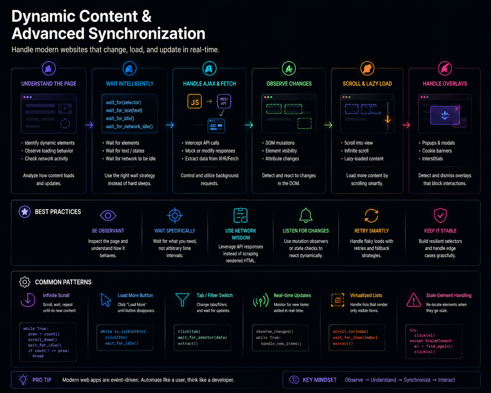

# Production Starter Kit

## A Reusable Automation Framework You Can Copy Into New Projects




## Previously

You learned the complete toolkit: browser lifecycle management, reliable navigation, retry taxonomy, structured logging, selector design, form interaction, authentication strategy, data extraction pipelines, and resilient failure handling.

Now we assemble everything into a single, reusable framework.


## Why This Chapter Exists

Every nodriver automation project follows the same pattern: launch browser, navigate, authenticate, extract, validate, store, log, close. Writing this from scratch for each project is wasteful and error-prone. The common/ library already provides the reusable components. This chapter shows how they fit together as a complete framework.


## The Cost of Getting This Wrong

| Mistake | Outcome | Cost |
|---------|---------|------|
| Modifying common/ modules per project | Every customization creates a fork that cannot pull upstream updates | Technical debt that grows with every new client |
| Copying the entire cookbook into each project | 60 recipes, tutorials, examples — none of which belong in your automation | Project clutter, confusion about what to maintain |
| Not version-pinning dependencies | Different versions installed on different machines | "Works on my machine" — the exact failure this kit eliminates |
| Hardcoding environment values in code | Each deployment requires editing the script | Merge conflicts, deployment errors, config drift |
| No per-run artifact directory | Logs and screenshots from different runs overwrite each other | Cannot debug yesterday's failure — evidence is gone |


## Production Incident

```
Consultancy builds automations for 15 clients. Each automation 
is a standalone Python script with its own startup logic, error 
handling, and output format. 

Client 1 takes 2 weeks.
Client 2 takes 2 weeks.
Client 3 takes 2 weeks. Nothing is reused.

A senior engineer joins. She extracts the common patterns into 
a shared library called common/. 

Client 4 takes 2 days. 
Client 5 takes 2 days.

When a client asks for Slack alerting, she adds it to the 
shared library. All 15 existing automations inherit it 
without changes. When Chrome updates deprecate a startup 
argument, she changes one config file. All 15 automations 
stay working.

The shared library later becomes the foundation of this cookbook.
```

**Lesson:** A common library is not overhead — it is leverage. Every pattern extracted into `common/` reduces the cost of every future automation. Never modify it. Extend it.


## The Starter Kit

The Starter Kit is not a framework you install. It is a project structure you copy. It includes:

- A `common/` library with modules for browser, retry, logging, config, session, recovery, data pipeline, and alerting
- A `recipes/` directory for automation scripts
- A `profiles/` directory for isolated browser profiles
- A `runs/` directory for per-execution artifacts
- A `docker/` directory with Dockerfile and docker-compose.yml
- An `.env.example` template


### Project Growth Path

The Starter Kit scales with your needs. Here is how the same project structure evolves:

```text
Starter Project (you)
  One automation, one target. SQLite. Runs manually.

Client Project (you + one client)
  Docker deployment. Scheduling. Slack alerts. Per-run artifacts.

Agency Project (you + multiple clients)
  Multiple profiles. Per-client configuration. Monitoring dashboard. Recovery.

Platform (you + team)
  Job registry. Operator dashboard. Cost tracking. Multi-server deployment.
```

At each stage, the Starter Kit adapts without structural changes. You add workers, not rewrite architecture.


### Dependency Graph

The Starter Kit's modules form a layered dependency graph. Understanding this graph helps you trace failures through the stack:

```text
Your Automation Script
    │
    ├── common/config.py       ← no dependencies (reads env vars)
    ├── common/logging.py      ← no dependencies (stdlib only)
    ├── common/retry.py        ← depends on logging
    ├── common/browser.py      ← depends on config (for startup args)
    ├── common/session.py      ← depends on browser
    ├── common/recovery.py     ← depends on logging, browser
    ├── common/data_pipeline.py← depends on logging (stdlib only for core)
    ├── common/alert.py        ← no dependencies (HTTP only)
    └── common/visual_diff.py  ← no dependencies (stdlib only)
```

If logging fails, recovery still works. If config fails, nothing works. This dependency graph is designed so that the most critical modules (config, logging) have zero dependencies, and higher-level modules (recovery, pipeline) depend only on lower-level modules.


## Engineering Analysis

A consultancy built automations for 15 clients. Each automation was a standalone Python script with its own startup logic, error handling, and output format. When a client asked for monitoring, the consultancy had to add it to 15 scripts individually.

They extracted the common patterns into a shared library. The next client automation took 2 days instead of 2 weeks. When they added Slack alerting, they changed one file, and all 16 automations inherited it.

The consultancy later published the shared library as `common/`. That library became the foundation of this cookbook.

**Lesson:** A common library is not overhead. It is leverage. Every pattern extracted into `common/` reduces the cost of every future automation.


## Mental Model — The Starter Kit Architecture

```text
your_project/
    ├── common/                  ← reusable modules (copy from cookbook)
    ├── recipes/                 ← automation scripts (one per target)
    ├── profiles/                ← isolated browser profiles (created per worker)
    ├── runs/                    ← per-execution artifacts (logs, screenshots, data)
    ├── docker/                  ← Dockerfile + docker-compose.yml
    ├── .env                     ← environment-specific configuration
    ├── requirements.txt         ← pinned dependencies
    └── README.md                ← project documentation
```

The `common/` module is the only shared code across projects. Everything else is project-specific.


## Learning Objectives

1. How to structure a production automation project for maintainability
2. How `common/` modules encapsulate the patterns from Chapters 1-7
3. How to configure a new automation project using the Starter Kit pattern
4. How to extend the kit with project-specific logic without breaking the structure


## Recipe 30 — The Production Starter Kit

**Tier: Full Production Depth (Capstone)**
**Stable ID:** PRODUCTION-SCAFFOLD
**Prerequisites:** All Chapter 1-7 Stable IDs
**File:** `recipes/ch08/30_starter_kit.py`

### Problem

Every new automation project requires the same infrastructure: browser management, retry logic, logging, configuration, session persistence, data validation, recovery, and alerting. Building this from scratch is wasteful.

### The Common Library

The `common/` directory contains all reusable modules built throughout Chapters 1-7:

| Module | Purpose | Stable ID | Used In |
|--------|---------|-----------|---------|
| `browser.py` | Launch/close with env-aware defaults | BROWSER-LAUNCH | Ch 1 |
| `retry.py` | Exponential backoff with taxonomy | RETRY-TAXONOMY | Ch 3 |
| `logging.py` | Structured logging with levels | LOGGING-SYSTEM | Ch 3 |
| `config.py` | Environment-aware configuration | CONFIGURATION-MGMT | Ch 3 |
| `selectors.py` | Stable selector helpers | SELECTOR-STRATEGY | Ch 4 |
| `timeouts.py` | Configurable timeout defaults | WAIT-STRATEGIES | Ch 2-3 |
| `session.py` | Cookie persistence and validation | SESSION-REUSE | Ch 5 |
| `recovery.py` | Failure classification and recovery | RETRY-TAXONOMY | Ch 3, 7 |
| `data_pipeline.py` | Validation, quarantine, provenance | DATA-VALIDATION | Ch 6, 13 |
| `alert.py` | Slack webhook notifications | OBSERVABILITY | Ch 12 |
| `visual_diff.py` | Structural page comparison | STRUCTURAL-COMPARISON | Ch 13 |

### Project Structure

```text
my-automation/
    ├── common/               ← copy from cookbook
    ├── recipes/
    │   └── my_extractor.py   ← your automation logic
    ├── profiles/
    │   └── worker-1/         ← created at first run
    ├── runs/
    │   └── 2026-07-15/
    │       ├── log.txt
    │       ├── screenshot.png
    │       ├── environment.json
    │       └── data.json
    ├── docker/
    │   └── docker-compose.yml
    ├── .env
    ├── .env.example
    └── README.md
```

### The Minimal Automation Script

```python
"""My automation — uses the common library from the Production Starter Kit."""

import asyncio
from common.browser import launch_browser, close_browser
from common.logging import logger
from common.config import config
from common.retry import retry
from common.recovery import RecoveryManager, FailureType


@retry(max_attempts=3)
async def extract_data(url: str) -> list:
    browser = await launch_browser(
        headless=config.getbool("HEADLESS", True),
    )
    try:
        page = await browser.get(url)
        data = await page.evaluate("...")
        logger.info("Extracted records", extra={"count": len(data)})
        return data
    except Exception as e:
        logger.error("Extraction failed", extra={"url": url, "error": str(e)})
        raise
    finally:
        await close_browser(browser)


async def main():
    url = config.get("TARGET_URL")
    data = await extract_data(url)
    print(f"Extracted {len(data)} records")


if __name__ == "__main__":
    asyncio.run(main())
```

### Production Rule

> The Starter Kit is not a library you import. It is a project structure you copy. Customize per project, but never modify `common/` — extend it with project-specific modules in your own directory.


## Recipe 30a — Docker Deployment

**Tier: Medium Depth**
**Stable ID:** DOCKER-DEPLOYMENT (Starter Kit variant)
**Prerequisites:** PRODUCTION-SCAFFOLD
**File:** `docker/docker-compose.yml`

The Starter Kit includes a Docker deployment template. See `docker/docker-compose.yml` and `docker/Dockerfile` in the cookbook repository.

Key configuration:

```yaml
services:
  automation:
    build: .
    env_file: .env
    shm_size: 2gb
    volumes:
      - ./profiles:/app/profiles
      - ./runs:/app/runs
```

### Production Rule

> Deploy via Docker image, not direct script execution. The Docker image ensures the same Chrome version, Python version, and dependencies across environments.


\newpage

## Common Mistakes

### [✗] Modifying common/ modules per project

Every change to `common/` creates a fork that must be maintained separately. When the cookbook updates, you cannot pull the new version without conflict.

**Fix:** Add project-specific logic in separate files that import from `common/`. Never edit `common/`.

### [✗] Copying the entire cookbook into each project

The cookbook contains 60 recipes, tutorials, and examples. Your project only needs `common/`, `.env.example`, and `docker/`.

**Fix:** Copy only the files your project needs. Delete the rest.

### [✗] Not version-pinning dependencies in requirements.txt

A `requirements.txt` without version pins will install different versions on different machines. A dependency update that breaks your automation becomes an untracked regression.

**Fix:** Use `pip freeze` after testing to pin all dependency versions.

### [✗] Hardcoding environment-specific values

When a project is copied to a new client, URLs, credentials, and schedules must change. Hardcoded values require editing the code.

**Fix:** Every environment-specific value goes in `.env`. The code reads from `config.get()`.

### [✗] Not creating a per-run artifact directory

Without per-run directories, logs and screenshots from different runs overwrite each other. Debugging yesterday's failure requires yesterday's artifacts.

**Fix:** The Starter Kit creates `runs/YYYY-MM-DD/` per execution.

### [✗] Writing automation logic directly in the recipe file

A recipe file that contains extraction logic, validation, storage, and alerting is hard to test, hard to debug, and hard to reuse.

**Fix:** Separate concerns: recipe orchestrates, extraction functions extract, validation functions validate.

### [✗] Forgetting .env.example

Every team member or client who sets up the project needs to know which environment variables are required. `.env.example` documents this without exposing real values.

**Fix:** Keep `.env.example` up to date with every configuration change.


## Reflection Questions

1. You copy the Starter Kit to a new client project. The client needs to send alerts via Microsoft Teams instead of Slack. Do you modify `common/alert.py` or create a new module? Why?

2. A project has been running for 6 months using the Starter Kit. You want to add HTTP request logging to every automation. How many files do you need to change, and which ones?

3. Your automation runs in three environments: dev, staging, and production. Each has different URLs, credentials, and timeouts. Where do these values live, and how do you switch between environments without editing code?

4. A new engineer joins your team. They need to create an automation for a new client. What files from the Starter Kit do you tell them to copy, and what do you tell them to customize?

5. You find a bug in `common/recovery.py`. The fix applies to all projects using the Starter Kit. What is your process for distributing the fix without breaking existing projects?


## Production Checklist

- [ ] Project follows the Starter Kit directory structure
- [ ] `.env` is never committed to version control
- [ ] `.env.example` documents all required environment variables
- [ ] `common/` has not been modified (extend, don't edit)
- [ ] `requirements.txt` pins all dependency versions
- [ ] Per-run artifact directory is created (`runs/YYYY-MM-DD/`)
- [ ] Docker deployment is configured (Dockerfile + compose)
- [ ] Automation logic is separated from orchestration logic
- [ ] README documents the project structure and setup commands
- [ ] Alert channel configuration is externalized (not hardcoded to Slack)


## Tradeoffs

| Decision | Benefit | Cost |
|----------|---------|------|
| Copy common/ per project | Isolation, no cross-project breakage | Duplicate maintenance |
| Install common/ as a package | Single source of truth | Version management overhead |
| Docker deployment | Reproducible environment | Image build time |
| Direct script execution | Fast iteration | Environment drift |
| Per-run artifact directories | Full failure history | Disk usage grows over time |


## Chapter Connections

- **Depends on:** Every Stable ID from Chapters 1-7
- **Uses:** All `common/*.py` modules
- **Produces:** PRODUCTION-SCAFFOLD, DOCKER-DEPLOYMENT
- **Leads to:** Chapter 9 (Advanced Browser Engineering) and the production-depth V2 content


## Chapter Summary

The Production Starter Kit is the bridge between learning browser automation patterns and deploying production systems. Copy the structure, import from `common/`, customize per project. Never modify `common/` — extend it. Keep environment configuration in `.env`, never in code. The Starter Kit represents the state of your automation engineering knowledge at this point in the book. Everything from Chapter 9 onward will extend it further — monitoring, recovery, data provenance, and complete production systems.


## Engineering Review

### Things You Now Understand
- Every automation project follows the same pattern — the Starter Kit codifies it
- `common/` modules should never be modified — extend them with project-specific modules
- Configuration belongs in `.env`, not in code — environment-specific values change per deployment
- Per-run artifact directories preserve evidence for debugging
- The dependency graph shows that critical modules (config, logging) have zero dependencies

### Common Mistakes
- [✗] Modifying `common/` modules per project — creates forks that cannot pull updates
- [✗] Copying the entire cookbook into each project — includes 60 recipes you don't need
- [✗] Not version-pinning dependencies — different versions on different machines
- [✗] Not creating per-run artifact directories — logs overwrite each other

### Senior Takeaways
- A common library is not overhead — it is leverage. Every pattern extracted reduces future project cost
- The Project Growth Path shows that the Starter Kit scales from personal use to agency platform
- Never edit `common/` — extend it. The dependency graph is designed so low-level modules have no dependencies

### Architecture Questions
1. A new engineer joins and creates a module that imports from `common/browser.py` AND `common/recovery.py`. Is this correct? Does the dependency graph support it?
2. You need to add Teams alerting alongside Slack. Do you modify `common/alert.py` or create a new module?
3. Your automation runs in dev, staging, and production. Each has different URLs and credentials. Where do these values live, and how do you switch environments?

**Next: Chapter 9 — Advanced Browser Engineering**

Where we move beyond the Starter Kit into browser internals: CDP event monitoring, performance measurement, and building observability into every automation.
