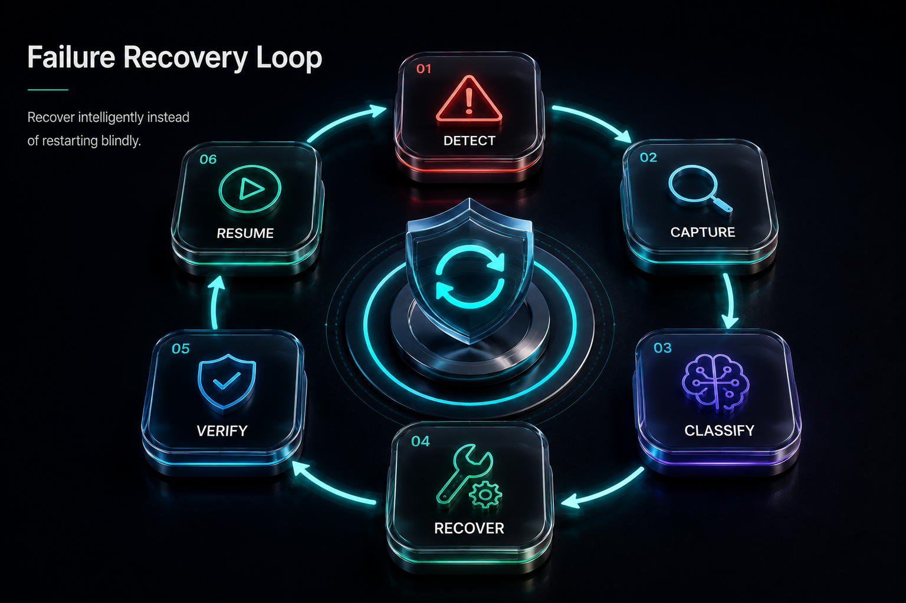

# Advanced Browser Engineering

## Stop Automating Pages. Start Observing the Browser.




## Previously

You built the Starter Kit — a reusable project structure with common/ modules for browser management, retry, logging, config, session, recovery, and data pipelines.

Now we go deeper: beyond controlling the browser to observing everything it does.


## Production Incident

```
A developer built a daily sales dashboard extractor.

The script logged in, opened the dashboard, extracted the 
numbers, and saved a report every morning. It worked for months.

One day, the dashboard frontend changed. The API started 
returning { "data": null }. The page still loaded. The script 
still ran. The report still generated. But every number was blank.

Nobody noticed for two weeks.

Why? Because they monitored "did the script finish?" — not 
"did the browser receive valid data?"
```


## Why This Chapter Exists

In V1, you learned how to control a browser — launch, navigate, click, extract. That is enough to automate a workflow, but production automation fails for a different reason: **you cannot see what is happening inside the browser.**

When a button click fails, is it because the JavaScript crashed, the network timed out, or the event listener wasn't registered? Without observability, every failure looks the same — "something went wrong."


## The Cost of Getting This Wrong

| Mistake | Outcome | Cost |
|---------|---------|------|
| Treating the browser as a black box | No insight into why a page loaded or failed | Debugging takes 10x longer — guesswork instead of evidence |
| Doing heavy work in CDP event handlers | Blocking the event loop causes missed events, timeouts | Monitoring code becomes the reason automation fails |
| Not monitoring the network layer | API returns null, page renders fine, data is empty | Silent data failures that look like successful runs |
| Ignoring console errors | JavaScript exceptions accumulate without detection | Subtle page breakage that only manifests in certain states |
| No resource blocking strategy | Images, fonts, analytics slow every page load | Unnecessary bandwidth, slower runs, higher VPS cost |


## What Is CDP?
- Find elements
- Click buttons
- Fill forms
- Extract data

That is enough to automate a workflow. But production automation fails for a different reason: **you cannot see what is happening inside the browser.**

When a button click fails, is it because:

- The JavaScript crashed?
- The API request failed?
- The page loaded incomplete data?
- The browser ran out of memory?
- Authentication expired?
- A resource never loaded?

Without visibility, every failure looks the same: "it broke."

This chapter changes your mental model from "controlling the page" to **"observing the browser runtime."**


## The Mental Shift

### Beginner Thinking

```text
Python Script → Click Button → Read Text → Save Result
```

The browser is a black box. You send commands via nodriver and hope they work.

But nodriver communicates through the Chrome DevTools Protocol over a WebSocket — the same protocol Chrome's DevTools panel uses. Every network request, console message, performance metric, and DOM mutation generates a CDP event. nodriver receives these events in real time, and your automation can subscribe to the event stream.

### Production Thinking

```text
                     Browser Runtime
                           |
            ┌──────────────┼──────────────┐
            |              |              |
        Network        JavaScript     Performance
        API calls      Console Errors  Metrics
            |              |              |
            └──────────────┼──────────────┘
                           |
                    Your Automation
```

The browser constantly produces signals. Your job is to observe and interpret them.

### The Analogy

A browser is like a restaurant kitchen.


### CDP Layer Diagram

CDP events flow through a layered architecture:

```text
Python / asyncio
    ↑ ↓  nodriver API calls
nodriver 0.50.x
    ↑ ↓  CDP messages (JSON over WebSocket)
Chrome DevTools Protocol
    ↑ ↓  Browser process routes to correct subsystem
Chrome Browser Process
    ↑ ↓  IPC
Renderer Process (per tab)
    ↑ ↓  JavaScript execution, DOM, CSS
Website
```

Events travel upward through this stack. An error at the JavaScript level becomes a console event, which becomes a CDP message, which travels through the WebSocket to nodriver, which dispatches it to your Python handler. Understanding this chain is how you diagnose events that are "lost" — they likely died in transit between layers.


### Event Thinking

Everything in browser automation is events.

```text
Network events:  request sent, response received, data chunk, request failed
DOM events:      element added, element removed, attribute changed, child list changed
Console events:  message logged, warning, error, verbose
Lifecycle events: page loaded, page unloaded, frame navigated, DOM content ready
Performance:     metric emitted, layout shift, largest contentful paint
```

nodriver's CDP connection streams these events in real time. Your automation subscribes to the relevant event streams and reacts. This is event-driven architecture applied to browser control — the same pattern used in distributed systems, adapted for the browser context.

The shift is:

```text
Beginner:  "I tell the browser what to do."
Senior:    "I observe what the browser is doing and respond."
```

The customer sees the final dish (HTML). But the chef receives ingredients from suppliers (APIs). If you want to understand the meal, watch the supply chain.

Your normal automation sees:

> Button exists

CDP lets you see:

> Request started → Response received → JavaScript executed → Console error occurred → Performance metric changed


## What Is CDP?

Chrome DevTools Protocol is the same communication layer Chrome's own DevTools use. It exposes every event the browser produces:

- Network requests starting and completing
- JavaScript execution and failures
- Console messages
- Performance metrics
- Page lifecycle events

If you have ever used Chrome DevTools' Network tab or Console tab, you have used CDP. This chapter teaches you to access it from code.


## The Critical Production Rule

**Never perform heavy work inside browser event handlers.**

A common mistake:

```python
async def on_request(event):
    save_to_database(event)
    analyze_response(event)
    write_file(event)
```

Looks reasonable. But imagine: the page loads and fires 1,500 requests. Your handler runs 1,500 times. Database writes, file I/O, analysis — all inside the callback. Your monitoring code becomes the reason your automation fails.

### Correct Architecture

```text
CDP Event
    ↓
Small Handler (just queue it)
    ↓
Queue (asyncio.Queue, bounded)
    ↓
Background Worker
    ↓
Database / Analysis
```

### Queue Backpressure

The queue between the handler and the worker is not optional — it is the only thing preventing your monitoring from breaking the automation. But a queue without backpressure is just a memory leak by another name.

```text
Producer (CDP events)          → fast, unbounded
    ↓
Queue (bounded, e.g. 1000)     → fills up if consumer is slow
    ↓
Consumer (write to DB)         → slow, bounded by I/O
```

When the queue reaches capacity, the system must decide:

| Strategy | Behavior | Use When |
|----------|----------|----------|
| Block producer | Handler waits for queue space | Events must not be lost |
| Drop oldest | Discard oldest event in queue | Fresh events are more valuable |
| Drop newest | Discard the current event | Every event is equally valuable |
| Persist to disk | Overflow to disk | Events are too valuable to lose |

In most automation scenarios, blocking the producer is the wrong choice — it stalls the entire browser's event handling. Dropping oldest events is usually correct: if the page has fired 1,500 requests and your queue holds 1,000, the earliest 500 events are likely less relevant than the most recent 500.


## Chapter Architecture

The recipes in this chapter follow this pipeline:

```text
                    Chrome Browser
                          |
                      CDP Events
                          |
            ┌─────────────┼─────────────┐
            |             |             |
        Network       Console     Performance
        (Req 31-32)   (Req 33)    (Req 34-35)
            |             |             |
            └─────────────┼─────────────┘
                          |
                 Async Processing Queue
                          |
                   Logging / Storage
                          |
                 Automation Decisions
```


## Recipe 31: Intercept and Analyze Network Traffic with CDP

**Tier: Full Production Depth**
**Stable ID:** NETWORK-INSPECTION
**File:** `recipes/ch09/31_inspect_network.py`
**Prerequisites:** BROWSER-LAUNCH, NAVIGATION-CONTROL

### Problem

Modern websites rarely contain their data directly in HTML. The page you see is a shell. The actual data arrives via API calls.

```html
<div id="products"></div>
<!-- Looks empty, but JavaScript will fill it -->
```

The real data:

```json
GET /api/products?page=1
{
  "items": [
    { "name": "Laptop", "price": 1299 }
  ]
}
```

If you only inspect HTML, you are looking at the final painting instead of the original blueprint.

### Why This Matters

Network extraction is often **faster, cleaner, and less fragile** than DOM extraction. API responses are structured (JSON), arrive before the DOM renders, and survive layout changes.

### When to Use Each Method

| Situation | Choose |
|-----------|--------|
| Static article page | DOM |
| HTML table | DOM |
| React/Vue dashboard | Network |
| Infinite scrolling | Network |
| Need exact visible text | DOM |
| Need structured records | Network |
| UI changes frequently | Network (may survive longer) |

### The Network Lifecycle

A page load is not one event. It is a chain:

```text
Navigate → HTML → CSS → JS → Images → API Calls → UI Render → Interaction
```

Your automation can observe every stage.

### Implementation Concept

```text
1. Enable network monitoring
2. Register request handler
3. Receive events
4. Filter useful requests
5. Queue events for processing
6. Analyze or store
```

### Handling 1000+ Requests

Modern pages generate analytics, ads, fonts, images, API calls, and tracking. Do not store everything. Filter:

- Keep: `/api/`, `/graphql`, `/data/`
- Drop: `.png`, `.jpg`, `.font`, `.analytics`

Use the queue architecture from `common/network_queue.py` to prevent handler overload.

### Failure Modes

| Failure | Symptom | Cause | Fix |
|---------|---------|-------|-----|
| Too many events | Browser slows | Handler does too much | Queue + worker |
| Missing auth data | API returns 401 | No cookies/tokens | Use authenticated session |
| Wrong timing | Empty response captured | Wrong lifecycle point | Wait for actual event |
| Memory growth | RAM exhaustion | Storing all events without limit | Cap queue at 5000 |

### Production Rule

> When a webpage becomes difficult to automate, stop fighting the interface. Observe what the browser is communicating.


## Recipe 32: Block Unnecessary Resources for Performance

**Tier: Full Production Depth**
**Stable ID:** RESOURCE-CONTROL
**File:** `recipes/ch09/32_block_resources.py`
**Prerequisites:** NETWORK-INSPECTION

### Problem

Automation often waits for things it never uses. A normal user needs images, animations, ads. A data extraction worker needs HTML, JavaScript, and API responses. The rest is waste.

### Why This Matters

A system checking 10,000 product pages daily:

Without optimization: 10,000 × 8s = 22 hours
With resource control: 10,000 × 2s = 5.5 hours

Resource blocking is the single biggest performance lever.

### The Strategy

Never start with "block everything." Use this process:

```text
Observe → Measure → Block → Validate
```

### Blocking Modes

| Mode | Blocks | Use When |
|------|--------|----------|
| Safe | Analytics, tracking | Unknown website |
| Balanced | Images, fonts, videos | Needs data, not visuals |
| Aggressive | Everything unnecessary | Only structured data needed |

### The Danger

Blocking `app.js` because it is large can silently break login, button handlers, and API calls. Always validate after blocking.

### Production Rule

> A fast automation that produces wrong results is slower than a slow automation that produces correct results.


## Recipe 33: Debug JavaScript Failures Through Console Logs

**Tier: Full Production Depth**
**Stable ID:** CONSOLE-MONITORING
**File:** `recipes/ch09/33_debug_console.py`

### Problem

The automation fails. No Python exception. No timeout. The page simply stops behaving correctly. Without console monitoring, every failure looks the same: "it broke."

### Console Categories

| Type | Example | Severity |
|------|---------|----------|
| Error | `TypeError: Cannot read property 'value'` | Usually critical |
| Warning | `Deprecated API usage` | May become critical |
| Network error | `Failed to load resource` | Auth or API issue |

### Production Pattern

When a failure occurs, capture all four:

```text
Console Log   → What JS errors happened?
Network Log   → What API calls failed?
Screenshot    → What did the page look like?
HTML Snapshot → What was the DOM state?
```

Together they create a failure investigation package.


## Recipe 34: Measure Browser Performance

**Tier: Full Production Depth**
**Stable ID:** BROWSER-PERFORMANCE
**File:** `recipes/ch09/34_measure_performance.py`

### Problem

Automation becomes slower over time. The common response: "increase timeout." Wrong. Timeout hides the problem. Performance metrics are change detection tools.

### Key Metrics

| Metric | What It Shows | Good | Warning |
|--------|--------------|------|---------|
| TTFB | Server response time | <500ms | >2s |
| FCP | First content paint | <1.5s | >4s |
| LCP | Largest content visible | <2.5s | >4s |
| DOM size | Element count | <1500 | >5000 |

### Production Use

Compare metrics across runs. If LCP jumps from 2s to 10s overnight, the page or CDN changed.


## Recipe 35: Emulate Different Browser Environments

**Tier: Medium Depth**
**Stable ID:** ENVIRONMENT-EMULATION
**File:** `recipes/ch09/35_emulate_environments.py`

### Problem

Automation works on your laptop, fails on the server. Same code, different browser environment.

Your automation depends on:

```text
Python Version + Chrome Version + OS + Locale + Timezone + Profile + Permissions + Network
```

Every production run should record an environment snapshot:

```json
{
  "python": "3.11",
  "chrome": "130",
  "os": "ubuntu22",
  "timezone": "UTC",
  "locale": "en-US"
}
```

When something breaks: compare environments.


## Final Takeaways

After this chapter, you should no longer think:

> "My automation clicked the button."

You should think:

> "The browser entered a state. I observed the signals. I validated the outcome."

The difference between a script and a production system is visibility. A script executes. A system understands.

### Production Rules Summary

1. Never perform heavy work inside browser event handlers — use a queue
2. Filter network events aggressively — 1000+ events per page is normal
3. Monitor console errors — they are your early warning system
4. Track performance metrics over time — they detect silent regressions
5. Record your environment — "works on my machine" is not a diagnosis


## Engineering Review

### Things You Now Understand
- The browser is a black box — CDP events are your sensors
- Everything is events: network, DOM, console, lifecycle, performance — all streamed over CDP
- CDP handlers must be lightweight — queue events, process in background worker
- Queue backpressure prevents monitoring from breaking the automation
- Resource blocking requires validation — never block without verifying the page still works
- Browser health telemetry (BROWSER-HEALTH) monitors connection state, memory, open pages

### Common Mistakes
- [X] Doing heavy work in CDP event handlers — blocks the event loop, causes timeouts
- [X] Monitoring "did the script finish" instead of "did the browser receive valid data"
- [X] Blocking resources without verifying the page still renders correctly

### Senior Takeaways
- The shift is from "I tell the browser what to do" to "I observe what the browser is doing and respond"
- CDP layer diagram shows events travel through 6 layers — lost events died somewhere in transit
- Queue backpressure with drop-oldest is the correct strategy for most automation scenarios

### Architecture Questions
1. A page fires 1,500 network requests in 2 seconds. Your CDP handler writes every request to a database. The write takes 50ms per request. What happens, and what should the architecture be?
2. You block all images and fonts. The page loads faster, but a price extraction now returns `undefined`. What happened?
3. Browser health checks show the browser is alive, but console monitoring detects JavaScript errors on every page. Is this a browser failure or an application failure?

**Next: Chapter 10 — Browser Fingerprints, Reliability & Compatibility**

Where we move from "how the browser behaves" to "why the same automation behaves differently across environments."
