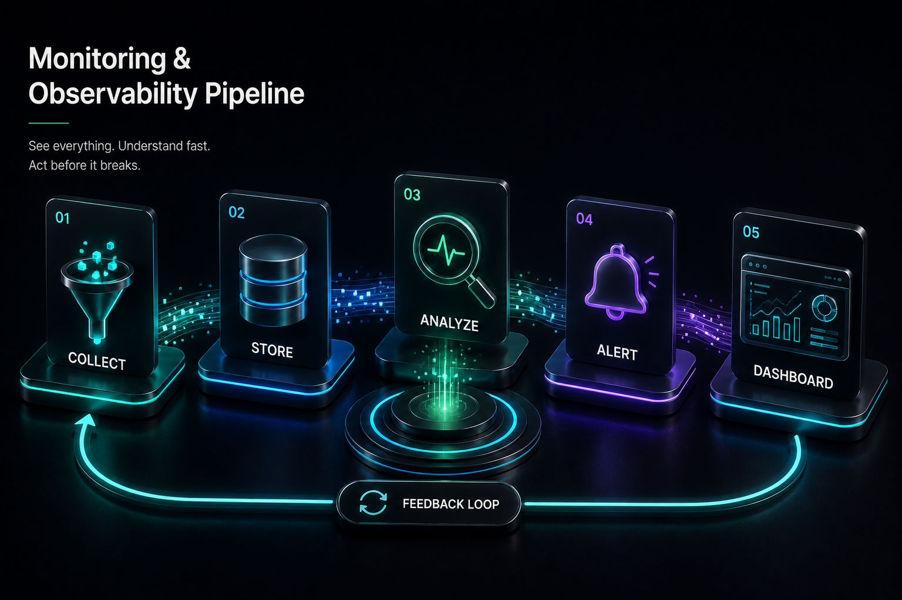

# Browser Reliability & Fingerprints

## Build Automation That Behaves Consistently Everywhere




## Previously

You learned to observe the browser through CDP events — network traffic, console logs, performance metrics, and page lifecycle signals. The browser is no longer a black box.

Now we address the class of failures that frustrates every automation engineer: "the code works on my machine, but fails on another machine."


## Why This Chapter Exists

The script is identical. The website is identical. The automation logic is identical. Yet the behavior changes.

Because the browser is running inside an **environment** — and no two environments are identical.


## The Cost of Getting This Wrong

| Symptom | Root Cause | Cost |
|---------|-----------|------|
| Date fields show wrong values | Server is in UTC, dev machine is in IST | Silent data corruption — dates off by one day |
| Currency formatting is different | Locale settings differ between machines | Wrong parsing, wrong comparisons |
| Screenshots don't match | Viewport size, font availability, GPU differ | Visual regression alerts fire constantly |
| Login verification fails | Profile state, cookie domain, or extension differences | Hours debugging why one machine cannot authenticate |
| PDF exports look broken | Missing fonts on headless server | Client-facing documents with wrong formatting |

Every item in this table was a production incident that took someone 2-5 days to diagnose. The fix was not a code change — it was an environment alignment.


## Production Incident

```
Developer builds invoice automation on his laptop:
    Windows 11, Chrome 130, English, IST, 1920x1080
Everything works. Deploys to VPS:
    Ubuntu Server, Chrome 128, UTC, no desktop, different fonts

Automation starts failing:
  - Date fields show wrong values (UTC vs IST)
  - Currency format changes (₹ vs $)
  - Login verification fails (different cookies)
  - PDF exports look different (missing fonts)

Developer spends a week debugging code.
The code is not the problem. The environment changed.
```

**Lesson:** When behavior differs between machines, compare environments before changing code. An environment snapshot is more valuable than a selector rewrite.


## The Big Idea

### Automation Does Not Run Inside Code. It Runs Inside A World.

That world includes:

```text
Python Version

+

nodriver Version

+

Chrome Version

+

Operating System

+

Browser Profile

+

Timezone

+

Language

+

Fonts

+

Screen Configuration

+

Network Conditions

+

Permissions
```

Together, these create your **Browser Environment**.


## Engineering Analysis

A developer builds an invoice automation system.

On his laptop:

```text
Windows 11
Chrome 130
English
India timezone
1920x1080 screen
```

Everything works.

He deploys to a VPS:

```text
Ubuntu Server
Chrome 128
UTC timezone
No desktop environment
Different fonts
Different profile
```

The automation starts failing:

* date fields show wrong values
* currency formatting changes
* screenshots differ
* login verification fails
* PDF exports look different

The developer starts debugging code.

But the code is not the problem. The environment changed.


## The Mental Model: Environment Is a Contract

A reliable automation system has an agreement between:

```text
Your Automation

        +

Browser Environment

        +

Target Website

        =

Expected Behaviour
```

If any part changes unexpectedly, the contract breaks.

### Example: The Timezone Bug

Imagine an accounting automation.

The code asks:

```python
today = datetime.now()
```

Developer machine: `2026-07-15`

Server: `2026-07-14`

Why? Different timezone. The automation generates yesterday's report. No exception. No crash. A silent production failure.


## Chapter Goals

By the end of this chapter, you will know how to:

* understand what websites can observe about browsers
* diagnose environment differences
* create reproducible browser environments
* manage browser profiles correctly
* handle regional differences
* avoid accidental inconsistencies
* build compatibility checks before deployment


## Important Clarification: Fingerprints Are Not Magic

The internet often describes browser fingerprints as "a way websites detect bots." That explanation is incomplete.

A fingerprint is simply a collection of browser characteristics that describe the environment:

```text
Browser version
Screen size
Language
Timezone
Operating system
Graphics capabilities
```

These signals exist because browsers naturally differ.


### The Environment Drift Story

```
Week 1: Developer sets up automation on laptop. Chrome 130, Python 3.11, 
        IST timezone, English locale. Everything works perfectly.

Week 6: Chrome auto-updates to 131. A font rendering change shifts 
        some element positions by 1px. Screenshot comparisons start 
        failing. Developer ignores it — cosmetic only.

Week 12: Automation deployed to VPS. Ubuntu, Chrome 128 (pinned),
         UTC timezone. Date fields start showing wrong values. 
         "Must be a timezone bug." Developer adds a timezone fix.

Week 24: Server admin rebuilds the Docker image. Chrome 132 now 
         ships by default. A CDP event format changed — the network
         monitor stops parsing response headers. Automation still 
         works but diagnostic data is incomplete.

Week 52: Nobody on the team remembers the original environment. 
         The automation "just works" for reasons nobody fully 
         understands. When it breaks, the fix takes 3 days because 
         reproducing the original environment is impossible.
```

Each drift event was individually harmless. Cumulatively, they created an environment that nobody can fully describe. Environment snapshots (Recipe 39) prevent this by capturing the state at every stage.


### Compatibility Matrix

Before deploying any automation, verify the compatibility of every component in your stack:

| Component | Version | Notes |
|-----------|---------|-------|
| Chrome | 128+ | nodriver 0.50.x supports Chrome 116-132 |
| nodriver | 0.50.3 | Pinned in requirements.txt |
| Python | 3.11+ | async/await, type hints |
| OS | Linux (Ubuntu 22.04+) | Recommended for Docker deployment |
| OS | Windows 10/11 | Works, additional font/config steps |
| Docker | 24+ | Required for reproducible deployments |
| Docker image | python:3.11-slim | Base image used in the cookbook |

This matrix should live in your project's README and be verified before each deployment. A Chrome update from 128 to 130 does not break nodriver, but a jump from 116 to 132 might.

### Environment Drift Timeline

Environments do not break suddenly. They drift slowly:

```text
Day 1:    Developer's machine. Chrome 128, Python 3.11.4, nodriver 0.50.1.
          Automation works.

Day 40:   Chrome auto-updates to 130. Minor rendering differences.
          Automation still works — no one noticed.

Day 120:  VPS deployed. Ubuntu 22.04, Chrome 128 (pinned in Docker).
          Automation works — identical Chrome, different OS fonts.

Day 280:  Docker image rebuilt. Chrome 132 now ships in the base image.
          Automation breaks — CDP API changed for an event handler.
```

The drift was invisible until it caused a failure. Environment snapshots (Recipe 39) capture the state at each point, letting you compare Day 1 vs Day 280 to find the difference.

### The Production Goal

The goal is **not** "hide everything." The goal is: **make your automation environment predictable.**


## Chapter Architecture

```text
                Browser Environment
                      |
        ┌─────────────┼─────────────┐
        |             |             |
    Identity      Regional      Capability
    Signals       Signals       Signals
        |             |             |
        └─────────────┼─────────────┘
                      |
             Environment Snapshot
                      |
             Compatibility Check
                      |
           Reliable Automation
```


## The Four Environment Signal Categories

### Identity Signals — "What browser is this?"

Examples: browser version, operating system, user agent.

```javascript
navigator.userAgent
// "Mozilla/5.0 Windows Chrome/130"
```

### Regional Signals — "Where does this browser appear to operate?"

Examples: language, timezone, locale, currency format.

```javascript
Intl.DateTimeFormat().resolvedOptions().timeZone
// "Asia/Kolkata"
```

### Capability Signals — "What can this browser do?"

Examples: screen size, touch support, graphics capability, available APIs.

### State Signals — "What history does this browser have?"

Examples: cookies, local storage, cache, extensions, permissions.


## Recipe 36 — Audit Your Browser Environment

**Tier: Full Production Depth**
**Stable ID:** FINGERPRINT-AUDIT
**File:** `recipes/ch10/36_understand_fingerprints.py`

### Problem

When automation behaves differently between machines, developers usually compare code. They should compare environments.

### The Wrong Debugging Process

Developer: "Let me rewrite the selector. Let me add more waits. Let me add retries." Nothing works. Because the actual difference is:

```
Machine A: Chrome 130
Machine B: Chrome 128
```

### The Better Approach

Create an environment report:

```json
{
  "python": "3.11",
  "chrome": "130",
  "platform": "Linux",
  "timezone": "UTC",
  "language": "en-US",
  "screen": "1920x1080"
}
```

Now differences become visible.

### Implementation

```python
async def collect_environment(page):
    return await page.evaluate("""
    () => ({
        userAgent: navigator.userAgent,
        language: navigator.language,
        languages: navigator.languages,
        platform: navigator.platform,
        timezone: Intl.DateTimeFormat().resolvedOptions().timeZone,
        screen: { width: screen.width, height: screen.height }
    })
    """)
```

### What This Helps Diagnose

| Symptom | Check |
|---------|-------|
| Dates are wrong | `timezone` |
| Language changed | `language` |
| Screenshots differ | `screen dimensions` |
| Login differs | `profile state` |

### Failure Modes

| Failure | Cause | Fix |
|---------|-------|-----|
| Comparing code instead of env | Same script, different results | Generate snapshots |
| Environment drift | Chrome updates, OS changes | Pin versions |
| No history | Cannot tell what changed | Store snapshots per run |

### Production Pattern

Store environment snapshots with every run:

```
runs/
  2026-07-15/
    environment.json
    result.json
    logs.txt
```

When something breaks, compare yesterday vs today.


## Recipe 37 — Build Reproducible Browser Environments

**Tier: Full Production Depth**
**Stable ID:** ENVIRONMENT-REPRODUCTION
**File:** `recipes/ch10/37_reproducible_environments.py`

### Problem

Production systems need predictable execution. A developer should be able to say: "This automation runs in the same environment every time."

### Analogy

A restaurant recipe. Bad: "Add some flour." Good: "Use 250g flour, 180°C oven, 20 minutes."

Automation needs the second approach.

### Environment Versioning

Track everything:

```text
Python: 3.11.8
Chrome: 130.0.x
nodriver: 0.50.3
OS: Ubuntu 22.04
Dependencies: pinned in requirements.txt
```

### Browser Version Strategy

| Approach | Pros | Cons |
|----------|------|------|
| Always latest | Newest features | Unexpected changes |
| Controlled updates | Predictable | Requires maintenance |

**For production: controlled updates win.**

### Profile Reproducibility

A profile contains: cookies, local storage, preferences, extensions, cache, permissions.

It does NOT contain: Python variables, automation logic, script state.

### Common Mistake

Sharing one profile across workers:

```text
worker1, worker2, worker3 → same profile
```

Result: profile locked, cookies corrupted, unexpected sessions.

Correct:

```
profiles/
  worker-1/
  worker-2/
  worker-3/
```


## Recipe 38 — Browser Profile Isolation

**Tier: Medium Depth**
**Stable ID:** PROFILE-ISOLATION
**File:** `recipes/ch10/38_multi_environment.py`

### Problem

Profiles are powerful. They are also dangerous.

### Real Example

A company automates three customer accounts. Wrong: all share `customer-profile/`. All accounts share cookies, sessions, preferences. Account A accidentally operates as Account B.

### Correct Design

```
profiles/
  customer-a/
  customer-b/
  customer-c/
```

### Profile Lifecycle

| Phase | Action |
|-------|--------|
| Creation | When first needed |
| Validation | Session exists, correct account, correct permissions |
| Cleanup | Remove stale profiles |

### Decision Table

| Situation | Profile Strategy |
|-----------|-----------------|
| One personal account | Persistent profile |
| Multiple accounts | Separate profiles |
| Short extraction | Temporary profile |
| Production worker | Dedicated profile |
| CI testing | Fresh profile each run |


## Recipe 39 — Regional Configuration Testing

**Tier: Medium Depth**
**Stable ID:** ENVIRONMENT-SNAPSHOT
**File:** `recipes/ch10/39_environment_snapshot.py`

### Problem

Many websites behave differently depending on location.

### Example

An ecommerce site:

User A: Language=English, Currency=USD
User B: Language=Japanese, Currency=Yen

Same URL. Different page.

### Regional Factors

| Factor | Controls |
|--------|----------|
| Language | Text, menus, formatting |
| Timezone | Dates, availability, reports |
| Locale | Currency, numbers, sorting |

### Production Rule

> Never assume website output is universal. Always know: website output = environment + account + location.


## Recipe 40 — Diagnose Browser Compatibility

**Tier: Full Production Depth**
**Stable ID:** COMPATIBILITY-DIAGNOSIS
**File:** `recipes/ch10/40_diagnose_compatibility.py`

### Problem

When automation breaks, you need a systematic diagnosis process. Not random fixes.

### Compatibility Checklist

Before debugging code, check:

1. **Runtime** — Python version, nodriver version
2. **Browser** — Chrome version, Chrome path
3. **Environment** — OS, timezone, locale
4. **Profile** — profile exists? locked? session valid?

### Diagnostic Flow

```text
Automation Failed
    ↓
Did browser start?
  NO → Environment issue
  YES → Did page load?
    NO → Network/browser issue
    YES → Did interaction work?
      NO → DOM/application issue
```


## Chapter Decision Cards

### Should I Use A Persistent Profile?

**YES:** recurring workflow, stable account, trusted environment
**NO:** testing, parallel workers, temporary jobs

### Should I Pin Browser Versions?

**YES:** production, client systems, scheduled jobs
**NO:** experiments, personal scripts

### Should I Change Environment Signals?

First ask: "Why?" If the answer is "I need consistency" — good. If the answer is "I need to defeat a website" — wrong engineering mindset.


## Chapter Production Rules

1. A browser environment is part of your application.
2. If two machines behave differently, compare environments before changing code.
3. Profiles are state containers, not automation memory.
4. Reproducibility beats cleverness.
5. The best automation is predictable automation.


## Chapter Summary

After this chapter, you should understand that a browser is not just Chrome running your script. It is a complete execution environment.

Reliable automation requires controlling:

* what browser runs
* where it runs
* what state it carries
* what signals it produces

The question changes from "Why did my script fail?" to **"What changed in the environment that allowed this failure?"**

That is the difference between debugging randomly and engineering systematically.


## Engineering Review

### Things You Now Understand
- A browser environment is a contract between automation, browser, and website — changing any part breaks it
- Four signal categories: identity, regional, capability, state
- Environment drift happens slowly and invisibly — snapshots capture the state at each point
- Compatibility matrix should be verified before every deployment
- The production goal is predictability, not stealth

### Common Mistakes
- [X] Comparing code instead of environment when behavior differs between machines
- [X] Ignoring environment drift — Chrome updates, OS changes, font differences accumulate
- [X] Assuming headless Chrome is identical to headed — rendering, fonts, GPU all differ
- [X] Sharing profiles across environments — Chrome version differences can corrupt profile state

### Senior Takeaways
- When behavior differs between machines, compare environments before changing code
- Environment drift is invisible until it causes a failure — snapshots make it visible
- The Compatibility Matrix should live in your project's README

### Architecture Questions
1. Your automation works on your laptop (Windows, Chrome 130) but fails on the VPS (Linux, Chrome 128). What 3 differences would you check first?
2. A client reports that screenshots from your automation look different than they did last month. Nothing changed in the code. What changed in the environment?
3. You deploy the same automation to 2 clients. Client A's report shows ₹ prices. Client B's shows $ prices. The code is identical. What environment signal differs?

**Next: Chapter 11 — Complex Web Application Interaction**

Where we move from understanding the browser environment to controlling modern applications built with iframes, Shadow DOM, virtualized lists, and dynamic JavaScript frameworks.
