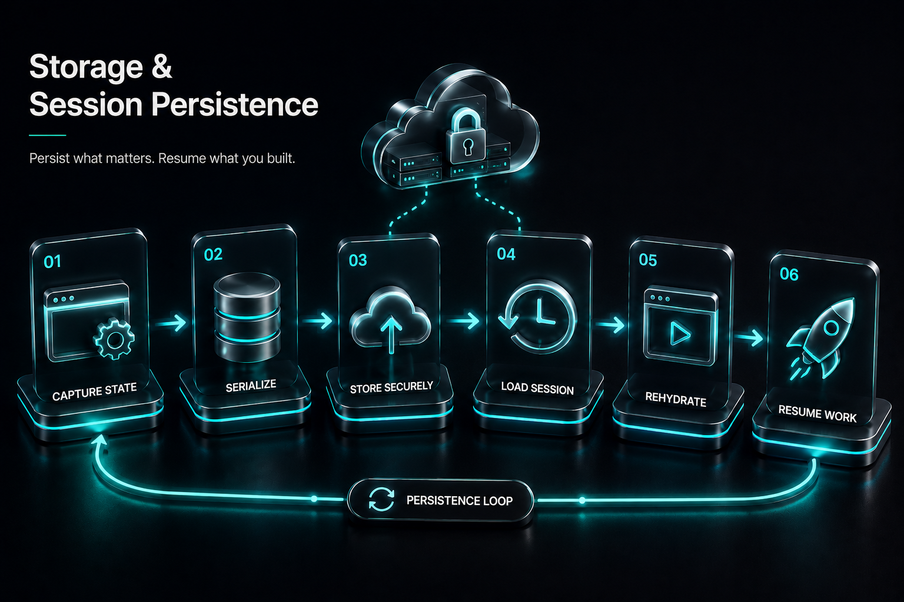

# Production Automation Systems

## From Scripts to Systems

> **A browser automation script can impress a developer.**
> **A browser automation system can run a business.**




## Previously

You learned how to validate extracted data, normalize formats, detect duplicates, attach provenance, and build incremental scraping pipelines. Data is now trustworthy before it reaches storage.

Now we move up the stack: from individual data operations to the production platform that runs them.


## Why This Chapter Exists

Every automation begins the same way. A developer writes a launch-extract-save loop. The script works. Then it runs every day for three months. Questions appear:

* What happens if Chrome crashes?
* What if today's data is empty?
* What if the VPS reboots?
* What if the login expires?
* What if yesterday's job is still running?
* What if two workers scrape the same customer?
* What if nobody notices the failure?

None of these are browser problems. They are production engineering problems.


## The Cost of Getting This Wrong

| Mistake | Outcome | Cost |
|---------|---------|------|
| No deployment pipeline | Automations deployed by SSH + manual setup | Environment drift, "works on my machine" |
| No job lock | Two workers overlap, corrupting each other's data | Silent data corruption that looks like normal results |
| No monitoring | Automation fails silently for days | Business decisions made on missing data |
| No recovery strategy | Every crash requires manual restart | 3 AM pages for every transient failure |
| No secrets management | Credentials hardcoded in Dockerfile | Security breach when image is shared |
| No health checks | Browser crashes and stays crashed until next run | Missed schedules pile up unrecoverably |

* What happens if Chrome crashes?
* What if today's data is empty?
* What if the VPS reboots?
* What if the login expires?
* What if yesterday's job is still running?
* What if two workers scrape the same customer?
* What if nobody notices the failure?

None of these are browser problems. They are **production engineering problems**.

That is what this chapter solves.


## The Biggest Mental Shift In The Entire Book

### V1 Mental Model

```text
Python → Browser → Website → Output
```

### Production Mental Model

```text
Scheduler → Worker → Browser → Recovery → Validation → Storage → Metrics → Alerts → Operator
```

The browser is now only one component.


## The Automation Lifecycle

Think of automation like running a restaurant. Customers don't care whether your oven works. They care that dinner arrives on time.

Browser automation is the oven. Production engineering is the restaurant.

Every automation follows the same lifecycle:

```text
Configuration → Schedule → Worker Starts → Environment Check →
Launch Browser → Authenticate → Perform Work → Validate Output →
Store Results → Collect Metrics → Cleanup → Sleep
```

Notice: **the browser occupies only one step.**


### The Cost of Production Features

Every production feature you add — monitoring, recovery, alerting, validation — has a cost:

| Feature | Benefit | Maintenance Cost |
|---------|---------|-----------------|
| Logging | Diagnose failures | Log rotation, storage, querying |
| Monitoring | Detect failures early | Dashboard maintenance, alert tuning |
| Recovery | Automatic self-healing | Recovery path testing, flaky recovery detection |
| Validation | Data quality guarantees | Schema updates when websites change |
| Alerting | Human notification | Alert fatigue, threshold tuning |
| Secrets management | Security | Credential rotation, access audits |

This is not an argument against adding features. It is an argument for intentionality. Every feature should be added because the automation's cost of failure justifies it — not because "production systems should have it."


### Production Deployment Ladder

Automation systems evolve through deployment stages as they grow from personal scripts to production platforms:

```text
Laptop     → Running manually when needed. No deployment.
Docker     → Packaged in a container. Reproducible environment.
One VPS    → Single server, scheduled execution. Centralized.
Multi-Worker → Concurrent tasks, profile isolation. Parallel execution.
Multi-Server → Queue distribution, load balancing. Horizontal scale.
Platform   → Job registry, health checks, operator dashboard. Full lifecycle management.
```

Each rung on the ladder requires different engineering. The ladder helps you decide: "I have 5 suppliers to monitor. Do I need Multi-Worker or is Docker enough?" The answer depends on concurrency needs and failure cost — not on what seems technically impressive.

### The Production Reliability Pyramid

Every production automation should satisfy four levels:

```text
                Business Value
                     ▲
               Reliable Data
                     ▲
             Reliable Execution
                     ▲
             Reliable Browser
```

Most tutorials stop at the bottom. Professional automation engineers care about the top.


## Production Incident

A logistics company automated shipment tracking. The automation logged in, opened dashboard, downloaded CSV, emailed report. It worked perfectly for six months.

Then Chrome auto-updated. Downloads silently stopped. The script still exited with `Exit Code: 0`. Every monitoring system showed `SUCCESS`. No report existed. Nobody noticed for four days.

**A successful process does not guarantee a successful business outcome.**


## Chapter Architecture

```text
                 Scheduler
                     │
                     ▼
          Production Worker
                     │
        ┌────────────┼────────────┐
        ▼            ▼            ▼
 Configuration   Browser      Recovery
        │            │            │
        └────────────┼────────────┘
                     ▼
               Data Validation
                     ▼
                  Database
                     ▼
             Metrics Collector
                     ▼
              Alert Dispatcher
```


## Production Principles

Every recipe in this chapter supports one of six engineering principles:

1. **Automations must survive failure.**
2. **Automations must explain failure.**
3. **Automations must recover whenever safe.**
4. **Automations must never silently corrupt data.**
5. **Automations must leave evidence.** Logs. Metrics. Screenshots. HTML. Console output.
6. **Every automation should be restartable.**


## Recipe 46 — Deploy Browser Automation with Docker

**Tier: Full Production Depth**
**Stable ID:** DOCKER-DEPLOYMENT
**File:** `recipes/ch12/46_docker.py`

### Problem

Your automation works perfectly on your laptop. Now deploy it. Suddenly: Chrome not found, missing libraries, different fonts, wrong timezone, permission denied.

Nothing changed. Except everything.

### Why Docker?

Docker packages Python + Chrome + nodriver + Dependencies + Configuration into one reproducible environment. The question changes from "Will this work on the server?" to "The server runs the exact same environment."

### Analogy

Imagine baking a cake. Laptop = random oven, random flour, random temperature. Docker = same oven, same flour, same recipe, same result.

### Production Pipeline

```text
Developer → Git → Docker Build → Image → VPS → Container → Scheduler
```

### Common Failure Modes

| Failure | Cause | Fix |
|---------|-------|-----|
| Chrome crashes randomly | Missing shared memory | `shm_size: 2gb` |
| Reports one day early | Wrong timezone | Set TZ environment variable |
| PDF exports broken | Missing fonts | Install font packages |
| Chrome security issues | Running as root | Use non-root user |
| Session corruption | Profile mounted wrong | Use persistent volume |

### Production Rule

> Never deploy directly from your laptop. Deploy an image.

> **Advanced Deployment: Reducing Docker Image Size**
>
> Once your automation is stable, you can optimize your Docker image using multi-stage builds, removing package caches, and minimizing runtime dependencies. These techniques reduce deployment time and storage but add complexity.
>
> | Choice | When |
> |--------|------|
> | Google Chrome Stable | Default — best compatibility |
> | Chromium | Linux-only, lighter but not identical |
> | Multi-stage build | CI/CD optimization after stable |
>
> Optimize only after correctness and reproducibility are established.


## Recipe 47 — Schedule Reliable Automation Jobs

**Tier: Full Production Depth**
**Stable ID:** JOB-SCHEDULING
**File:** `recipes/ch12/47_schedule_jobs.py`

### Problem

Running a script once is easy. Running it every day for a year is engineering.

### Scheduling Is Not Time — It Is Coordination

Questions scheduler must answer:

* What if yesterday's job still runs?
* What if today's job starts twice?
* What if the server reboots?

### Wrong Architecture

```text
cron → python script
```

Simple. Fragile.

### Better Architecture

```text
Scheduler → Acquire Lock → Run Worker → Release Lock → Record Metrics
```

### Overlapping Jobs

Imagine 09:00 Worker A starts. 09:10 Still running. 09:15 Worker B starts. Both log into the same account, modify the same data. Chaos.

**Solution:** Use a lock. If job is running, skip and alert.

### Production Rule

> Never allow duplicate production jobs unless explicitly designed.


## Recipe 48 — Store Automation Data Safely

**Tier: Medium Depth**
**Stable ID:** DATABASE-STORAGE
**File:** `recipes/ch12/48_store_data.py`

### Problem

The browser collected perfect information. Writing directly to CSV works until: duplicate rows, crashes, concurrent workers, updates.

### Data Storage Layers

```text
Browser → Raw Data → Validation → Database → Exports
```

The database is the system of record. CSV is an output format.

### SQLite vs PostgreSQL

| Situation | Choice |
|-----------|--------|
| Single worker, prototype, desktop | SQLite |
| Multiple workers, APIs, concurrent writes | PostgreSQL |

### Production Rule

> Store structured data first. Export later.


## Recipe 49 — Observability and Metrics

**Tier: Full Production Depth**
**Stable ID:** OBSERVABILITY
**File:** `recipes/ch12/49_monitoring_alerts.py`

### Problem

Your automation ran overnight. Was it healthy? How do you know?

### Logging Is Not Observability

Logs answer "what happened?" Metrics answer "how healthy is the system?"

### Metrics Every Automation Needs

```text
Runtime, Success Rate, Failure Rate, Browser Restarts,
Records Processed, Validation Failures, Retries, Average Duration
```

### Example Dashboard

```text
Price Monitor
Runs: 248 | Success: 246 | Failed: 2
Avg Runtime: 4m 12s | Records: 48,122
Validation Failures: 12 | Browser Restarts: 1
```

One glance tells you the health of the platform.

### Production Rule

> If you cannot measure it, you cannot operate it.

### Failure Budgets

Every automation system has a failure budget — the acceptable rate of failure within a time window. The budget is not a technical metric; it is a business decision.

```text
Target:       99.9% success rate
Budget:       0.1% failures
Daily runs:   144 (every 10 minutes)
Budget/day:   0.144 failures allowed (roughly 1 failure per week)
```

When the failure rate exceeds the budget, the team stops feature work and investigates reliability. This is the Site Reliability Engineering approach applied to browser automation.

Exhausting the failure budget is not an emergency — it is a signal. It tells you that something in the system needs attention before it fails completely. A system that burns through its monthly failure budget in three days should be investigated, not ignored just because each individual failure was non-critical.


## Recipe 50 — Recovery and Health Management

**Tier: Full Production Depth**
**Stable ID:** HEALTH-RECOVERY
**File:** `recipes/ch12/50_health_recovery.py`

### Problem

Production systems fail. The question is not "will it fail?" The question is "what happens next?"

### Recovery Ladder

```text
Failure → Detect → Classify → Recover → Validate → Resume → Alert (if needed)
```

### Recovery Categories

| Failure | Action |
|---------|--------|
| Browser crash | Restart browser |
| Session expired | Re-login |
| Temporary network failure | Retry |
| Validation failure | Stop and alert |
| Unknown failure | Capture diagnostics, stop |

### Recovery Manager Architecture

```text
RecoveryManager → FailureType → Strategy → Resume / Stop / Escalate
```

### Production Rule

> Recovery without diagnosis is gambling.


## Recipe 51 — Secrets and Configuration Management

**Tier: Medium Depth**
**Stable ID:** SECRETS-MGMT
**File:** `recipes/ch12/51_secrets_management.py`

### Problem

Every automation needs credentials.

```python
# BAD
PASSWORD = "abc123"
```

```python
# BETTER
import os
PASSWORD = os.environ.get("LOGIN_PASSWORD")
```

### Configuration Layers

```text
Development → Staging → Production
```

Each environment should have different credentials, endpoints, browser profiles, and schedules. Never edit code when deploying. Change configuration.

### Production Rule

> Code should be identical across environments. Only configuration changes.


## Chapter Decision Cards

### Docker or Local?

| Situation | Recommendation |
|-----------|---------------|
| Learning | Local |
| Personal scripts | Local |
| Client deployment | Docker |
| Scheduled jobs | Docker |

### SQLite or PostgreSQL?

| Situation | Choice |
|-----------|--------|
| One worker | SQLite |
| Multiple workers | PostgreSQL |
| API access | PostgreSQL |
| Small personal tool | SQLite |

### Retry or Recover?

| Failure | Action |
|---------|--------|
| Timeout | Retry |
| Browser crash | Restart browser |
| Session expired | Re-login |
| Empty validated data | Stop & Alert |
| Unknown | Capture diagnostics |


## Production Deployment Checklist

Before deployment, verify each component:

| # | Capability | Stable ID | Status |
|---|------------|-----------|--------|
| 1 | Environment snapshot captured | ENVIRONMENT-SNAPSHOT | □ |
| 2 | Retry taxonomy configured | RETRY-TAXONOMY | □ |
| 3 | Structured logging enabled | LOGGING-SYSTEM | □ |
| 4 | Health checks implemented | BROWSER-HEALTH | □ |
| 5 | Recovery manager configured | RECOVERY-MANAGER | □ |
| 6 | Secrets managed via .env | SECRETS-MGMT | □ |
| 7 | Metrics collection active | OBSERVABILITY | □ |
| 8 | Data validation pipeline | DATA-QUALITY | □ |


## Common Deployment Mistakes

After learning the right patterns, here are the mistakes most beginners make:

### [X] Running Chrome as root

Chrome security sandbox requires a non-root user inside the container. Use `USER appuser` in your Dockerfile.

### [X] Sharing one profile across workers

Multiple workers writing to the same profile directory causes corruption. Each worker needs `profiles/worker-1/`, `profiles/worker-2/`, etc.

### [X] Infinite retries

```python
while True:
    try:
        run()
    except:
        pass  # Never stop retrying
```

This masks real failures and prevents alerting. Always cap retries (3-5 max), then escalate.

### [X] Hardcoded passwords

Passwords committed to git are permanently compromised. Use `.env` files and environment variables.

### [X] Assuming exit code == success

A script that exits with code 0 may have produced empty, incorrect, or corrupted data. Always validate output before reporting success.

### [X] No health check

Without health checks, a crashed browser stays crashed until the next scheduled run — or until a human notices.

### [X] No validation

Without validation, bad data enters your database silently. A scraper that stores wrong data is worse than one that fails.


## Production Readiness Score

Use this to assess any automation system:

| Capability | When Present |
|------------|-------------|
| □ Environment Snapshot | Versioned, stored per run |
| □ Retry Taxonomy | Bounded retries with backoff |
| □ Structured Logging | Timestamps, levels, correlation IDs |
| □ Health Checks | Browser alive, page responds |
| □ Recovery Manager | Crash → restart, session → re-login |
| □ Secrets Management | No hardcoded credentials |
| □ Metrics Collection | Runtime, success rate, records |
| □ Data Validation | Schema checks, quarantine on failure |

**Your score:**
- **0–2:** Prototype. Works on your machine.
- **3–5:** Internal tool. Reliable enough for personal use.
- **6–8:** Production ready. Survives failures, explains itself, can be operated by others.


## Architecture Summary

```text
Scheduler
    │
    ▼
Worker
    │
    ▼
Browser
    │
    ▼
Validation
    │
    ▼
Storage
    │
    ▼
Monitoring
    ├──► Metrics
    ├──► Logs
    └──► Alerts → Operator
```

> **See Appendix A** for the complete production architecture diagram, including recovery flows, failure classification, and multi-worker deployment components.


## Chapter Summary

The browser is no longer the center of the system. It becomes one worker inside a much larger architecture.

Production automation is not defined by how fast it clicks, how many selectors it knows, or how clever the scraping logic is. It is defined by:

* whether it survives failure
* whether it protects data quality
* whether it can explain what happened
* whether another engineer can operate it six months later

A script performs work. A production automation system performs work **reliably, repeatedly, and observably**.


## Engineering Review

### Things You Now Understand
- The browser is one component in a production system — not the center of it
- Docker ensures reproducible environments across development and production
- Scheduling requires coordination (locks), not just time (cron)
- Observability requires metrics, not just logs
- Recovery depends on correct failure classification
- Secrets and configuration belong in `.env`, never in code or Dockerfile

### Common Mistakes
- [X] Deploying directly from laptop — environment drift is guaranteed
- [X] No job lock — overlapping workers corrupt each other's data
- [X] Assuming exit code 0 means success — the script can succeed while producing empty data
- [X] No health checks — crashed browser stays crashed until next scheduled run
- [X] Hardcoded passwords in Dockerfile — anyone with image access can extract them

### Senior Takeaways
- The Production Deployment Ladder shows how to evolve from Laptop to Platform
- Every production feature has a maintenance cost — add features intentionally
- Failure budgets turn reliability from a feeling into a metric

### Architecture Questions
1. Your automation runs on a Docker container. Chrome crashes. Docker restart policy restarts the container. The lock file is stale. What happens on restart?
2. You have 5 clients, each with different schedules. Do you use 5 cron jobs, or one scheduler with a job registry?
3. A client asks for 99.99% reliability. Your current system achieves 99.5%. What is the cost of closing that gap?

**Next: Chapter 13 — Data Engineering Pipelines**

The browser collects data. The automation system is responsible for proving that the data can be trusted. Chapter 13 teaches you to validate, normalize, deduplicate, and audit the output of everything Chapter 12 showed you how to deploy.

