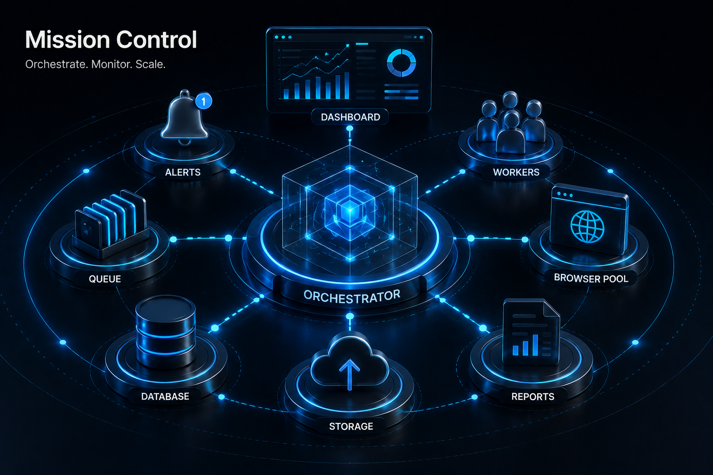

# Production Case Studies

## From Recipes to Real Systems

> **A recipe teaches you how to use a tool.**
> **A case study teaches you why the tool exists.**




## Previously

You built the complete data trust pipeline — validation, normalization, provenance, structural comparison, incremental scraping. Every record entering your database is now provably correct.

Now we apply everything from the entire book to real business problems.


## Why This Chapter Exists

Up to this point, every recipe has focused on solving a specific technical problem. Real businesses don't ask for these things. They say: "We lose money because competitors change prices faster than we notice."

Business problems never arrive as programming problems. This chapter teaches you to translate one into the other — and choose the right architecture for each scenario.


## The Cost of Getting This Wrong

| Mistake | Outcome | Cost |
|---------|---------|------|
| Building for one use case without extensibility | Every new client requires a new automation from scratch | 2 weeks per client — unsustainable |
| Choosing the wrong storage for the scale | SQLite with 10 concurrent workers | Database locked errors, data loss |
| No architecture review | "Why not Kubernetes?" — "I didn't think about it" | Over-engineered or under-engineered, never right-sized |
| No failure scenarios documented | Alert fires at 3 AM — operator has no runbook | Incident response time: hours instead of minutes |
| No scaling path | System works for one client, cannot grow to ten | Rewrite required at every growth stage |


## Capstone Repository Layout

Each case study is a self-contained directory you can copy into a client project and adapt.

```text
capstones/
│
├── common/                     ← Toolkit built throughout the book
│
├── 56_price_monitor/           ← Standalone application
│   ├── __init__.py
│   ├── main.py
│   ├── README.md
│   └── requirements.txt
│
├── 57_saas_dashboard/
│
├── 58_lead_workflow/
│
├── 59_supplier_pipeline/
│
└── 60_operations_platform/
```

Each capstone imports from `common/` — Chapters 1-13 built the toolbox; Chapter 14 proves the toolbox is sufficient.


## Case Study Structure

Every case study follows the same framework:

1. **Business Problem** — Why does this automation exist?
2. **Requirements** — Functional and non-functional
3. **Constraints** — The real-world limits
4. **Architecture** — How components connect
5. **Technology Decisions** — Why this architecture?
6. **Implementation** — System-by-system, not line-by-line
7. **Failure Scenarios** — What breaks and how
8. **Scaling Path** — Version 1 → Version 2 → Version 3


# CAPSTONE RECIPE 56

## Enterprise Price Monitoring Platform

### Business Problem

A national retailer competes with five major marketplaces. Three analysts spend four hours every day manually comparing prices across Amazon, Flipkart, Reliance, Croma, and Vijay Sales.

### Requirements

- Monitor 10,000 products across 5 competitors
- Check every 6 hours
- Alert on price drops below threshold
- Maintain price history for trend analysis

### Constraints

- Login required for 3 of 5 marketplaces
- Rate limits on 2 sites (max 1 request per 2 seconds)
- Must finish before 8 AM daily
- Single VPS with 4GB RAM

### Architecture

```text
Scheduler (cron)
    ↓
Worker Pool (1 browser)
    ↓
nodriver Extraction
    ↓
Validation (common/data_pipeline.py)
    ↓
SQLite (price_history.db)
    ↓
Slack Alert (common/alert.py)
```

### Technology Decisions

| Decision | Reason |
|----------|--------|
| SQLite | Single worker, no concurrent writes needed |
| `common/alert.py` | Simple Slack webhook — no email or SMS complexity |
| `common/data_pipeline.py` | Validation + quarantine + alerting in one module |
| Incremental scraping | 99.9% of data unchanged daily — hash before scrape |

### Architecture Review


### Architecture Tradeoff: Why Not...

Every case study in this chapter makes explicit choices. Here are the common alternatives and why they were rejected:

| Technology | Why It Appears | Why It Wasn't Chosen |
|-----------|---------------|---------------------|
| **Kubernetes** | Industry standard for container orchestration | Overkill for 1-5 containers on a single VPS. Adds control plane complexity, network overhead, and learning curve. Docker Compose is correct until you need multi-server. |
| **Redis** | Fast queue, pub/sub, caching | Unnecessary until you have multiple workers competing for work. A single-threaded asyncio worker doesn't need a separate queue server. |
| **PostgreSQL** | Production-grade relational database | Correct when you have concurrent writers. SQLite with WAL mode handles single-writer workloads efficiently. Add PostgreSQL when worker count > 1. |
| **RabbitMQ / Kafka** | Message broker for distributed systems | Adds serialization, deserialization, broker management. The automation is a batch job, not a stream processor. A simple asyncio.Queue is sufficient. |
| **Microservices** | Loose coupling, independent scaling | Each "service" would be a single function. Splitting them into separate processes adds network calls, serialization overhead, and deployment complexity for zero benefit. |

The rule: choose the simplest technology that meets your current scale. Premature distribution is the most common architecture mistake in automation systems.


The decisions above are not accidental. Each was chosen over alternatives with clear tradeoffs:

| Question | Answer | Why NOT the alternative |
|----------|--------|----------------------|
| Why NOT PostgreSQL? | Single worker, no concurrent writes. SQLite removes a server dependency. | PostgreSQL adds operational complexity (connection management, backups) for zero concurrency benefit. |
| Why NOT microservices? | One VPS, one worker. Splitting into services adds network calls, serialization, and deployment complexity. | The automation is a batch job, not an API. Microservices would add cost without architectural benefit. |
| Why NOT Redis for the queue? | There is no queue — the worker runs sequentially. A queue would be useful only if extracting from multiple sites concurrently. | Premature optimization. Add Redis when the worker count exceeds 1. |
| Why NOT Kubernetes? | One container, one VPS. Kubernetes would manage one pod on one node — orchestration overhead with zero benefit. | Docker Compose on a single VPS is the correct deployment model until the system needs multiple servers. |

Every architecture decision should be defensible against real alternatives. If the answer to "why not X" is "I didn't think about it," the architecture is not reviewed — it is accidental.

### Implementation

The capstone at `recipes/ch14/56_price_monitor/main.py` imports from `common/`:

```python
from common.browser import launch_browser
from common.data_pipeline import validate_product, attach_provenance
from common.alert import AlertLevel, send_alert
```

Only recipe-specific extraction logic lives inside the capstone.

### Failure Scenarios

| Failure | Detection | Recovery |
|---------|-----------|----------|
| Selector changed | Validation fails on all records | Alert human, pause |
| Login expired | Auth check fails | Re-login or alert |
| Rate limited | HTTP 429 | Backoff and retry |
| Empty page loaded | Structural comparison detects | Re-navigate |
| 0 prices extracted | Validation alert threshold | Stop, alert |

### Scaling Path

**Version 1** — 1 worker, 1 browser, SQLite, 10,000 products, 6-hour cycle

**Version 2** — 3 workers, 3 browsers, PostgreSQL, 30,000 products, 2-hour cycle

**Version 3** — Queue-based distribution, worker pool, dedicated metrics, Grafana dashboard

### Lessons Learned

The Price Monitor taught five lessons that apply to every automation project:

1. **HTML selectors are the weakest link.** In 18 months of operation, three different marketplace frontends changed enough to break selectors. Each time, the data was still on the page — just at a different DOM location. Data-attribute selectors survived; structural selectors did not.

2. **Validation is not optional — it is the automation's immune system.** Validation caught a 100% failure rate (all selectors returning empty) within one run cycle. Without validation, that failure would have produced empty reports until a human noticed the zero row count — potentially days later.

3. **Incremental scraping is the highest-ROI optimization.** After the first full scrape, 80% of subsequent runs detected zero changes and completed in under 2 minutes instead of 30. The hash comparison took 100ms per page and eliminated redundant processing.

4. **Monitoring finds failures before validation does.** The structural comparison (Recipe 55) detected that a product table had dropped from 125 rows to 0 before the first validation check ran. The alert fired within 5 seconds of page load — faster than any data-level check could.

5. **Deployment automation is not optional.** The monitor was initially deployed by SSH + manual Docker build. After three deployment errors (wrong tag, missing env var, port conflict), the team added a deployment script. The script paid for itself within a week.


# CAPSTONE RECIPE 57

## SaaS Dashboard Automation

### Business Problem

An operations director needs yesterday's KPIs every morning before 8 AM. A finance team manually downloads monthly reports from a SaaS analytics dashboard. The process is forgotten on busy days.

### Requirements

- Log in to SaaS dashboard
- Navigate to the monthly report
- Export as PDF/CSV
- Verify file has expected content
- Deliver to shared folder + notify team

### Constraints

- Session expires after 24 hours
- MFA may be required (manual approval only)
- Report must be complete (not a partial export)

### Architecture

```text
Restore Session → Validate Session → Generate Report → Export → Verify File → Upload → Notify Slack

MFA Checkpoint: Manual approval file poll (if required)
```

### Technology Decisions

| Decision | Reason |
|----------|--------|
| Session persistence | Avoid re-login every run |
| File-based approval signal | Simple, auditable, no API dependencies |
| PDF + CSV export | Machine-readable + human-readable |

### Implementation

The capstone at `recipes/ch14/57_saas_dashboard/main.py`:

```python
# Session restore with MFA checkpoint
while not APPROVAL_FILE.exists():
    await asyncio.sleep(5)
```

The approval signal is intentionally simple. In production you might use Slack buttons, Teams approvals, or an internal dashboard.

### Failure Scenarios

| Failure | Detection | Recovery |
|---------|-----------|----------|
| Session expired | Validation check fails | Re-login |
| MFA triggered | Login redirects to challenge | Poll for manual approval |
| Report not generated | File size check fails | Retry generation |
| Upload failed | HTTP error | Retry with backoff |


# CAPSTONE RECIPE 58

## CRM Lead Processing System

### Business Problem

A sales team receives 200+ leads per day through a website form. Each lead must be validated, entered into the CRM, assigned to a salesperson, and followed up within 24 hours.

### Requirements

- Submit form data through the website
- Validate fields before submission
- Check CRM for duplicates (company + email)
- Create CRM entry if new
- Send notification

### Constraints

- CRM has no public API
- Form has anti-bot fields requiring real browser rendering
- Running twice must not create duplicate leads (idempotency)

### Architecture

```text
Lead Form → Validation → Duplicate Check → CRM Entry → Sales Assignment → Slack Notification
```

### Technology Decisions

| Decision | Reason |
|----------|--------|
| Natural key dedup | `company + email` — survives system restarts |
| `common/data_pipeline.py` | Reuses validation + quarantine |
| Browser automation | CRM has no API; form requires real rendering |

### Implementation

The capstone at `recipes/ch14/58_lead_workflow/main.py`:

```python
dedup_key = f"{lead.get('company', '')}|{lead.get('email', '')}"
if dedup_key in self.seen:
    return {"status": "duplicate"}
```

### Failure Scenarios

| Failure | Detection | Recovery |
|---------|-----------|----------|
| Form validation fails | Field-level error | Quarantine lead |
| CRM entry fails | HTTP error | Retry, then alert |
| Duplicate detected | Natural key match | Skip, log |


# CAPSTONE RECIPE 59

## Supplier Intelligence Pipeline

### Business Problem

A procurement team monitors 25 supplier portals for stock levels, pricing, ETA, and promotions. Each supplier has a different website, authentication scheme, and data format.

### Requirements

- Monitor 25 suppliers concurrently
- Each supplier has isolated profile and credentials
- Collect: stock, price, ETA, promotions
- Validate and normalize all data to a common schema
- Export daily report

### Constraints

- 4GB VPS — maximum 2-3 concurrent browsers
- Supplier portals may be slow (up to 30s page load)
- Profiles must be isolated (never share between suppliers)

### Architecture

```text
Scheduler → Queue → Worker Pool (2-3) → Profile Isolation → Extraction → Validation → Provenance → Database
```

### Technology Decisions

| Decision | Reason |
|----------|--------|
| 2-3 workers max | 4GB VPS cannot support more |
| Isolated profiles | Never share cookies/sessions between suppliers |
| `asyncio.Semaphore` | Control concurrency without external queue |

### Implementation

The capstone at `recipes/ch14/59_supplier_pipeline/main.py`:

```python
MAX_WORKERS = 3
sem = asyncio.Semaphore(MAX_WORKERS)
```

Each supplier gets its own browser profile in `profiles/SUP-001/`, `profiles/SUP-002/`, etc.


# CAPSTONE RECIPE 60

## Automation Operations Platform

### Business Problem

An agency manages automation for 12 clients. Each client has different websites, schedules, profiles, and output requirements. Previously each automation ran on a separate server — unsustainable.

### Requirements

- Run 12+ automations from a single platform
- Each automation has its own profile, schedule, and output
- Central monitoring and alerting
- Add new automations without restarting the system

### Architecture

```text
Job Registry → Scheduler → Worker Pool → Browser Pool → Recovery → Metrics → Alerts → Dashboard
```

```text
Job Registry
    │
    ▼
Scheduler
    │
    ▼
Worker Pool
    │
    ▼
Browser Pool
    │
    ▼
Recovery Manager (common/recovery.py)
    │
    ├── Metrics (common/metrics.py)
    ├── Logs (common/logging.py)
    └── Alerts (common/alert.py)
```

### Technology Decisions

| Decision | Reason |
|----------|--------|
| Single Python application | Runnable, not distributed. Readers can deploy on one VPS. |
| `common/recovery.py` | Reuses failure classification from Chapter 12 |
| Job registry dict | Simple — no external database needed for orchestration |

### Implementation

The capstone at `recipes/ch14/60_operations_platform/main.py`:

```python
class AutomationPlatform:
    def register_job(self, name, target_url, schedule, profile_dir):
        ...
    async def dispatch(self, job):
        ...
    async def run(self):
        ...
```

Docker deployment is a sidebar. The runnable recipe is the single Python application.

### Failure Scenarios

| Failure | Detection | Recovery |
|---------|-----------|----------|
| Job crash | Exception in dispatch | Recover via RecoveryManager |
| Profile corrupted | Browser fails to launch | Reset profile, then alert |
| Worker stuck | Timeout exceeded | Kill and restart |

### Scaling Path

**Version 1** — Single process, sequential dispatch, SQLite metrics

**Version 2** — Async worker pool, concurrent dispatch, PostgreSQL

**Version 3** — Queue distribution, multi-server, Prometheus + Grafana


## The Automation Engineer's Manifesto

After 60 recipes and 14 chapters, here are the principles that will outlast any tool or library.

| Principle | First Introduced |
|-----------|-----------------|
| Validate before trusting | Recipe 52 (DATA-VALIDATION) |
| Design for recovery, not just success | Recipe 50 (HEALTH-RECOVERY) |
| Observe before debugging | Recipe 31 (NETWORK-INSPECTION) |
| Treat profiles as state, not identity | Recipe 38 (PROFILE-ISOLATION) |
| Environment matters — compare before code | Recipe 39 (ENVIRONMENT-SNAPSHOT) |
| Build systems, not scripts | Chapter 12 |
| Data without provenance cannot be trusted | Recipe 56 (DATA-PROVENANCE) |
| Automate business outcomes, not browser clicks | Chapter 14 |
| Every automation should be restartable | Principle 6, Chapter 12 |
| The goal is not to automate faster — it is to build systems people can rely on | This chapter |


## Engineering Review

### Things You Now Understand
- Business problems never arrive as programming problems — your job is translation
- Every architecture decision is a tradeoff — "why not X" is as important as "why Y"
- Capstone recipes are miniature production applications with full lifecycle management
- Five case studies show the same patterns applied to different business domains
- The Manifesto summarizes 12 principles that outlast any tool or library

### Common Mistakes
- [✗] Building for one use case without extensibility — every new client requires a rewrite
- [✗] Choosing the wrong storage for the scale — SQLite with 10 concurrent workers produces locked errors
- [✗] No architecture review — "why not Kubernetes?" should have an answer
- [✗] No failure scenarios documented — operator has no runbook at 3 AM

### Senior Takeaways
- The architecture review answers "why NOT" — every decision should be defensible against real alternatives
- Lessons from production: selectors break, validation saves, incremental scraping is highest-ROI optimization
- The Manifesto's 12 principles are the book's intellectual backbone

### Architecture Questions
1. You have one VPS, 3 clients, and 5 automation targets. Do you use SQLite or PostgreSQL? One profile per worker or one shared profile?
2. A client asks for "real-time data." Your architecture polls every 6 hours. Do you change the architecture or educate the client?
3. You add a 6th case study for a new client. It requires Redis for queue management. Does this break the pattern established in the other 5 case studies?


## Epilogue

When you started this book, you learned how to launch a browser.

By the end, you learned how to design, deploy, monitor, recover, validate, and operate browser automation systems.

Languages, frameworks, and browser APIs will change. Chrome DevTools Protocol will evolve. New automation libraries will appear.

The engineering principles you have learned — reproducibility, validation, observability, recovery, and system design — will remain valuable long after today's tools are replaced.

That is why this book was never really about nodriver. It was about becoming the kind of engineer who can build automation systems that businesses trust.
