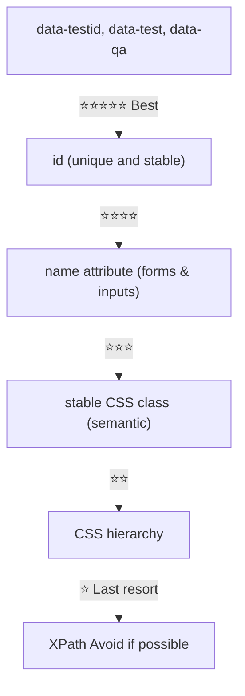
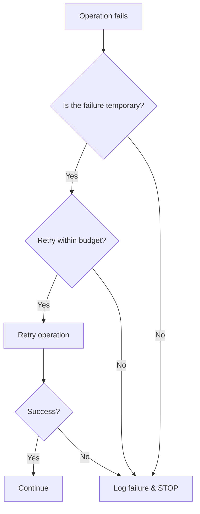
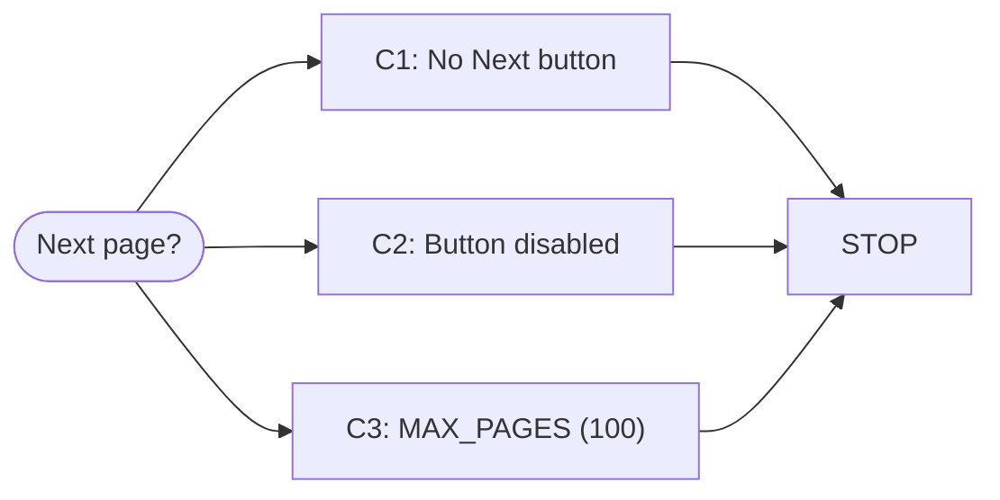
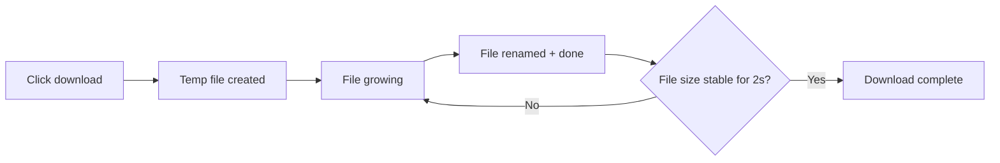
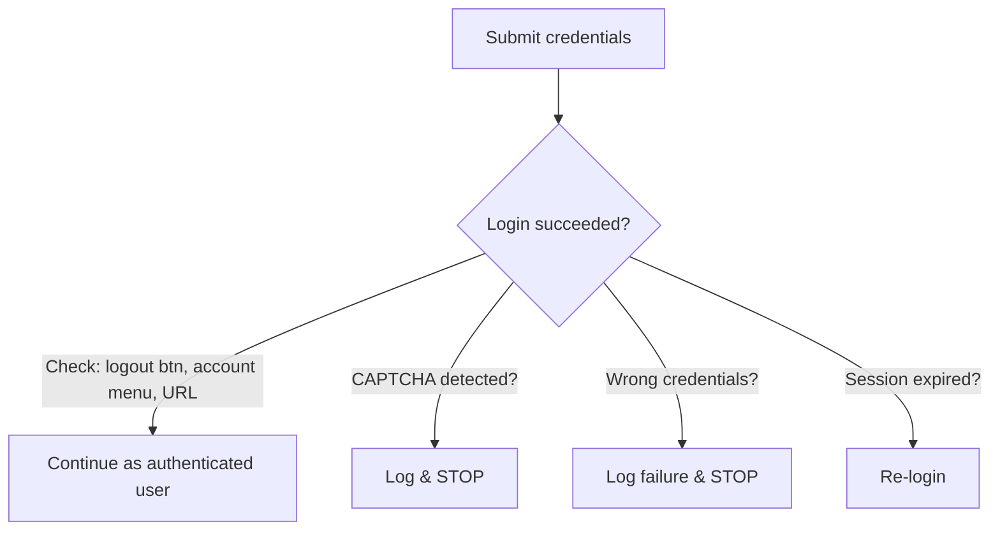
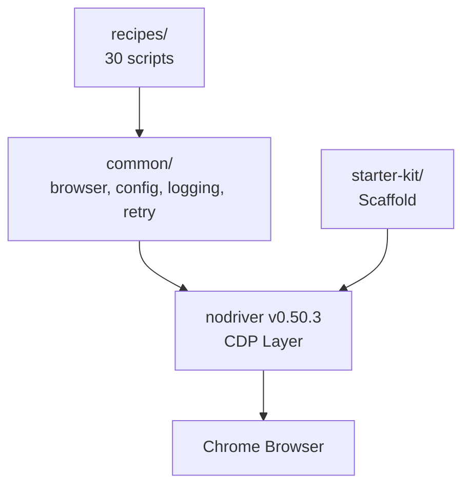

# Image & Diagram Prompts for Cookbook

## Product Context
Python Browser Automation Cookbook (nodriver v0.50.3). Premium product, $29-59. Dark navy theme throughout. Target: devs/automation engineers.

## 5 SD3 Images (Stability AI)

### 1. HERO — Book cover background
**File:** `images/hero.png`
**Placement:** Cover / marketing header
**Requirements:** 16:9, digital-art, no text, no sci-fi/robots
**Current prompt used:**
> Dark navy geometric abstract background, deep indigo to almost black gradient, subtle thin grid lines receding into darkness. Flowing cyan neon light trails forming abstract data stream patterns. Small amber accent light particles. Clean minimal composition with generous negative space. Professional book cover background. Cinematic lighting. 8K quality. Premium corporate aesthetic.

### 2. SELECTOR PRIORITY — 5-level hierarchy
**File:** `images/selector_hierarchy.png`
**Placement:** Recipe 13 — Find Elements Reliably
**Requirements:** 16:9, digital-art, no text, no sci-fi/robots
**Current prompt used:**
> Clean 5-layer pyramid diagram, dark navy background, each layer rendered as a floating horizontal bar. Top bar glows cyan, second bar green, third teal, fourth amber, bottom bar red. Bars decrease in width from top to bottom forming pyramid. Connecting vertical lines between bars. Minimal tech diagram style. Same color palette as Stripe docs. Soft subtle glow on edges.

### 3. STOP vs RETRY — Decision flow
**File:** `images/stop_vs_retry_flow.png`
**Placement:** Recipe 29 — Resilient Automation (most important lesson)
**Requirements:** 16:9, digital-art, no text, no sci-fi/robots
**Current prompt used:**
> Clean decision flowchart on dark navy background. Single entry point node at top, diamond decision node below. Two paths: right path in red leads to stop block, left path in green leads to retry loop. Retry loop shows arrow cycling back to decision diamond with a small counter icon. Clean node outlines with subtle inner glow. Vercel-like technical illustration quality.

### 4. PAGINATION SAFETY — 3 stop conditions
**File:** `images/pagination_safety.png`
**Placement:** Recipe 24 — Handle Pagination
**Requirements:** 16:9, digital-art, no text, no sci-fi/robots
**Current prompt used:**
> Three parallel horizontal bars on dark navy background. First bar cyan, second bar amber, third bar red. All three arrows converge rightward into a single vertical stop bar glowing red. Clean minimal diagram. Geometric precision. Straight lines and right angles only. Small X icons near each bar. Premium tech doc style.

### 5. DOWNLOAD LIFECYCLE — 5-stage pipeline
**File:** `images/download_lifecycle.png`
**Placement:** Recipe 26 — Download Files Reliably
**Requirements:** 16:9, digital-art, no text, no sci-fi/robots
**Current prompt used:**
> Horizontal 5-stage pipeline on dark navy background. Five connected nodes in sequence: first cyan circle (click), then amber square (temp file), amber square (growing file), green square (rename), green circle with checkmark (done). Connecting arrows between stages. Clean minimal pipeline diagram. Same visual language as Linear's documentation diagrams.

---

## 6 Mermaid Diagrams (text-based, rendered in browser)

### File: `images/cookbook_mermaid.html`
Open `file:///C:/Users/varas/personalities/cookbook/images/cookbook_mermaid.html` to see them. Each is an HTML file loading Mermaid v11 from CDN.

### Diagram 1: Selector Priority Flowchart
**Placement:** Recipe 13 — alongside the SD3 image

### Diagram 2: Stop vs Retry Decision Flow
**Placement:** Recipe 29 — alongside the SD3 image

### Diagram 3: Pagination Safety
**Placement:** Recipe 24 — alongside the SD3 image

### Diagram 4: Download Lifecycle
**Placement:** Recipe 26 — alongside the SD3 image

### Diagram 5: Login Verification
**Placement:** Recipe 19 — Login Forms

### Diagram 6: Cookbook Architecture
**Placement:** Starter Kit / README

---

## Instructions for ChatGPT
When you take these to ChatGPT, tell it:

1. The product is a premium Python cookbook (dark navy theme, Stripe/Linear/Vercel quality target)
2. Each image is for 16:9 SD3 generation with Stability AI, digital-art preset
3. Ask ChatGPT to rewrite each prompt to be MORE detailed, MORE specific, and MORE premium
4. For Mermaid: ask ChatGPT to make the workflow diagrams more informative with better styling, color rules, and annotations
5. Key constraint: NO text in the SD3 images. Everything is communicated visually.

Then paste back the improved prompts + Mermaid definitions here and I'll regenerate everything.
