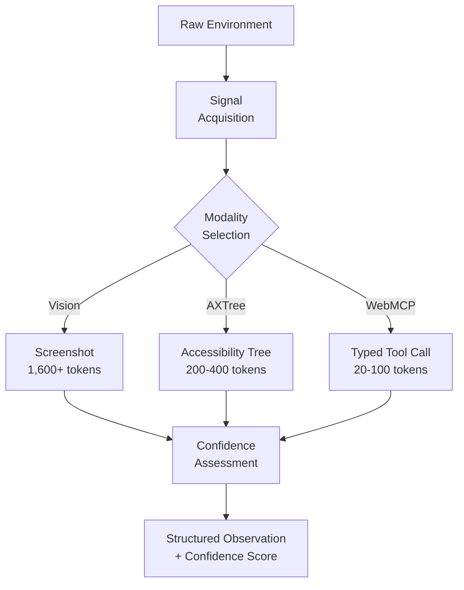
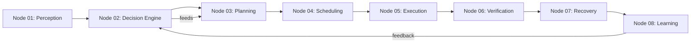
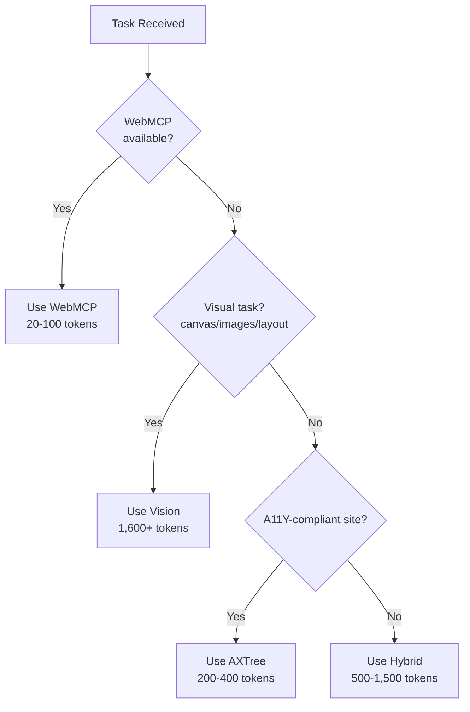
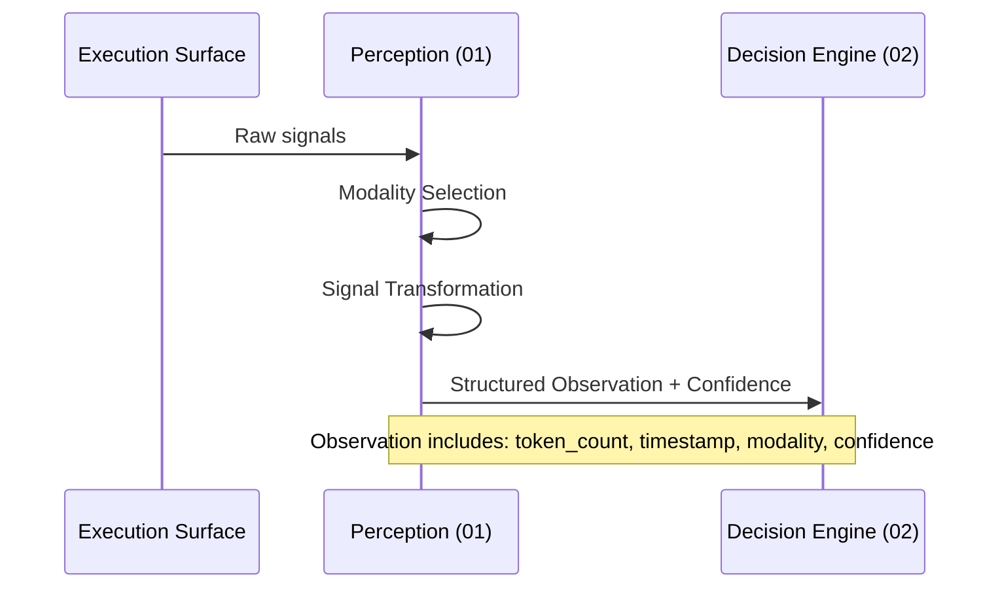
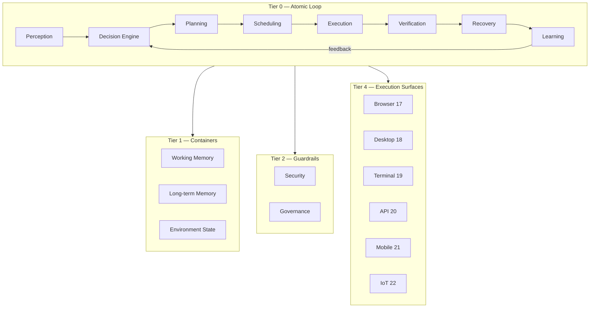

# Agent Systems Diagram Standard v1.0

> **Status:** Frozen  
> **Date:** 2026-07-22  
> **Purpose:** Standard visual language for all diagrams across the Research Package system.

---

## Core Rules

1. All diagrams use **Mermaid** syntax for source files (`diagrams/` directory).
2. Published outputs are **SVG** in `figures/` directory.
3. Every diagram has a **caption** in the referencing `references.md` section that explains what it shows and why it matters.
4. No ad-hoc chart styles. These five diagram types cover all documented needs:

| Type | Use When | File Convention |
|---|---|---|
| **Flow Diagram** | Showing data/information flow between components | `flow-*.mermaid` |
| **Dependency Diagram** | Showing which nodes depend on which | `deps-*.mermaid` |
| **Decision Tree** | Showing modality selection or other branching logic | `decision-*.mermaid` |
| **Sequence Diagram** | Showing temporal ordering of interactions between nodes | `seq-*.mermaid` |
| **Architecture Diagram** | Showing structural layout of a system or layer | `arch-*.mermaid` |

---

## Color Palette

| Color | Hex | Use |
|---|---|---|
| **Teal** | `#3F6E8C` | Primary nodes, core pipeline |
| **Muted Green** | `#6B9080` | Supporting/guardrail nodes |
| **Warm Gray** | `#2E3440` | Text, borders, background |
| **Light Warm** | `#F5F3EE` | Background fills |
| **Highlight** | `#E5DED2` | Emphasized elements in diagrams |

---

## Flow Diagrams

For showing perception pipeline, execution flow, data transformation.

Style rules:
- Round rectangles for processes, diamonds for decisions, square brackets for I/O
- Bold labels for major transitions
- Keep descriptions on single lines; use ` ` for multi-line labels
- Arrows must have labels when the branch has meaning

---

## Dependency Diagrams

For showing node-to-node relationships within the architecture.

Style rules:
- Use explicit arrow labels (`-->|label|`) for meaningful relationships
- Solid lines for primary dependencies, dashed for optional/conditional
- Direction flows left-to-right by default

---

## Decision Trees

For showing selection logic (e.g., modality selection, model routing).

Style rules:
- Decisions are diamonds with labeled branches
- Outcomes are rectangles
- One level of nesting maximum (deep trees use flowcharts with subgraphs instead)

---

## Sequence Diagrams

For showing temporal interactions between nodes during an agent step.

Style rules:
- Use short participant names (node number abbreviation)
- Self-messages show internal processing
- Notes explain what's implicit in the arrow labels

---

## Architecture Diagrams

For showing system structure, layers, or physical deployment.

Style rules:
- Use subgraphs for tiers/layers
- One diagram per package unless cross-tier complexity demands multiple
- Avoid nested subgraphs deeper than one level

---

## General Rules

1. **One diagram per conceptual idea.** Don't cram multiple concepts into one diagram.
2. **Maximum 15 elements per diagram.** If you need more, split into focused diagrams.
3. **Every diagram must be compilable with `mermaid-cli`.** Test rendering before publishing.
4. **File naming:** `diagrams/<type>-<topic>.mermaid` → `figures/<type>-<topic>.svg`
5. **Captions in references.md:** Every diagram reference includes a one-line explanation of what the reader should notice.

---

*End of Diagram Standard v1.0*
