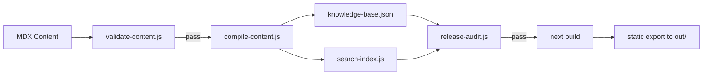

# Browser Engineering Knowledge System — Architecture

> Site: https://versatilesparks.qzz.io
> Repo: `website-next/` (Next.js 16 static export)
> Deploy: Cloudflare Pages via GitHub Actions
> Source of rationale: Hermes state.db conversations (see ANCHORED_SUMMARY.md at repo root)

---

## What This Document Covers

This file documents **what** the site is and **how** it works. For the **why** behind every architectural decision (business rationale, market research, conversation history), see the companion file: `ANCHORED_SUMMARY.md` at the repository root. Each decision below links to its source session where available.

---

## 1. Overview

The Versatile Sparks website is a **static-export Next.js 16 application** that functions as an interactive knowledge graph over two commercial browser-automation handbooks.

| Product | Price | Slug | Gumroad |
|---|---|---|---|
| Python Browser Automation Cookbook | $29 / ₹2499 | `cookbook` | `gum.co/python-browser-automation-cookbook` |
| Browser Automation Playbook | $59 / ₹4999 | `playbook` | `gum.co/browser-automation-playbook` |

The site is not a traditional blog or documentation portal. It presents a **dependency graph of browser-engineering concepts** (Anti-Detection, CDP, Sessions, Fingerprints, etc.) with each node linking to recipes from the books that implement that concept. The UX is inspired by developer tools (VS Code, Linear): command palette navigation, split-panel layout, system inspector sidebar.

---

## 2. Creation Timeline

Built over ~22 hours (18 July 19:12 → 19 July 17:46) in 6 commits:

### Phase 0: Static HTML Site (Initial Commit)

**Commit `29e94df`** — Sat Jul 18 19:12
Initial repo creation with a Python/Jinja2 static HTML site at `website/`. 271 files, 32,386 insertions. No `website-next/` yet.

### Phase 0.5: Old Site Polish (3 precursor commits)

| Commit | Time | Change |
|---|---|---|
| `a0e548e` | 21:11 | Flat cover images + 3D thumbnail mockups added |
| `7a6acb5` | 21:17 | Sample PDFs generated (first 15/36 pages) |
| `af95c38` | 21:27 | Visual overhaul: Plus Jakarta Sans font, dark mode with ambient glows, glassmorphism cards, gradient text |

### Phase 1: Next.js Conversion (The Big One)

**Commit `a7a145d`** — Sun Jul 19 08:25 — **THE FOUNDATIONAL COMMIT**

Complete rewrite from Python/Jinja2 static site to Next.js 16 App Router. 101 files changed (+9,247 / -6,533).

**What was created:**
- `website-next/` directory with Next.js 16 + React 19 + Tailwind v4 + TypeScript
- Single-page application with **SVG knowledge graph** (`KnowledgeGraph.tsx`)
- **Command palette** (`CommandPalette.tsx`) for ⌘K navigation
- **Three-panel layout** (graph sidebar | content | system inspector)
- **MDX content compilation** pipeline (`compile-content.js` → `knowledge-base.json`)
- **11 concept pages, 3 recipes, 2 books** in the initial content set
- Dark monochrome theme (`#090909` background, `#f5f2eb` accent)

**Old site gutted:** All HTML pages deleted, replaced with Next.js build output.

### Phase 2: Expansion & Production Readiness

**Commit `6836893`** — Sun Jul 19 14:33 — 112 files (+9,162 / -847)

The largest content expansion:
- **87 new recipe MDX files** (30 V1 + 56 V2 + 1 variant) generated by `generate_recipes_mdx.py`
- **New concept:** Proxies & IP Rotation
- **Dynamic route pages** for `/books/[slug]`, `/concepts/[slug]`, `/recipes/[slug]`
- **Client components extracted:** BookPageClient, ConceptPageClient, RecipePageClient, ConsoleShell, ContentBody
- **SEO infrastructure:** `robots.ts`, `sitemap.ts`
- **Content validation** (`validate-content.js`) + **release audit** (`release-audit.js`)
- **GitHub Actions deploy workflow** to Cloudflare Pages
- `knowledge-base.json` grew from 408 → 5,376 lines

### Phase 3: Legal Pages

**Commit `9e02b26`** — Sun Jul 19 17:46 — 7 files (+610)

- About, Privacy, Terms, Errata, Callback pages
- `LegalLayout.tsx` shared component
- Python code generator for JSX (`generate_legal_pages.py`)
- Sitemap updated with new entries

### Phase 4: HPF Engine (Unrelated Addition)

**Commits `5c6ae5c` + `5a3edbf`** — Jul 29

Added HPF (Hierarchical Provenance Framework) reasoning engine under `tools/hpf-engine/`. Not part of the website.

---

## 3. Architecture

```
┌─────────────────────────────────────────────────────────┐
│                    Cloudflare Pages                      │
│         https://versatilesparks.qzz.io                      │
│                         ▲                                │
│                         │ deploy                         │
│                    GitHub Actions                        │
│              .github/workflows/deploy.yml                │
│                         ▲                                │
│                   npm run build                          │
│                         │                                │
│               ┌─────────┴──────────┐                     │
│               │    next build       │                     │
│               │  (static export)    │                     │
│               └─────────┬──────────┘                     │
│                         │                                │
│        ┌────────────────┴────────────────┐               │
│        │            prebuild              │               │
│        │  (sequential, exits on failure)  │               │
│        │                                  │               │
│   ┌────┴────┐  ┌──────┴──────┐  ┌───────┴───────┐       │
│   │validate │  │   compile   │  │  search-index │       │
│   │-content │──▶   -content  │──▶   generate    │       │
│   │  .js    │  │    .js      │  │     .js       │       │
│   └─────────┘  └──────┬──────┘  └───────┬───────┘       │
│                       │                  │               │
│                       ▼                  ▼               │
│              src/db/knowledge    public/search           │
│              -base.json         -index.json              │
│                       │                  │               │
│                       └──────┬───────────┘               │
│                              ▼                           │
│                     release-audit.js                     │
│                    (sanity checks)                       │
└─────────────────────────────────────────────────────────┘
```

### Static Export Constraints

- `next.config.ts`: `output: "export"`, `images.unoptimized: true`
- No API routes, no middleware, no server-side rendering
- All dynamic routes use `generateStaticParams()` to pre-render at build time
- `robots.ts` and `sitemap.ts` use `dynamic = "force-static"`

---

## 4. Component Hierarchy

```
RootLayout (layout.tsx)
│  ├─ Metadata + JSON-LD Organization schema
│  └─ <body className="bg-[#090909] text-[#f2f2f2]">
│
├─ LEGAL PAGES (/about, /privacy, /terms, /errata, /callback)
│  └─ LegalLayout.tsx
│      ├─ Header (Logo + Nav)
│      ├─ Article (eyebrow + title + description + children)
│      └─ Footer (Brand + links + version)
│
└─ MAIN APP (ConsoleShell.tsx)
   ├─ HEADER: "Browser Infrastructure Browser" branding
   │   + breadcrumb + search box + ⌘K button
   │
   ├─ LEFT SIDEBAR (320px, workspace modes)
   │   ├─ KnowledgeGraph.tsx (SVG dependency map)
   │   │   - 12 concepts with fixed coordinates
   │   │   - Pan, zoom, hover highlighting
   │   │   - Animated dependency lines
   │   └─ Workspace Mode selector
   │       (Explore | Study | Reference)
   │
   ├─ MAIN CONTENT AREA (one of):
   │   ├─ page.tsx (home page)
   │   │   ├─ Hero: "Build Browser Infrastructure."
   │   │   ├─ Two book cards (cookbook + playbook)
   │   │   ├─ Navigator.tsx (filterable recipe explorer)
   │   │   └─ Active concept/book/recipe detail
   │   │
   │   ├─ BookPageClient.tsx (/books/[slug])
   │   │   ├─ Title + bookmark
   │   │   ├─ Stats (recipes, concepts, coverage)
   │   │   ├─ ContentBody.tsx (body rendering)
   │   │   ├─ Recipe list (filterable)
   │   │   ├─ Concept tag buttons
   │   │   └─ Sibling books
   │   │
   │   ├─ ConceptPageClient.tsx (/concepts/[slug])
   │   │   ├─ Title + bookmark
   │   │   ├─ Dependency path (requires → used_by)
   │   │   ├─ Environment target (difficulty, compatibility)
   │   │   ├─ ContentBody.tsx
   │   │   ├─ Related concepts
   │   │   ├─ Recipe list
   │   │   └─ Book coverage bars
   │   │
   │   └─ RecipePageClient.tsx (/recipes/[slug])
   │       ├─ Breadcrumb + chapter ref
   │       ├─ Title + bookmark
   │       ├─ Concept tags
   │       ├─ ContentBody.tsx (with code blocks)
   │       ├─ Source book link
   │       └─ Related recipes
   │
   ├─ RIGHT SIDEBAR (300px, "System Inspector")
   │   ├─ Active entity details
   │   ├─ Tags & aliases
   │   └─ Bookmarks list
   │
   ├─ FOOTER
   │   ├─ System status ("SYSTEM OK")
   │   ├─ Version (v2.0.0)
   │   └─ Recently viewed items
   │
   └─ CommandPalette.tsx (⌘K modal)
       ├─ System commands (mode switch, fullscreen, downloads)
       ├─ Concept navigation
       └─ Recipe navigation
```

### Component Communication

- **State lives in ConsoleShell** (activeConceptId, activeBookId, activeRecipeId, searchQuery, workspaceMode, bookmarks)
- Passed down as props to children
- No global state manager (no Redux, Zustand, or Context for core state)
- **localStorage** keys: `"vs-bookmarks"` and `"vs-recent"`
- Routing via `next/navigation` (`useRouter`, `router.push`)

---

## 5. Content Model

### Entity Types

```
KnowledgeBase
├── concepts[]     (12 items, expanded from initial 11)
│   ├─ id, title, summary
│   ├─ difficulty: "Beginner" | "Intermediate" | "Advanced"
│   ├─ requires[] / used_by[]     ← dependency graph edges
│   ├─ tags[], aliases[]
│   ├─ introduced, updated, deprecated, compatible_with, last_reviewed
│   ├─ slug, body
│   ├─ related[]                 ← auto-derived at compile time
│   ├─ recipes[]                 ← hydrated at compile time
│   └─ books[]                   ← hydrated at compile time
│
├─ recipes[]     (87 items: 30 V1 + 56 V2 + 1 variant)
│   ├─ id, title
│   ├─ concepts[]                ← references to concept IDs
│   ├─ difficulty, environment[]
│   ├─ downloads[]               ← recipe script file paths
│   ├─ book                      ← reference to book ID
│   ├─ slug, body
│   ├─ conceptObjects[]          ← hydrated at compile time
│   └─ bookObject                ← hydrated at compile time
│
└─ books[]       (2 items)
    ├─ id, title, subtitle
    ├─ price_usd, price_inr
    ├─ version, released
    ├─ gumroad_url
    ├─ formats[]
    ├─ slug, body, summary
    └─ No recipes[] array        ← recipes reference the book instead
```

### Dependency Graph (Concept Relationships)

```
Authentication → Cookies
              → Sessions
                          
Sessions       → Anti Detection → Fingerprints
                                 → Profiles
                                 → Proxies
Fingerprints
Profiles       → CDP
Proxies

CDP            → Network Interception → Scaling → Observability → Recovery

Anti Detection → Fingerprints
Anti Detection → Proxies
Anti Detection → Profiles
```

This graph is **hard-coded** in `KnowledgeGraph.tsx` with fixed SVG coordinates in an 800×960 viewBox. The edges are defined once and SVG `<path>` elements are drawn with `d="M..."` commands. There is no automatic layout algorithm.

### MDX Content Source

- `content/concepts/*.mdx` — 12 files with YAML frontmatter
- `content/recipes/recipe-v1-*.mdx` — 30 files (Cookbook V1)
- `content/recipes/recipe-v2-*.mdx` — 57 files (Playbook V2, including v2-30a)
- `content/books/*.mdx` — 2 files

Recipe MDX files are **auto-generated** by `scripts/generate_recipes_mdx.py` (Python), which scans the book chapter source files for `## Recipe N:` headings.

---

## 6. Build Pipeline



### Pipeline Scripts

| Script | Run order | Purpose | Failure mode |
|---|---|---|---|
| `validate-content.js` | 1st | Structural integrity of all MDX frontmatter | Exit 1 on errors |
| `compile-content.js` | 2nd | MDX → `knowledge-base.json` with hydration | Exit 1 |
| `generate-search-index.js` | 3rd | `knowledge-base.json` → `public/search-index.json` | Exit 1 |
| `release-audit.js` | 4th | Sanity checks on compiled output | Exit 1 |
| `next build` | 5th | Next.js static export to `out/` | Next.js default |

### Validation Rules (validate-content.js)

1. Every entity has `id`, `title`, non-empty `body`
2. No duplicate IDs across entity types
3. Concept `requires` / `used_by` / `related` resolve to existing concepts
4. Recipe `concepts` and `book` resolve
5. Every recipe has at least one concept
6. `requires`/`used_by` symmetry (warning)
7. Orphan detection (no graph edges + no recipes) — warning

### Compilation Enrichment (compile-content.js)

1. **Auto-derives `related` concepts** when not set explicitly:
   - Sibling signal: concepts sharing a `requires` or `used_by` entry
   - Tag overlap signal: concepts sharing tags
   - Excludes direct graph neighbors (already visible in dependency panel)
   - Top 5, sorted by score then ID
2. **Hydrates concept.recipes[]** with id, title, slug, book, difficulty, environment
3. **Hydrates concept.books[]** with id, title, slug, summary
4. **Hydrates recipe.conceptObjects[]** with full concept summary
5. **Hydrates recipe.bookObject** with full book summary

### Recipe Generation (generate_recipes_mdx.py)

- Standalone Python script (not part of npm pipeline)
- Reads chapter markdown from `book/v1/` and `book/v2/` (hardcoded path on author's machine)
- Extracts recipe titles via regex
- Maps chapters to concept areas via hardcoded lookup
- Assigns difficulty by recipe number
- Generates `content/recipes/recipe-v{N}-{N}.mdx`

---

## 7. Design System

### Colors

| Token | Value | Usage |
|---|---|---|
| `--background` | `#090909` | Page background |
| `--foreground` | `#f2f2f2` | Primary text |
| `--surface` | `#111111` | Card/surface backgrounds |
| `--card` | `#161616` | Card backgrounds (alt) |
| `--border` | `#242424` | Borders, dividers |
| `--text-muted` | `#8a8a8a` | Secondary/muted text |
| `--accent` | `#f5f2eb` | Accent (headings, highlights) |

### Typography

- **Font stack:** System UI (`-apple-system, BlinkMacSystemFont, 'Segoe UI', Roboto, ...`) set in `globals.css`
- No custom font imports or `@next/font` usage
- Bold applied via Tailwind classes

### Key CSS Features

- **Ambient glow effects:** Not in the Next.js version (removed from old site's visual overhaul). Current site uses flat dark surfaces with border contrast.
- **Scrollbar styling:** 6px width, `#242424` border-color thumb
- **SVG animations:** `@keyframes drawLine` for dependency graph edges (`.dependency-line` class)
- **`prefers-reduced-motion`:** Disables animations for accessibility
- **No Tailwind CSS variables —** uses hard-coded hex values in JSX (e.g., `bg-[#090909]`)
- **CSS custom properties** defined in `globals.css` are available but not consistently used in components

---

## 8. Deployment

### GitHub Actions Workflow (`.github/workflows/deploy.yml`)

```yaml
Trigger: push to master, paths: website-next/**
Steps:
  1. actions/checkout@v4
  2. actions/setup-node@v4 (Node 20)
  3. npm ci (website-next/)
  4. npm run build (website-next/)
  5. cloudflare/wrangler-action@v3:
       command: pages deploy website-next/out --project-name=versatilesparks
```

### Domain

- Custom domain: `versatilesparks.qzz.io`
- DNS managed by Cloudflare
- Static files served from Cloudflare Pages global edge network

---

## 9. SEO Strategy

### Per-Page Metadata

| Page | OG Type | Priority | Sitemap Frequency |
|---|---|---|---|
| Home (/) | website | 1.0 | weekly |
| Concepts (/concepts/[slug]) | article | 0.8 | monthly |
| Books (/books/[slug]) | book | 0.7 | monthly |
| Recipes (/recipes/[slug]) | article | 0.6 | monthly |
| About, Privacy, Terms | — | 0.3-0.5 | yearly |
| Errata | — | 0.4 | monthly |
| Callback | — | 0.3 | yearly |

### Structured Data (JSON-LD)

- **Root layout:** `Organization` schema (name, url, logo, sameAs with GitHub/Gumroad)
- **Book pages:** `Book` schema with `hasPart` references to all recipes
- **Concept pages:** `TechArticle` schema with references to related concepts
- **Recipe pages:** `TechArticle` schema with `isPartOf` pointing to parent book

### Robots & Sitemap

- `robots.txt`: Allow all, disallow `/api/`, point to sitemap
- `sitemap.xml`: Auto-generated from `knowledge-base.json` at build time, uses `last_reviewed` dates

---

## 10. Client-Side Features

### Bookmarking

- **localStorage key:** `"vs-bookmarks"`
- Format: JSON array of entity IDs (e.g., `["anti-detection", "recipe-v1-19", "cookbook"]`)
- Toggle button on every detail view (concept, recipe, book)
- Displayed in ConsoleShell's right sidebar

### Recently Viewed

- **localStorage key:** `"vs-recent"`
- Displayed in ConsoleShell footer
- Currently read but never written in the codebase — may be populated by unread component or planned for future

### Keyboard Shortcuts

| Key | Action |
|---|---|
| ⌘K / Ctrl+K | Open command palette |
| Shift+Space | Toggle fullscreen mode |
| Escape | Close command palette / exit fullscreen |
| ↑↓ | Navigate command palette items |
| Enter | Select command palette item |

### Search

- Client-side substring search across concepts (title, summary, body, tags, aliases) and recipes (title, body)
- Concepts ranked higher than recipes; exact title matches score highest
- Uses `public/search-index.json` as the search corpus (flat array, not a trie/full-text index)
- Search results appear inline in ConsoleShell

### Workspace Modes

| Mode | Sidebars | Use Case |
|---|---|---|
| Explore | Both visible | Browsing the knowledge graph |
| Study | Hidden | Focused reading |
| Reference | Hidden | Quick recipe lookup |

---

## 11. Legal Pages

All five legal/info pages share a common layout:

```
LegalLayout.tsx
├─ Header: Logo link to / + nav (About, Errata, Privacy, Terms, Library)
├─ Main: Eyebrow + Title + Description + children (prose)
└─ Footer: Brand + links + version
```

Generated by `scripts/generate_legal_pages.py` (Python code generator), written in Python to avoid VS Code/Prettier reformatting the JSX. Each page uses `dynamic = "force-static"`.

### Pages

| Page | Route | Content |
|---|---|---|
| About | `/about` | Mission, library description, graph explanation, contact (yasaka.hanini@protonmail.com) |
| Privacy | `/privacy` | No backend, no tracking cookies, no analytics, localStorage only, Gumroad payments, Cloudflare CDN |
| Terms | `/terms` | DRM-free license, updates policy, refunds, CC BY-NC 4.0 |
| Errata | `/errata` | Known issues tracker (none at launch) |
| Callback | `/callback` | Purchase recovery / library access |

---

## 12. Package Dependencies

| Package | Version | Purpose |
|---|---|---|
| `next` | 16.2.10 | Framework |
| `react` / `react-dom` | 19.2.4 | UI library |
| `lucide-react` | 1.25.0 | Icons (BookMarked, BookOpen, Search, PanelRightClose, etc.) |
| `framer-motion` | 12.42.2 | Animation (declared but may not be actively used) |
| `tailwindcss` | ^4 | CSS framework |
| `@tailwindcss/postcss` | ^4 | PostCSS plugin for Tailwind v4 |
| `typescript` | ^5 | Type safety |
| `eslint` / `eslint-config-next` | ^9 / 16.2.10 | Linting |

### Disabled ESLint Rules

- `react-hooks/set-state-in-effect` — the SSR/CSR localStorage hydration pattern triggers this
- `react/no-unescaped-entities` — conflicts with Prettier formatting

---

## 13. File Tree Reference

```
website-next/
├── .gitignore
├── AGENTS.md                    # "This is NOT the Next.js you know"
├── CLAUDE.md                    # Points to AGENTS.md
├── README.md                    # Generic create-next-app boilerplate (stale)
├── ARCHITECTURE.md              # ← This file
├── eslint.config.mjs
├── next.config.ts               # output: "export", images unoptimized
├── package.json
├── postcss.config.mjs
├── tsconfig.json
│
├── content/
│   ├── books/
│   │   ├── cookbook.mdx         # $29 / 15 recipes
│   │   └── playbook.mdx         # $59 / 60 recipes
│   ├── concepts/
│   │   ├── anti-detection.mdx
│   │   ├── authentication.mdx
│   │   ├── cdp.mdx
│   │   ├── cookies.mdx
│   │   ├── fingerprints.mdx
│   │   ├── network-interception.mdx
│   │   ├── observability.mdx
│   │   ├── profiles.mdx
│   │   ├── proxies.mdx
│   │   ├── recovery.mdx
│   │   ├── scaling.mdx
│   │   └── sessions.mdx
│   └── recipes/
│       ├── recipe-v1-1.mdx  ... recipe-v1-30.mdx  (30 V1)
│       ├── recipe-v2-1.mdx  ... recipe-v2-56.mdx  (56 V2)
│       └── recipe-v2-30a.mdx                      (1 variant)
│
├── public/
│   ├── assets/covers/           # 4 cover images (flat + thumbnail, both books)
│   ├── downloads/               # Sample PDFs (first 15/36 pages)
│   ├── search-index.json        # Client-side search corpus
│   └── *.svg                    # Generic SVG icons
│
├── src/
│   ├── app/
│   │   ├── layout.tsx           # Root layout with metadata + JSON-LD
│   │   ├── page.tsx             # Home page (client component)
│   │   ├── globals.css          # Tailwind + CSS custom properties
│   │   ├── robots.ts            # robots.txt generator
│   │   ├── sitemap.ts           # sitemap.xml generator
│   │   ├── about/page.tsx
│   │   ├── privacy/page.tsx
│   │   ├── terms/page.tsx
│   │   ├── errata/page.tsx
│   │   ├── callback/page.tsx
│   │   ├── books/[slug]/page.tsx    # Dynamic book page
│   │   ├── concepts/[slug]/page.tsx # Dynamic concept page
│   │   └── recipes/[slug]/page.tsx  # Dynamic recipe page
│   │
│   ├── components/
│   │   ├── BookPageClient.tsx
│   │   ├── CommandPalette.tsx
│   │   ├── ConceptPageClient.tsx
│   │   ├── ConsoleShell.tsx      # Main app shell (369 lines)
│   │   ├── ContentBody.tsx       # Markdown-lite renderer
│   │   ├── KnowledgeGraph.tsx    # SVG dependency graph (372 lines)
│   │   ├── LegalLayout.tsx       # Legal page shell
│   │   ├── Navigator.tsx         # Recipe filter/browser
│   │   └── RecipePageClient.tsx
│   │
│   ├── db/
│   │   └── knowledge-base.json   # Compiled content (5,736 lines)
│   │
│   └── types/
│       └── knowledge.ts          # TypeScript type definitions
│
└── scripts/
    ├── compile-content.js         # MDX → knowledge-base.json
    ├── generate_legal_pages.py    # Legal pages JSX generator
    ├── generate_recipes_mdx.py    # Recipe MDX generator from book source
    ├── generate-search-index.js   # knowledge-base.json → search-index.json
    ├── release-audit.js           # Pre-deploy sanity checks
    └── validate-content.js        # Content integrity validation
```

---

## 14. Known Gaps & Notes for Future Maintainers

### Technical Debt

1. **Hard-coded graph coordinates:** `KnowledgeGraph.tsx` has fixed SVG positions for 12 concepts. Adding a new concept requires manual coordinate calculation, path drawing, and zoom bound updates.

2. **No font optimization:** Site uses system UI font stack rather than `@next/font`. Loading a custom font could improve visual consistency.

3. **`framer-motion` is installed but unused:** It appears in `package.json` as a dependency but is not imported in any of the 12 components read. May be planned for future animations or can be removed to reduce bundle size.

4. **`vs-recent` localStorage key is never written:** The "recently viewed" section in ConsoleShell footer reads this key but no component writes to it. Either unfinished or the write logic lives in an unread component.

5. **`search-index.json` is generated but unused:** The file exists at `public/search-index.json` but ConsoleShell search queries `knowledge-base.json` directly at runtime. The index was likely intended for an unbuilt search feature.

6. **Stale README:** `website-next/README.md` is generic `create-next-app` boilerplate. Does not reflect the actual project.

7. **No tests:** No test files exist in `website-next/`.

8. **Python path hard-coding:** `generate_recipes_mdx.py` contains hardcoded paths (`C:/Users/varas/personalities/cookbook`) that won't work on other machines.

### Architecture Decisions Worth Preserving

1. **Static export over SSR:** Chosen for zero server cost, maximum CDN performance, and simplicity. The trade-off is no API routes, no dynamic content, no user accounts.

2. **JSON as data layer over CMS:** Every page imports `knowledge-base.json` directly. This keeps dependencies minimal but means content updates require a full rebuild.

3. **SPA-in-static-export pattern:** The home page is a single-page application (state management, client-side routing within the page) that also has separate dynamic route pages for SEO. This hybrid approach works because `router.push()` navigates between the SPA and the route pages.

4. **Python code generation for MDX/JSX:** Recipe MDX files and legal page JSX are generated by Python scripts. This choice was deliberate to avoid the author's editor/linter reformatting generated output.

5. **No markdown library:** `ContentBody.tsx` implements a minimal markdown parser (headings, lists, code blocks only) instead of importing `react-markdown` or similar. Keeps the bundle small for static export.

---

## 16. Decision Log — Why We Built What We Built

Every architectural decision below links to the rationale documented in `ANCHORED_SUMMARY.md` (repo root). That file captures the business context, market research, and conversation history from Hermes sessions.

| Decision | Rationale (see ANCHORED_SUMMARY.md section) | Source Session |
|---|---|---|
| **Cloudflare Pages free tier** | Part 1 — "Why Cloudflare Pages" | `20260717_135025` |
| **No images on website** | Part 1 — "Why no image website" | `20260719_183410` msg [26] |
| **No "Governing Law" in Terms** | Part 1 — "Why Governing Law was removed" | `20260717_141835` |
| **6 pages only (no blog/newsletter)** | Part 1 — "Why 6 pages" | `20260717_135025` |
| **Knowledge-graph IA (not storefront)** | Part 2 — "Why a knowledge system" | Code analysis (no conversation log) |
| **Next.js 16 static export** | Part 2 — "What's missing" | Code analysis (no conversation log) |
| **Tailwind CSS v4** | Part 2 — "What's missing" | Code analysis (no conversation log) |
| **framer-motion (declared, unused)** | Part 2 — "What's missing" | Code analysis (no conversation log) |
| **12 concept dependency graph** | Part 2 — knowledge graph structure | Code analysis (no conversation log) |
| **Concept-first content model** | The site IA is concept-first: 12 concepts → 87 recipes → 2 books. Books are entry points, but the content is organized around engineering knowledge, not product pages. | Code analysis (no conversation log) |
| **Dev.to first publishing platform** | Part 3 — "Platform decisions" | `20260725_215623` |
| **Hashnode blocked (Pro required)** | Part 3 — "Why Hashnode was dropped" | `20260725_215623` |
| **Reddit as separate cron job** | Part 4 — Entire section | `20260723_112033` |
| **Article 1 = nodriver mistakes** | Part 3 — "Why first article" | `20260725_215623` |
| **No services/methodology pages** | Part 5 — "Why not Agent Replay" | `20260717_141835` |

**Note:** Decisions marked "no conversation log" exist in git history (`a7a145d`, `6836893`, `9e02b26` — all Jul 19) but no Hermes user prompt or agent discussion about them was logged. The rationale is inferred from code analysis.
